# YouTube Scraper Enhancement - Implementation Plan v2.0
## Transforming to AI Research Intelligence System

**Document Version**: 1.0.0
**Date**: 2025-01-06
**Status**: ACTIVE
**Succession Ready**: ✅ Complete handoff documentation included

---

## Executive Summary

### Vision Transformation

**From (v1.0)**: Single-purpose transcript scraper with basic summaries
- 1,652 lines of code
- Simple 3-panel GUI
- 15-20 bullet point summaries per video
- Individual video processing only

**To (v2.0)**: AI Research Intelligence System
- Estimated 8,000-10,000 lines of code
- Intelligent 5-layer processing stack
- Cross-video synthesis and learning paths
- Executable playbooks and visual diagrams
- ROI scoring and implementation readiness assessment
- Master knowledge base with deduplication

### Strategic Objectives

1. **Maximize Learning Extraction**: Transform passive consumption into actionable intelligence
2. **Enable Pattern Recognition**: Identify insights across multiple sources
3. **Accelerate Implementation**: Convert knowledge to executable playbooks
4. **Measure ROI**: Score and prioritize based on implementation value
5. **Build Institutional Memory**: Create persistent, queryable knowledge base

### Success Metrics

**Quantitative Metrics**:
- ✅ Process 10+ videos in single batch
- ✅ Generate 50+ actionable insights per video (up from 15-20)
- ✅ 90% deduplication accuracy across videos
- ✅ <30 second incremental processing per video
- ✅ ROI scoring variance <10% on re-runs

**Qualitative Metrics**:
- ✅ Learning paths logically sequenced
- ✅ Playbooks immediately executable
- ✅ Visual diagrams clarify complex relationships
- ✅ Knowledge base searchable and referenceable
- ✅ Implementation journal tracks progress

---

## Architecture Blueprint

### System Architecture Overview

```
┌─────────────────────────────────────────────────────────────┐
│                     User Interface (UI-001)                 │
│         Enhanced GUI with Intelligence Dashboard            │
└──────────────────┬──────────────────────────────────────────┘
                   │
┌──────────────────▼──────────────────────────────────────────┐
│              Integration Layer (INTEGRATE-001)              │
│         Orchestration, Error Handling, Workflow             │
└─────┬──────┬──────┬──────┬──────┬──────────────────────────┘
      │      │      │      │      │
┌─────▼──┐┌──▼───┐┌─▼────┐┌▼─────┐┌▼──────┐
│CORE-001││INTEL ││VISUAL││KNOWL ││EXEC   │
│Enhanced││-001  ││-001  ││-001  ││-001   │
│Summary ││Intel ││Diagram││Memory││Playbook│
└────┬───┘└──┬───┘└──┬───┘└──┬───┘└──┬────┘
     │       │       │       │       │
     └───────┴───────┼───────┴───────┘
                     │
              ┌──────▼──────┐
              │  GPT-4 API  │
              │   Service   │
              └─────────────┘
```

### Module Dependency Graph

```
CORE-001 (Foundation)
    ├── INTEL-001 (depends on CORE)
    ├── VISUAL-001 (depends on CORE)
    ├── EXEC-001 (depends on CORE)
    └── KNOWLEDGE-001 (depends on CORE + INTEL)
            └── UI-001 (depends on all modules)
                    └── INTEGRATE-001 (final assembly)
```

### Parallel Development Strategy

**Stream 1**: Core Enhancement (Week 1-2)
- Agent: `backend-developer`
- Focus: CORE-001 foundation

**Stream 2**: Intelligence Layer (Week 2-3)
- Agent: `architecture-specialist`
- Focus: INTEL-001 + KNOWLEDGE-001

**Stream 3**: Visualization (Week 2-3)
- Agent: `frontend-developer`
- Focus: VISUAL-001 + UI-001

**Stream 4**: Execution Layer (Week 3-4)
- Agent: `backend-developer`
- Focus: EXEC-001 + INTEGRATE-001

### API Contracts

```python
# Module Interface Standards
class ModuleInterface:
    """Standard interface for all modules"""

    def process(self, input_data: Dict) -> Dict:
        """Process input and return structured output"""
        pass

    def validate(self, data: Dict) -> bool:
        """Validate input/output data"""
        pass

    def get_status(self) -> Dict:
        """Return module status and metrics"""
        pass
```

---

## Phased Implementation Roadmap

### Phase 1: Foundation Enhancement (Week 1-2)
**Objective**: Upgrade core summarization with enhanced prompts

**Deliverables**:
- Enhanced summary generation (50+ items)
- Cross-video synthesis capability
- Modular architecture refactor
- Unit test coverage >80%

**Resources**:
- Lead: `backend-developer`
- Support: `architecture-specialist`
- Validation: `critic-agent`

**Milestones**:
- Day 3: Core module skeleton complete
- Day 7: Enhanced prompts implemented
- Day 10: Summary generation validated
- Day 14: Synthesis engine operational

### Phase 2: Intelligence Layer (Week 2-3)
**Objective**: Add ROI scoring and learning paths

**Deliverables**:
- Readiness assessment algorithm
- ROI scoring engine
- Learning path generator
- Knowledge deduplication

**Resources**:
- Lead: `architecture-specialist`
- Support: `backend-developer`
- Validation: `development-quality-specialist`

**Milestones**:
- Day 17: Readiness scorer complete
- Day 21: ROI calculator operational
- Day 24: Learning path generator tested
- Day 28: Knowledge base integrated

### Phase 3: Visual & Action Layers (Week 3-4)
**Objective**: Generate diagrams and playbooks

**Deliverables**:
- Mermaid diagram generator
- Playbook template engine
- Prompt library builder
- CLI command extractor

**Resources**:
- Lead: `frontend-developer` (Visual)
- Lead: `backend-developer` (Action)
- Validation: `critic-agent`

**Milestones**:
- Day 21: Diagram generation working
- Day 24: Playbook templates created
- Day 28: Prompt extraction validated
- Day 31: CLI parsing complete

### Phase 4: Integration & UI (Week 4-5)
**Objective**: Assemble complete system

**Deliverables**:
- Enhanced GUI with dashboard
- Module orchestration
- End-to-end testing
- Performance optimization

**Resources**:
- Lead: `devops-infrastructure-specialist`
- Support: `frontend-developer`
- Validation: `development-quality-specialist`

**Milestones**:
- Day 28: UI mockups approved
- Day 31: Dashboard implementation started
- Day 35: Orchestration layer complete
- Day 38: E2E tests passing

### Phase 5: Deployment & Documentation (Week 5-6)
**Objective**: Production release

**Deliverables**:
- Deployment package (.exe build)
- User documentation
- Migration guide (v1→v2)
- Training materials

**Resources**:
- Lead: `documentation-specialist`
- Support: `devops-infrastructure-specialist`
- Validation: `critic-agent`

**Milestones**:
- Day 35: Documentation draft
- Day 38: Build pipeline operational
- Day 42: Beta deployment
- Day 45: Production release

---

## Module Specifications

### CORE-001: Enhanced Summary & Synthesis Engine

**Purpose**: Foundation layer for all intelligence processing

**Input Contract**:
```python
{
    "videos": [
        {
            "id": str,
            "title": str,
            "transcript": str,
            "metadata": {
                "channel": str,
                "duration": int,
                "views": int,
                "upload_date": str,
                "description": str,
                "tags": list[str]
            }
        }
    ],
    "config": {
        "summary_depth": int,  # 50-100 items
        "synthesis_enabled": bool,
        "cross_reference": bool,
        "analysis_mode": str  # "quick" | "developer" | "research"
    }
}
```

**Output Contract**:
```python
{
    "summaries": {
        "video_id": {
            "notable_items": list[dict],  # 50+ structured insights
            "key_insights": str,
            "extracted_prompts": list[dict],
            "extracted_commands": list[dict],
            "tool_mentions": dict,
            "complexity_score": float,
            "implementation_time": int,
            "prerequisites": list[str]
        }
    },
    "synthesis": {
        "executive_summary": str,
        "common_themes": list[str],
        "contradictions": list[dict],
        "unique_insights": dict,
        "consensus_points": list[str],
        "chronological_timeline": list[dict],
        "cross_video_patterns": list[dict]
    }
}
```

**API Specification**:
```python
class CoreEngine:
    """Enhanced summary and synthesis engine"""

    def enhance_summary(
        self,
        transcript: str,
        metadata: dict,
        mode: str = "developer"
    ) -> dict:
        """
        Generate enhanced summary with 50+ insights

        Args:
            transcript: Video transcript text
            metadata: Video metadata dictionary
            mode: Analysis depth ("quick" | "developer" | "research")

        Returns:
            Enhanced summary with structured insights
        """
        pass

    def synthesize_videos(
        self,
        summaries: list[dict],
        context: dict = None
    ) -> dict:
        """
        Cross-video synthesis with pattern detection

        Args:
            summaries: List of video summaries
            context: Optional user context

        Returns:
            Comprehensive synthesis with meta-patterns
        """
        pass

    def extract_entities(
        self,
        text: str,
        entity_types: list[str] = None
    ) -> dict:
        """
        Extract technical entities (tools, commands, prompts)

        Args:
            text: Source text
            entity_types: Types to extract (default: all)

        Returns:
            Dictionary of extracted entities by type
        """
        pass
```

**Enhanced Prompt Template**:
```
SYSTEM ROLE:
You are a technical research analyst extracting ACTIONABLE implementation guidance
from AI development tutorials. Focus on copy-paste ready code, commands, and prompts.

ANALYSIS MODE: {mode}
- quick: 10-15 highest-value items ($0.15)
- developer: 15-20 items + playbooks + templates ($0.30)
- research: 20-25 items + deep analysis + context ($0.50)

OUTPUT STRUCTURE:
## {15-20+} Notable Items

### {N}. **{Clear Title}** [{Tag: Protocol|Command|Tool|Pattern|Warning}]
**Implementation Time**: [5min/30min/2hr]
**Readiness**: [✅ Ready | ⚠️ Needs Setup | 🔬 Experimental]

{Description with implementation details}

**How to Implement**:
1. {Specific step with exact command/code}
2. {Verification step}
3. {Common error + fix}

**Code/Command**:
```language
{exact copy-paste ready code}
```

**Source Timestamp**: {MM:SS}

EXTRACTION PRIORITIES:
1. Executable Protocols
2. Copy-Paste Ready Code
3. CLI Commands with flags explained
4. Prompt Templates (verbatim)
5. Tool Configurations
6. Version Specifics
7. Performance Data
8. Error Solutions
9. Workflow Decisions
10. Best Practices
```

**Testing Requirements**:
- Unit tests for each extraction category
- Integration test with GPT-4 API
- Performance benchmark (<10s per video)
- Quality validation (50+ items extracted)
- Cost estimation accuracy (±10%)

**Acceptance Criteria**:
- ✅ Extracts 50+ insights per video
- ✅ Identifies cross-video patterns
- ✅ Maintains <$0.10 API cost per video
- ✅ Handles videos up to 2 hours
- ✅ Preserves code/command formatting
- ✅ Includes verification steps

**Risk Assessment**:
| Risk | Mitigation |
|------|------------|
| GPT-4 token limits on long videos | Chunking strategy with overlap |
| Inconsistent extraction quality | Prompt engineering + validation |
| Cost overruns | Token optimization + caching |

**Agent Assignment**: `backend-developer` with `architecture-specialist` review

**Estimated Effort**: 80 hours (2 weeks)

---

### INTEL-001: Intelligence & ROI Engine

**Purpose**: Score implementation readiness and calculate ROI

**Input Contract**:
```python
{
    "summaries": dict,  # From CORE-001
    "user_context": {
        "industry": str,
        "team_size": int,
        "tech_stack": list[str],
        "objectives": list[str],
        "skill_level": str  # "beginner" | "intermediate" | "advanced"
    }
}
```

**Output Contract**:
```python
{
    "readiness_scores": {
        "insight_id": {
            "status": str,  # "READY" | "NEEDS_SETUP" | "EXPERIMENTAL"
            "score": float,  # 0-100
            "complexity": float,  # 0-1
            "setup_time": int,  # minutes
            "prerequisites": list[str],
            "confidence": float,  # 0-1
            "blockers": list[str]
        }
    },
    "roi_analysis": {
        "high_value": list[dict],  # Score >80
        "medium_value": list[dict],  # Score 50-80
        "low_value": list[dict],  # Score <50
        "quick_wins": list[dict],  # High ROI + low complexity
        "foundations": list[dict]  # Required for later items
    },
    "learning_path": {
        "phases": list[dict],
        "total_time": int,  # hours
        "roadmap_diagram": str,  # Mermaid code
        "dependencies": dict
    }
}
```

**API Specification**:
```python
class IntelligenceEngine:
    """Readiness assessment and ROI calculation"""

    def calculate_readiness(
        self,
        insight: dict,
        context: dict
    ) -> dict:
        """
        Score insight for implementation readiness

        Scoring factors:
        - Prerequisites present/absent
        - Code completeness
        - External dependencies
        - Complexity indicators
        - Version/compatibility warnings

        Returns:
            Readiness score with factors and blockers
        """
        pass

    def score_roi(
        self,
        insights: list[dict],
        objectives: list[str]
    ) -> dict:
        """
        Calculate ROI based on time savings and costs

        Formula:
        roi = (annual_savings - cost) / implementation_time

        Returns:
            Prioritized insights by ROI score
        """
        pass

    def generate_learning_path(
        self,
        topics: list[dict],
        level: str
    ) -> dict:
        """
        Create phased learning path with dependencies

        Uses topological sort to order by prerequisites
        Clusters into phases by readiness and complexity

        Returns:
            Phased learning path with roadmap
        """
        pass
```

**Readiness Scoring Algorithm**:
```
READY ✅:
- No prerequisites mentioned
- Code is copy-paste ready
- No API keys/external services needed
- Marked as "basic"/"simple"
- No version warnings

NEEDS_SETUP ⚠️:
- Requires API key setup
- Needs tool installation
- Requires config changes
- Prerequisites listed
- Dependencies mentioned

EXPERIMENTAL 🔬:
- Contains "experimental"/"beta"/"unstable"
- Version < 1.0
- Caveats mentioned
- "Still testing"
- No verification shown

Complexity Score (0-1):
- 0.0-0.3: Beginner (copy-paste, 1-2 steps)
- 0.3-0.6: Intermediate (5-10 steps, debugging)
- 0.6-1.0: Advanced (architecture, multi-file)

Signals:
- Number of steps
- Number of files
- Number of tools interacting
- Error handling presence
- Code snippet length
- Technical jargon density
```

**ROI Calculation Logic**:
```python
# Time Savings Estimation
time_saved_per_use = detect_automation_savings(insight)
frequency = detect_use_frequency(insight)  # daily/weekly/monthly
annual_savings = time_saved_per_use * frequency_per_year

# Cost Estimation
implementation_cost = readiness.setup_time * hourly_rate
api_costs = estimate_api_usage(insight) * api_price
tool_costs = sum(tool_subscriptions_required(insight))
total_cost = implementation_cost + api_costs + tool_costs

# ROI Score
roi_score = (annual_savings - total_cost) / implementation_time

# Recommendation
if roi_score > 50 and breakeven < 2_weeks:
    return "HIGH"
elif roi_score > 10 and breakeven < 2_months:
    return "MEDIUM"
else:
    return "LOW"
```

**Testing Requirements**:
- Consistency tests (same input = same score ±10%)
- Edge case handling (missing context)
- Learning path logic validation
- ROI calculation accuracy
- Dependency graph correctness

**Acceptance Criteria**:
- ✅ Scoring variance <10% on re-runs
- ✅ Learning paths logically sequenced
- ✅ ROI factors transparent and adjustable
- ✅ Quick wins identified accurately
- ✅ Dependency cycles detected and broken

**Risk Assessment**:
| Risk | Mitigation |
|------|------------|
| Subjective scoring without validation | Explainable factors + confidence scores |
| Context-dependent accuracy | User feedback loop + tuning |
| Dependency detection failures | Multiple signal analysis |

**Agent Assignment**: `architecture-specialist` with `backend-developer` support

**Estimated Effort**: 60 hours (1.5 weeks)

---

### VISUAL-001: Diagram Generation Engine

**Purpose**: Create Mermaid diagrams for visual understanding

**Input Contract**:
```python
{
    "synthesis": dict,  # From CORE-001
    "diagram_types": list[str],  # ["timeline", "architecture", "comparison", "flowchart"]
    "complexity": str,  # "simple" | "detailed" | "comprehensive"
    "theme": str  # "default" | "dark" | "forest"
}
```

**Output Contract**:
```python
{
    "diagrams": {
        "timeline": {
            "mermaid_code": str,
            "title": str,
            "description": str,
            "events": list[dict]
        },
        "architecture": {
            "mermaid_code": str,
            "components": list[dict],
            "relationships": list[dict],
            "layers": list[str]
        },
        "comparison": {
            "mermaid_code": str,
            "entities": list[str],
            "attributes": dict,
            "winner": str  # Based on criteria
        },
        "flowchart": {
            "mermaid_code": str,
            "decision_points": list[dict],
            "paths": list[dict]
        }
    },
    "preview_urls": dict,  # Optional: rendered previews
    "markdown_embeds": dict  # Ready for MD files
}
```

**API Specification**:
```python
class VisualEngine:
    """Mermaid diagram generation"""

    def generate_timeline(
        self,
        events: list[dict],
        granularity: str = "month"
    ) -> str:
        """
        Create technology evolution timeline

        Groups events by time period
        Shows progression of tools/techniques

        Returns:
            Mermaid timeline code
        """
        pass

    def create_architecture_diagram(
        self,
        components: dict,
        style: str = "layered"
    ) -> str:
        """
        Build system architecture diagram

        Styles:
        - "layered": Horizontal layers
        - "hub": Central hub with spokes
        - "flow": Directional flow

        Returns:
            Mermaid graph code
        """
        pass

    def build_comparison_matrix(
        self,
        items: list[dict],
        criteria: list[str]
    ) -> str:
        """
        Create tool comparison matrix

        Shows features/attributes side-by-side
        Calculates scores and recommendations

        Returns:
            Mermaid table or graph code
        """
        pass

    def validate_mermaid(self, code: str) -> bool:
        """Validate Mermaid syntax"""
        pass
```

**Diagram Templates**:

**Timeline Template**:


**Architecture Template**:


**Comparison Template**:

```mermaid
graph LR
    subgraph Tool A
    A1[Feature 1: ✅]
    A2[Feature 2: ✅]
    A3[Feature 3: ⚠️]
    end
    subgraph Tool B
    B1[Feature 1: ✅]
    B2[Feature 2: ⚠️]
    B3[Feature 3: ✅]
    end
```


**Testing Requirements**:
- Mermaid syntax validation (100% valid)
- Diagram rendering tests
- Complexity scaling tests
- Visual clarity assessment
- Export format compatibility

**Acceptance Criteria**:
- ✅ Valid Mermaid syntax 100%
- ✅ Diagrams render without errors
- ✅ Automatic complexity adjustment
- ✅ Export to PNG/SVG/MD
- ✅ Theme support working

**Risk Assessment**:
| Risk | Mitigation |
|------|------------|
| Complex diagrams unreadable | Auto-simplification rules |
| Mermaid limitations | Fallback to text representations |
| Rendering failures | Validation before output |

**Agent Assignment**: `frontend-developer` with `uiux-implementation-specialist` support

**Estimated Effort**: 40 hours (1 week)

---

### KNOWLEDGE-001: Memory & Knowledge Base

**Purpose**: Persistent knowledge storage with deduplication

**Input Contract**:
```python
{
    "new_insights": list[dict],  # From all modules
    "source_metadata": {
        "video_id": str,
        "title": str,
        "channel": str,
        "date": str
    },
    "timestamp": str,
    "session_id": str,
    "deduplication_threshold": float  # 0-1 similarity
}
```

**Output Contract**:
```python
{
    "knowledge_base": {
        "total_entries": int,
        "new_additions": int,
        "duplicates_merged": int,
        "categories": {
            "tools": list[dict],
            "techniques": list[dict],
            "patterns": list[dict],
            "anti_patterns": list[dict]
        },
        "statistics": {
            "most_mentioned": list[dict],
            "trending": list[dict],
            "deprecated": list[dict]
        }
    },
    "implementation_journal": {
        "entries": list[dict],
        "progress_tracking": dict,
        "milestones": list[dict],
        "time_invested": int
    },
    "search_index": {
        "keywords": list[str],
        "relationships": dict,
        "tag_cloud": dict
    }
}
```

**API Specification**:
```python
class KnowledgeEngine:
    """Persistent knowledge base with deduplication"""

    def store_insight(
        self,
        insight: dict,
        dedupe: bool = True
    ) -> str:
        """
        Store insight with automatic deduplication

        Deduplication algorithm:
        1. Compute semantic embedding
        2. Find similar entries (cosine similarity)
        3. If similarity > threshold, merge
        4. Update cross-references

        Returns:
            Insight ID (new or existing)
        """
        pass

    def search_knowledge(
        self,
        query: str,
        filters: dict = None,
        limit: int = 10
    ) -> list[dict]:
        """
        Semantic search across knowledge base

        Supports:
        - Keyword search
        - Semantic similarity
        - Filtered search (category, date, source)
        - Ranked results

        Returns:
            List of matching insights with scores
        """
        pass

    def update_journal(
        self,
        entry: dict
    ) -> bool:
        """
        Update implementation journal

        Tracks:
        - What was implemented
        - Time taken
        - Success/failure
        - Lessons learned
        - Next steps

        Returns:
            Success boolean
        """
        pass

    def export_knowledge(
        self,
        format: str = "json",
        filters: dict = None
    ) -> str:
        """
        Export knowledge base

        Formats:
        - json: Full structured export
        - markdown: Human-readable
        - csv: Spreadsheet compatible

        Returns:
            Exported data as string
        """
        pass
```

**Deduplication Algorithm**:
```python
def deduplicate_insight(new_insight: dict, existing: list[dict]) -> str:
    """
    Semantic deduplication using embeddings

    Steps:
    1. Generate embedding for new insight
    2. Compute similarity with existing entries
    3. If max_similarity > threshold (0.85):
        a. Merge insights
        b. Consolidate sources
        c. Update confidence scores
        d. Return existing ID
    4. Else:
        a. Add as new entry
        b. Create cross-references
        c. Return new ID

    Similarity factors:
    - Title similarity (0.3 weight)
    - Description similarity (0.5 weight)
    - Tool/technique overlap (0.2 weight)
    """
    pass
```

**Storage Schema (SQLite)**:
```sql
CREATE TABLE insights (
    id TEXT PRIMARY KEY,
    title TEXT NOT NULL,
    description TEXT,
    category TEXT,
    source_video_id TEXT,
    source_timestamp TEXT,
    implementation_time INT,
    complexity REAL,
    roi_score REAL,
    status TEXT,
    created_at TIMESTAMP,
    updated_at TIMESTAMP,
    embedding BLOB
);

CREATE TABLE sources (
    id TEXT PRIMARY KEY,
    video_id TEXT,
    title TEXT,
    channel TEXT,
    upload_date TEXT,
    views INT
);

CREATE TABLE journal_entries (
    id TEXT PRIMARY KEY,
    insight_id TEXT,
    date TEXT,
    status TEXT,
    time_spent INT,
    notes TEXT,
    success BOOLEAN
);

CREATE TABLE relationships (
    source_id TEXT,
    target_id TEXT,
    relationship_type TEXT,
    strength REAL
);
```

**Testing Requirements**:
- Deduplication accuracy tests (90%+ precision)
- Search relevance validation
- Data persistence verification
- Concurrent access handling
- Backup/restore functionality

**Acceptance Criteria**:
- ✅ 90%+ deduplication accuracy
- ✅ Sub-second search response (<1s)
- ✅ Zero data loss on crashes
- ✅ Export/import functionality working
- ✅ Journal tracks progress accurately

**Risk Assessment**:
| Risk | Mitigation |
|------|------------|
| Knowledge base corruption | Regular backups + validation |
| Deduplication false positives | Tunable threshold + manual override |
| Search quality degradation | Periodic reindexing |

**Agent Assignment**: `backend-developer` with `data-operations-specialist` consultation

**Estimated Effort**: 70 hours (1.75 weeks)

---

### EXEC-001: Playbook & Execution Engine

**Purpose**: Generate executable guides and templates

**Input Contract**:
```python
{
    "insights": list[dict],  # From CORE-001
    "context": {
        "user_skill_level": str,
        "available_tools": list[str],
        "time_budget": int,  # hours
        "objectives": list[str]
    },
    "output_formats": list[str]  # ["markdown", "cli", "checklist", "script"]
}
```

**Output Contract**:
```python
{
    "playbooks": {
        "playbook_id": {
            "title": str,
            "objective": str,
            "prerequisites": list[dict],
            "estimated_time": str,
            "steps": list[dict],
            "verification": list[dict],
            "troubleshooting": dict,
            "success_criteria": list[str],
            "related_playbooks": list[str]
        }
    },
    "prompts": {
        "category": {
            "prompt_id": {
                "title": str,
                "template": str,
                "variables": list[dict],
                "use_case": str,
                "example": str
            }
        }
    },
    "cli_commands": {
        "platform": {
            "command_id": {
                "command": str,
                "description": str,
                "flags": dict,
                "prerequisites": list[str],
                "example_output": str
            }
        }
    },
    "checklists": list[dict]
}
```

**API Specification**:
```python
class ExecutionEngine:
    """Playbook and template generation"""

    def generate_playbook(
        self,
        topic: dict,
        style: str = "detailed"
    ) -> dict:
        """
        Create step-by-step executable playbook

        Styles:
        - "quick": 5-10 steps, minimal explanation
        - "detailed": 10-20 steps, full context
        - "comprehensive": 20+ steps, alternatives included

        Returns:
            Complete playbook with verification steps
        """
        pass

    def extract_prompts(
        self,
        content: str,
        categorize: bool = True
    ) -> list[dict]:
        """
        Extract and structure prompt templates

        Detects:
        - System prompts
        - User prompts
        - Few-shot examples
        - Variables and placeholders

        Returns:
            List of structured prompts
        """
        pass

    def parse_cli_commands(
        self,
        text: str,
        platform: str = "auto"
    ) -> dict:
        """
        Extract CLI commands with context

        Parses:
        - Command structure
        - Flags and arguments
        - Prerequisites
        - Expected output
        - Common errors

        Returns:
            Dictionary of parsed commands
        """
        pass

    def create_checklist(
        self,
        steps: list[dict],
        format: str = "markdown"
    ) -> dict:
        """
        Generate implementation checklist

        Formats:
        - markdown: GitHub-style checkboxes
        - html: Interactive web checklist
        - json: Programmatic access

        Returns:
            Formatted checklist
        """
        pass
```

**Playbook Template Structure**:
```markdown
# Playbook: {Title}

## Objective
{Clear statement of what this achieves}

## Prerequisites
- [ ] {Requirement 1} - Install: `{command}`
- [ ] {Requirement 2} - From Video {n}
- [ ] {Requirement 3} - API key obtained

**Estimated Time**: {hours}
**Complexity**: [Beginner/Intermediate/Advanced]
**Business Value**: {ROI statement}

## Step-by-Step Implementation

### Step 1: {Action}
**What to Do**:
```bash
{exact command}
```

**What This Does**: {explanation}

**Expected Output**:
```
{example output}
```

**If You See Error**: "{error}" → {solution}

### Step 2: {Action}
[Repeat structure...]

## Verification

**How to Test**:
- [ ] Run: `{test_command}`
- [ ] Expected: {description}
- [ ] Success indicator: {what to look for}

**Troubleshooting**:
| Issue | Solution |
|-------|----------|
| {common issue} | {fix} |

## Optimization Tips
- {Tip from Video 3}: {explanation}
- {Tip from Video 7}: {explanation}

## Related Playbooks
- [{Related Playbook 1}](#) - Prerequisite
- [{Related Playbook 2}](#) - Advanced version

## Sources
- Video {n}: {title} ({timestamp})
- Video {n}: {title} ({timestamp})
```

**Prompt Library Template**:
```markdown
# Prompt Category: {Category}

## Prompt: {Purpose}
**Source**: Video {n}, {timestamp}
**Use Case**: {When to use this}

### Template
```
{Exact prompt text with {variables}}
```

### Variables
- `{var1}`: {description} - Example: {example}
- `{var2}`: {description} - Example: {example}

### Example Usage
**Input**:
```
{Filled template example}
```

**Expected Output**:
```
{What you should get}
```

### Variations
- **Quick version**: {simplified prompt}
- **Detailed version**: {expanded prompt}

### Tips
- {Tip 1 from source}
- {Tip 2 from experience}
```

**Testing Requirements**:
- Playbook executability validation (manual testing)
- Prompt effectiveness testing (output quality)
- CLI command syntax checking (platform-specific)
- Checklist completeness verification
- Template variable coverage

**Acceptance Criteria**:
- ✅ Playbooks immediately actionable
- ✅ Prompts properly formatted with variables
- ✅ CLI commands validated and tested
- ✅ Success criteria measurable
- ✅ Troubleshooting sections comprehensive

**Risk Assessment**:
| Risk | Mitigation |
|------|------------|
| Generic playbooks not useful | Context-aware generation + examples |
| Invalid CLI commands | Platform-specific validation |
| Prompts don't work | Testing with real AI models |

**Agent Assignment**: `backend-developer` with `technical-writer-prd-specialist` support

**Estimated Effort**: 50 hours (1.25 weeks)

---

### UI-001: Enhanced User Interface

**Purpose**: Intelligent dashboard for all features

**Input Contract**:
```python
{
    "modules": dict,  # All module states
    "user_preferences": {
        "theme": str,
        "default_view": str,
        "auto_save": bool,
        "notifications": bool
    },
    "session_data": {
        "videos_processed": int,
        "insights_generated": int,
        "time_elapsed": int
    }
}
```

**Output Contract**:
```python
{
    "ui_state": {
        "active_panel": str,
        "filters": dict,
        "sort_order": str,
        "view_mode": str,
        "zoom_level": float
    },
    "dashboard_metrics": {
        "videos_processed": int,
        "insights_generated": int,
        "playbooks_created": int,
        "knowledge_entries": int,
        "total_cost": float,
        "time_saved_estimate": int
    },
    "export_options": {
        "formats": list[str],
        "destinations": list[str]
    }
}
```

**UI Layout Design**:

```
┌────────────────────────────────────────────────────────────┐
│  YouTube Research Intelligence System v2.0          [⚙️][❓]│
├────────────────────────────────────────────────────────────┤
│                                                            │
│  Dashboard                                  [v] Metrics    │
│  ┌──────────────────────────────────────────────────────┐ │
│  │ Videos: 10 │ Insights: 523 │ Playbooks: 8 │ Cost: $2│ │
│  │ Time Saved: 12 hrs │ ROI: 156x │ Knowledge: 347     │ │
│  └──────────────────────────────────────────────────────┘ │
│                                                            │
│  ┌─ Input ────────────────────────────────────────────┐   │
│  │ URLs:                                              │   │
│  │ ┌────────────────────────────────────────────────┐│   │
│  │ │ https://youtube.com/watch?v=...               ││   │
│  │ │ https://youtube.com/watch?v=...               ││   │
│  │ └────────────────────────────────────────────────┘│   │
│  │                                                    │   │
│  │ Analysis Depth: ○ Quick  ◉ Developer  ○ Research  │   │
│  │                                                    │   │
│  │ [✓] Summaries  [✓] Synthesis  [✓] Playbooks       │   │
│  │ [✓] ROI Scoring  [✓] Learning Path  [✓] Diagrams  │   │
│  │ [✓] Knowledge Base                                 │   │
│  │                                                    │   │
│  │ Output: C:\Research\AI_Tools\     [Browse]        │   │
│  │                                                    │   │
│  │ Estimated: 10 videos × $0.08 = $0.80 | 4-6 min    │   │
│  │                                                    │   │
│  │ [🚀 Start Intelligence Processing]                 │   │
│  └────────────────────────────────────────────────────┘   │
│                                                            │
│  ┌─ Progress ─────────────────────────────────────────┐   │
│  │ [████████████████░░░░] 80% Complete                │   │
│  │                                                    │   │
│  │ Current: Generating learning paths...             │   │
│  │ Module Status:                                     │   │
│  │   CORE-001    ✅ Complete (8/8 videos)            │   │
│  │   INTEL-001   ⏳ Processing (523 insights)         │   │
│  │   VISUAL-001  ⏸️  Queued                          │   │
│  │   EXEC-001    ⏸️  Queued                          │   │
│  │   KNOWLEDGE   ⏳ Deduplicating (347 stored)        │   │
│  │                                                    │   │
│  │ Time Elapsed: 03:42 | Estimated Remaining: 01:18  │   │
│  └────────────────────────────────────────────────────┘   │
│                                                            │
│  ┌─ Results Preview ──────────────────────────────────┐   │
│  │ [Summaries] [Synthesis] [Playbooks] [Diagrams]    │   │
│  │                                                    │   │
│  │ Top Insights (by ROI):                             │   │
│  │ 1. ✅ Gmail MCP Setup (ROI: 139x) - Ready          │   │
│  │ 2. ✅ Agentic Workflows (ROI: 87x) - Needs Setup   │   │
│  │ 3. ✅ Memory Integration (ROI: 64x) - Ready        │   │
│  │                                                    │   │
│  │ Learning Path: 3 phases, 6 weeks                   │   │
│  │ [View Full Path] [Export Results] [Open Folder]   │   │
│  └────────────────────────────────────────────────────┘   │
└────────────────────────────────────────────────────────────┘
```

**API Specification**:
```python
class UIController:
    """Enhanced user interface controller"""

    def render_dashboard(self, data: dict) -> None:
        """Render intelligence dashboard with metrics"""
        pass

    def handle_user_input(self, event: dict) -> dict:
        """Process user interactions and update state"""
        pass

    def update_progress(self, status: dict) -> None:
        """Update progress indicators in real-time"""
        pass

    def export_results(
        self,
        format: str,
        data: dict,
        destination: str
    ) -> str:
        """
        Export results to various formats

        Formats:
        - markdown: All files as MD
        - pdf: Compiled report
        - zip: Complete package
        - html: Interactive report

        Returns:
            Export file path
        """
        pass
```

**Key Features**:

1. **Intelligence Dashboard**
   - Real-time metrics
   - ROI visualization
   - Progress tracking
   - Cost monitoring

2. **Modular Feature Selection**
   - Checkboxes for each feature
   - Estimated cost/time updates
   - Dependency warnings

3. **Live Progress**
   - Per-module status
   - Current activity
   - Time estimates
   - Error alerts

4. **Results Preview**
   - Top insights by ROI
   - Quick navigation
   - Export options
   - Direct folder access

**Testing Requirements**:
- GUI responsiveness tests (<100ms)
- Feature accessibility validation
- Export functionality verification
- Error state handling
- Cross-platform compatibility (Windows primary)

**Acceptance Criteria**:
- ✅ <100ms UI response time
- ✅ All features accessible with <3 clicks
- ✅ Progress clearly visible in real-time
- ✅ Export works for all formats
- ✅ Error messages actionable

**Risk Assessment**:
| Risk | Mitigation |
|------|------------|
| UI complexity overwhelming | Progressive disclosure + tooltips |
| Performance with large datasets | Pagination + lazy loading |
| Export failures | Validation + fallback formats |

**Agent Assignment**: `frontend-developer` with `uiux-implementation-specialist` lead

**Estimated Effort**: 60 hours (1.5 weeks)

---

### INTEGRATE-001: System Integration & Orchestration

**Purpose**: Orchestrate all modules into cohesive system

**Input Contract**:
```python
{
    "workflow": str,  # "standard" | "quick" | "comprehensive"
    "modules_config": {
        "CORE-001": dict,
        "INTEL-001": dict,
        "VISUAL-001": dict,
        "KNOWLEDGE-001": dict,
        "EXEC-001": dict
    },
    "error_handling": str,  # "strict" | "graceful" | "continue"
    "parallel_execution": bool
}
```

**Output Contract**:
```python
{
    "execution_status": {
        "workflow_id": str,
        "status": str,  # "running" | "complete" | "partial" | "failed"
        "completed_modules": list[str],
        "failed_modules": list[dict],
        "skipped_modules": list[str],
        "execution_time": float,
        "total_cost": float
    },
    "results": {
        "CORE-001": dict,
        "INTEL-001": dict,
        "VISUAL-001": dict,
        "KNOWLEDGE-001": dict,
        "EXEC-001": dict
    },
    "errors": list[dict],
    "performance_metrics": {
        "module_times": dict,
        "memory_peak": int,
        "api_calls": int,
        "cache_hits": int
    }
}
```

**API Specification**:
```python
class IntegrationOrchestrator:
    """System-wide orchestration and workflow management"""

    def execute_workflow(
        self,
        workflow: str,
        config: dict
    ) -> dict:
        """
        Execute complete intelligence workflow

        Workflows:
        - "standard": All features enabled
        - "quick": Core + summaries only
        - "comprehensive": All features + extended analysis

        Returns:
            Complete execution results
        """
        pass

    def validate_dependencies(self) -> bool:
        """
        Validate all module dependencies before execution

        Checks:
        - Module availability
        - API connectivity
        - Resource availability
        - Configuration validity

        Returns:
            Validation success
        """
        pass

    def handle_module_failure(
        self,
        module: str,
        error: Exception
    ) -> str:
        """
        Handle module failures gracefully

        Strategies:
        - Retry with backoff
        - Skip and continue
        - Fallback to degraded mode
        - Fail fast

        Returns:
            Recovery action taken
        """
        pass

    def optimize_execution_order(
        self,
        dependencies: dict
    ) -> list[str]:
        """
        Optimize module execution order for performance

        Considers:
        - Dependency constraints
        - Parallel execution opportunities
        - Resource usage patterns
        - API rate limits

        Returns:
            Optimized execution order
        """
        pass
```

**Workflow Execution Logic**:

```python
class WorkflowEngine:
    def execute_standard_workflow(self, videos: list[str]) -> dict:
        """
        Standard intelligence workflow

        1. CORE-001: Extract transcripts + summaries
        2. Parallel:
           - INTEL-001: Score + ROI + learning paths
           - VISUAL-001: Generate diagrams
           - EXEC-001: Create playbooks
        3. KNOWLEDGE-001: Store + deduplicate
        4. Final assembly + export
        """

        # Phase 1: Core extraction
        results = {}
        results['CORE'] = self.execute_module('CORE-001', {
            'videos': videos,
            'config': self.config['CORE-001']
        })

        # Phase 2: Parallel processing
        with ThreadPoolExecutor(max_workers=3) as executor:
            intel_future = executor.submit(
                self.execute_module, 'INTEL-001',
                {'summaries': results['CORE']['summaries']}
            )
            visual_future = executor.submit(
                self.execute_module, 'VISUAL-001',
                {'synthesis': results['CORE']['synthesis']}
            )
            exec_future = executor.submit(
                self.execute_module, 'EXEC-001',
                {'insights': results['CORE']['summaries']}
            )

            results['INTEL'] = intel_future.result()
            results['VISUAL'] = visual_future.result()
            results['EXEC'] = exec_future.result()

        # Phase 3: Knowledge storage
        results['KNOWLEDGE'] = self.execute_module('KNOWLEDGE-001', {
            'insights': self.consolidate_insights(results)
        })

        return results
```

**Error Handling Strategy**:

```python
class ErrorHandler:
    def handle_error(self, module: str, error: Exception) -> str:
        """
        Multi-level error handling

        Level 1: Retry (transient errors)
        Level 2: Graceful degradation (feature failures)
        Level 3: Fail fast (critical errors)
        """

        if isinstance(error, APITransientError):
            # Retry with exponential backoff
            return self.retry_with_backoff(module, max_retries=3)

        elif isinstance(error, ModuleFeatureError):
            # Graceful degradation
            log.warning(f"{module} feature failed, continuing with reduced functionality")
            return "degraded_mode"

        elif isinstance(error, CriticalError):
            # Fail fast
            log.error(f"Critical error in {module}, aborting workflow")
            self.cleanup()
            raise error

        else:
            # Unknown error - fail safe
            log.error(f"Unknown error in {module}: {error}")
            return "skip_module"
```

**Performance Optimization**:

```python
class PerformanceOptimizer:
    """System-wide performance optimization"""

    def optimize_api_calls(self):
        """
        Batch API calls and implement caching

        - Batch similar requests
        - Cache responses (24h TTL)
        - Rate limit compliance
        - Token optimization
        """
        pass

    def parallelize_execution(self):
        """
        Execute independent modules in parallel

        Safe to parallelize:
        - INTEL-001, VISUAL-001, EXEC-001 (after CORE)
        - Individual video processing
        - Diagram generation

        Must serialize:
        - CORE-001 (foundation)
        - KNOWLEDGE-001 (deduplication)
        - Final export
        """
        pass

    def manage_memory(self):
        """
        Optimize memory usage

        - Stream large files
        - Lazy load results
        - Clear caches periodically
        - Monitor peak usage
        """
        pass
```

**Testing Requirements**:
- End-to-end workflow tests (all workflows)
- Failure recovery scenarios (each module fails)
- Performance benchmarking (<30s per video)
- Concurrent execution validation
- Memory usage profiling (<500MB peak)

**Acceptance Criteria**:
- ✅ All workflows execute successfully
- ✅ Graceful degradation on failures
- ✅ <30s total processing per video
- ✅ Memory usage <500MB peak
- ✅ Parallel execution working
- ✅ Error recovery functional

**Risk Assessment**:
| Risk | Mitigation |
|------|------------|
| Module communication failures | Robust error handling + retries |
| Performance bottlenecks | Parallel execution + caching |
| Memory leaks | Profiling + cleanup routines |
| API rate limits | Rate limiting + backoff |

**Agent Assignment**: `devops-infrastructure-specialist` with `orchestrator-agent` coordination

**Estimated Effort**: 50 hours (1.25 weeks)

---

## Agent Orchestration Strategy

### Agent Assignment Matrix

| Module | Primary Agent | Support Agent | Validation Agent | Estimated Effort |
|--------|--------------|---------------|------------------|-----------------|
| CORE-001 | `backend-developer` | `architecture-specialist` | `critic-agent` | 80 hours |
| INTEL-001 | `architecture-specialist` | `backend-developer` | `development-quality-specialist` | 60 hours |
| VISUAL-001 | `frontend-developer` | `uiux-implementation-specialist` | `design-review` | 40 hours |
| KNOWLEDGE-001 | `backend-developer` | `data-operations-specialist` | `critic-agent` | 70 hours |
| EXEC-001 | `backend-developer` | `technical-writer-prd-specialist` | `critic-agent` | 50 hours |
| UI-001 | `frontend-developer` | `uiux-implementation-specialist` | `design-review` | 60 hours |
| INTEGRATE-001 | `devops-infrastructure-specialist` | `orchestrator-agent` | `development-quality-specialist` | 50 hours |
| **TOTAL** | | | | **410 hours** |

### Coordination Mechanisms

**1. Handoff Protocol**

```markdown
## Agent Handoff Template
**From Agent**: [agent-name]
**To Agent**: [agent-name]
**Module**: [module-id]
**Status**: [complete/partial/blocked]

**Deliverables**:
- [ ] Code committed to branch `feature/[module-id]`
- [ ] Tests passing (coverage >[X]%)
- [ ] Documentation updated
- [ ] API contracts validated
- [ ] Integration tests defined

**Context**:
[Relevant information for next agent]

**Blockers**:
[If any, with priority]

**Next Steps**:
[What the receiving agent should do first]

**Files Modified**:
- [file1.py] - [brief description]
- [file2.py] - [brief description]

**Dependencies**:
- Requires: [list modules/features]
- Blocks: [list dependent work]
```

**2. Daily Sync Points**

- **09:00 - Stream Leads Sync** (15 min)
  - Review yesterday's progress
  - Identify blockers
  - Plan today's priorities
  - Coordinate handoffs

- **14:00 - Integration Check** (30 min)
  - Test integration points
  - Validate API contracts
  - Review quality metrics
  - Address conflicts

- **17:00 - Progress Update** (10 min)
  - Update tracking dashboard
  - Commit to memory system
  - Note learnings
  - Plan tomorrow

**3. Quality Gates**

```python
# Each module must pass before handoff
quality_gates = {
    "code_coverage": ">80%",
    "tests_passing": "100%",
    "linting": "0 errors",
    "type_hints": "100% coverage",
    "api_contracts": "validated",
    "documentation": "complete",
    "performance": "within benchmarks"
}

def validate_quality_gate(module: str) -> bool:
    """Validate module against quality gates"""
    results = {
        "coverage": run_coverage_check(module),
        "tests": run_test_suite(module),
        "linting": run_linter(module),
        "types": check_type_hints(module),
        "api": validate_api_contracts(module),
        "docs": check_documentation(module),
        "perf": run_benchmarks(module)
    }

    for gate, threshold in quality_gates.items():
        if not meets_threshold(results[gate], threshold):
            log.error(f"{module} failed {gate} quality gate")
            return False

    return True
```

**4. Conflict Resolution**

```
Conflict Type → Resolver → Escalation Path

Technical conflicts (architecture, design)
    → architecture-specialist
    → orchestrator-agent
    → human decision

Priority conflicts (what to build first)
    → orchestrator-agent
    → product owner
    → stakeholder vote

Quality conflicts (standards, testing)
    → critic-agent
    → development-quality-specialist
    → architecture-specialist

Resource conflicts (time, cost, tools)
    → orchestrator-agent
    → project manager
    → stakeholder approval
```

**5. Communication Channels**


### Parallel Work Streams

**Week 1-2: Foundation**
```
Stream 1: CORE-001 (backend-developer)
  ├── Enhanced prompts
  ├── Summary generation
  ├── Synthesis engine
  └── Unit tests
```

**Week 2-3: Intelligence + Visualization**
```
Stream 2: INTEL-001 (architecture-specialist)
  ├── Readiness scoring
  ├── ROI calculation
  ├── Learning path generator
  └── Integration tests

Stream 3: VISUAL-001 + UI-001 (frontend-developer)
  ├── Mermaid generator
  ├── Dashboard design
  ├── Progress indicators
  └── Export functionality
```

**Week 3-4: Execution + Knowledge**
```
Stream 4: EXEC-001 (backend-developer)
  ├── Playbook generator
  ├── Prompt library
  ├── CLI extractor
  └── Template engine

Stream 5: KNOWLEDGE-001 (backend-developer + data-operations-specialist)
  ├── Database schema
  ├── Deduplication
  ├── Search engine
  └── Journal tracking
```

**Week 4-5: Integration**
```
Stream 6: INTEGRATE-001 (devops-infrastructure-specialist)
  ├── Orchestration
  ├── Error handling
  ├── Performance optimization
  └── E2E testing
```

---

## Testing & Quality Assurance

### Testing Pyramid

```
         ╱ E2E Tests (10%) ╲
        ╱   50 tests        ╲
       ╱                     ╲
      ╱ Integration (30%)     ╲
     ╱     150 tests           ╲
    ╱                           ╲
   ╱   Unit Tests (60%)          ╲
  ╱      300 tests                ╲
 ╱_________________________________╲
```

### Unit Test Requirements

**Per Module Coverage**:
```python
# Minimum coverage requirements
coverage_requirements = {
    "CORE-001": 85,      # Enhanced summary engine
    "INTEL-001": 80,     # Intelligence layer
    "VISUAL-001": 75,    # Diagram generation
    "KNOWLEDGE-001": 85, # Knowledge base
    "EXEC-001": 80,      # Playbook engine
    "UI-001": 70,        # User interface
    "INTEGRATE-001": 90  # Orchestration
}
```

**Test Categories**:

1. **Functional Tests**: Core logic validation
   ```python
   def test_summary_extraction():
       """Verify 50+ items extracted from transcript"""
       pass

   def test_roi_calculation():
       """Verify ROI formula accuracy"""
       pass
   ```

2. **Edge Cases**: Boundary conditions
   ```python
   def test_empty_transcript():
       """Handle empty transcript gracefully"""
       pass

   def test_token_limit_exceeded():
       """Handle GPT-4 token limit"""
       pass
   ```

3. **Error Handling**: Exception scenarios
   ```python
   def test_api_failure_recovery():
       """Verify retry logic on API failure"""
       pass

   def test_module_failure_degradation():
       """Continue with reduced functionality"""
       pass
   ```

4. **Performance**: Speed and memory usage
   ```python
   def test_processing_time():
       """Verify <30s per video"""
       pass

   def test_memory_usage():
       """Verify <500MB peak"""
       pass
   ```

5. **API Contracts**: Input/output validation
   ```python
   def test_core_output_contract():
       """Verify CORE-001 output matches contract"""
       pass
   ```

### Integration Test Scenarios

**Scenario 1: Single Video Processing**
```python
def test_single_video_e2e():
    """
    End-to-end test for single video

    Steps:
    1. Input 1 video URL
    2. Process through all modules
    3. Verify all outputs generated
    4. Check execution time <30s
    5. Validate output structure
    """
    video_url = "https://youtube.com/watch?v=test123"

    result = orchestrator.execute_workflow("standard", {
        "videos": [video_url],
        "config": default_config
    })

    assert result["status"] == "complete"
    assert "CORE" in result["results"]
    assert "INTEL" in result["results"]
    assert "VISUAL" in result["results"]
    assert "EXEC" in result["results"]
    assert "KNOWLEDGE" in result["results"]
    assert result["execution_time"] < 30
```

**Scenario 2: Batch Processing**
```python
def test_batch_processing():
    """
    Batch processing 10 videos with deduplication

    Steps:
    1. Input 10 video URLs
    2. Process with deduplication enabled
    3. Verify knowledge base updated
    4. Check memory usage <500MB
    5. Validate deduplication accuracy >90%
    """
    video_urls = [f"https://youtube.com/watch?v=test{i}" for i in range(10)]

    result = orchestrator.execute_workflow("standard", {
        "videos": video_urls,
        "config": default_config
    })

    assert result["status"] == "complete"
    assert result["results"]["KNOWLEDGE"]["duplicates_merged"] > 0
    assert result["performance_metrics"]["memory_peak"] < 500 * 1024 * 1024  # 500MB
```

**Scenario 3: Failure Recovery**
```python
def test_module_failure_recovery():
    """
    Test graceful degradation on module failure

    Steps:
    1. Simulate VISUAL-001 failure
    2. Verify other modules continue
    3. Check partial results available
    4. Validate error logging
    """
    with mock.patch("modules.visual_001.generate_diagrams", side_effect=Exception("Test failure")):
        result = orchestrator.execute_workflow("standard", {
            "videos": [test_video_url],
            "config": default_config,
            "error_handling": "graceful"
        })

        assert result["status"] == "partial"
        assert "CORE" in result["completed_modules"]
        assert "VISUAL-001" in result["failed_modules"]
        assert len(result["errors"]) > 0
```

**Scenario 4: Parallel Execution**
```python
def test_parallel_module_execution():
    """
    Verify parallel execution of independent modules

    Steps:
    1. Process with parallel execution enabled
    2. Monitor module start times
    3. Verify INTEL, VISUAL, EXEC start simultaneously
    4. Check total time < sequential time
    """
    start = time.time()
    result = orchestrator.execute_workflow("standard", {
        "videos": test_videos,
        "config": default_config,
        "parallel_execution": True
    })
    parallel_time = time.time() - start

    # Sequential would take ~3x longer
    assert parallel_time < sequential_baseline * 1.5
```

### Quality Metrics

**Code Quality Standards**:
```python
quality_standards = {
    "pylint": ">=9.0/10",
    "flake8": "0 errors",
    "black": "formatted",
    "type_hints": "100% coverage",
    "docstrings": "all public functions",
    "complexity": "<=10 per function"
}
```

**Performance Benchmarks**:
```python
performance_targets = {
    "single_video": {
        "time": 30,  # seconds
        "memory": 100,  # MB
        "api_cost": 0.10  # dollars
    },
    "batch_10_videos": {
        "time": 300,  # seconds (5 min)
        "memory": 500,  # MB
        "api_cost": 0.80  # dollars
    },
    "knowledge_search": {
        "time": 1,  # second
        "memory": 50  # MB
    }
}
```

**Reliability Targets**:
```python
reliability_requirements = {
    "uptime": 99.9,  # % (local app)
    "error_rate": 1,  # %
    "data_loss": 0,  # % (zero tolerance)
    "recovery_time": 10  # seconds
}
```

### Validation Checkpoints

**Pre-Commit Validation**:
```bash
#!/bin/bash
# pre-commit-check.sh

echo "Running pre-commit validation..."

# Code formatting
black src/ --check || exit 1

# Linting
flake8 src/ --max-line-length=100 || exit 1
pylint src/modules/ --fail-under=9.0 || exit 1

# Type checking
mypy src/ --strict || exit 1

# Unit tests
pytest tests/unit/ --cov=src --cov-report=term --cov-fail-under=80 || exit 1

echo "✅ All validation checks passed"
```

**Module Completion Validation**:
```python
def validate_module_completion(module_id: str) -> bool:
    """
    Comprehensive module validation before handoff

    Checks:
    - All unit tests passing
    - Coverage threshold met
    - API contract validated
    - Documentation complete
    - Performance benchmarks met
    - Integration tests defined
    """

    validation_results = {
        "tests": run_test_suite(module_id),
        "coverage": check_coverage(module_id),
        "api": validate_api_contract(module_id),
        "docs": check_documentation(module_id),
        "performance": run_benchmarks(module_id),
        "integration": verify_integration_tests(module_id)
    }

    failed_checks = [k for k, v in validation_results.items() if not v]

    if failed_checks:
        log.error(f"{module_id} failed validation: {failed_checks}")
        return False

    log.info(f"✅ {module_id} passed all validation checks")
    return True
```

---

## Deployment Strategy

### Incremental Rollout Plan

**Phase 1: Alpha Release** (Internal Testing)
- **Duration**: 3 days
- **Modules**: CORE-001 only
- **Users**: Development team (2-3 people)
- **Focus**: Core functionality validation
- **Success Criteria**:
  - ✅ Summaries generated successfully
  - ✅ Synthesis working correctly
  - ✅ No critical bugs
  - ✅ API costs within expected range

**Phase 2: Beta Release** (Limited Users)
- **Duration**: 1 week
- **Modules**: CORE + INTEL + VISUAL
- **Users**: 5-10 beta testers
- **Focus**: Workflow validation + feedback
- **Success Criteria**:
  - ✅ All modules working together
  - ✅ ROI scoring accurate
  - ✅ Diagrams rendering correctly
  - ✅ Performance within targets
  - ✅ Positive user feedback (4/5 rating)

**Phase 3: Release Candidate**
- **Duration**: 1 week
- **Modules**: All except final polish
- **Users**: 20-30 early adopters
- **Focus**: Performance and stability
- **Success Criteria**:
  - ✅ <1% error rate
  - ✅ Knowledge base working
  - ✅ Playbooks immediately executable
  - ✅ No memory leaks
  - ✅ 90% user satisfaction

**Phase 4: Production Release**
- **Duration**: Ongoing
- **Modules**: Complete system
- **Users**: General availability
- **Focus**: User feedback and iteration
- **Success Criteria**:
  - ✅ 99.9% uptime
  - ✅ 90% feature adoption
  - ✅ 95% reduction in post-scrape analysis time
  - ✅ Positive ROI demonstrated

### Feature Flag Strategy

```python
# feature_flags.py
FEATURE_FLAGS = {
    # Phase 1: Alpha
    "enhanced_summaries": True,
    "synthesis": True,

    # Phase 2: Beta
    "roi_scoring": False,
    "learning_paths": False,
    "visual_diagrams": False,

    # Phase 3: RC
    "knowledge_base": False,
    "playbooks": False,
    "prompt_library": False,

    # Phase 4: Production
    "full_intelligence": False,
    "advanced_analytics": False
}

def is_feature_enabled(feature: str) -> bool:
    """Check if feature is enabled"""
    return FEATURE_FLAGS.get(feature, False)

def enable_feature(feature: str):
    """Enable feature flag"""
    FEATURE_FLAGS[feature] = True
    save_config()

def disable_feature(feature: str):
    """Disable feature flag (rollback)"""
    FEATURE_FLAGS[feature] = False
    save_config()
```

### Rollback Procedures

**Level 1: Feature Rollback** (5 minutes)
```bash
# Disable specific feature
python scripts/manage_features.py disable roi_scoring
# Restart application
python src/app.py
```

**Level 2: Module Rollback** (15 minutes)
```bash
# Revert to previous module version
git checkout tags/v1.9.0 -- src/modules/INTEL-001/
# Rebuild
python scripts/rebuild.py
# Test
pytest tests/integration/ -k INTEL
```

**Level 3: Full Rollback** (30 minutes)
```bash
# Complete rollback to v1.0
git checkout tags/v1.0.0
# Rebuild
python scripts/build.py
# Notify users
python scripts/notify_rollback.py --version v1.0.0 --reason "Critical bug in v2.0"
# Deploy
python scripts/deploy.py --version v1.0.0
```

### User Migration Path (v1→v2)

**Step 1: Data Backup** (Automatic)
```python
def backup_v1_data():
    """
    Automatic backup of v1 data before migration

    Backs up:
    - User settings
    - Output directories
    - API key configuration
    - Preferences
    """
    backup_dir = Path.home() / ".youtube_scraper_backups" / datetime.now().strftime("%Y%m%d_%H%M%S")
    backup_dir.mkdir(parents=True, exist_ok=True)

    # Backup config
    shutil.copy(
        Path.home() / ".youtube_scraper_config.json",
        backup_dir / "config_v1.json"
    )

    log.info(f"✅ v1 data backed up to {backup_dir}")
```

**Step 2: Configuration Migration**
```python
def migrate_config():
    """Migrate v1 settings to v2 format"""
    v1_config = load_json(Path.home() / ".youtube_scraper_config.json")

    v2_config = {
        "api_key": v1_config.get("openai_api_key"),
        "output_path": v1_config.get("default_output_path"),
        "preferences": {
            "analysis_mode": "developer",  # Default for v2
            "auto_enable_intelligence": False,  # Let user opt-in
            "theme": "default"
        },
        "feature_flags": {
            "enhanced_summaries": True,
            "roi_scoring": False,  # Enable after tutorial
            "visual_diagrams": False,
            "knowledge_base": False
        }
    }

    save_json(Path.home() / ".youtube_scraper_config_v2.json", v2_config)
    log.info("✅ Configuration migrated to v2")
```

**Step 3: Feature Introduction** (Interactive)
```markdown
## Welcome to YouTube Scraper v2.0!

### What's New?
Your familiar scraper now has AI-powered intelligence features!

**Currently Active**:
✅ Enhanced Summaries - Now 50+ insights per video (up from 15-20)
✅ Cross-video Synthesis - Finds patterns across all videos

**New Features (Click to Enable)**:
⬜ ROI Scoring - Prioritize implementations by value
⬜ Learning Paths - Ordered guide with dependencies
⬜ Visual Diagrams - Mermaid timelines and architecture
⬜ Knowledge Base - Never research the same thing twice
⬜ Playbooks - Copy-paste ready implementation guides

**Choose Your Path**:
- [Start Tutorial] - 5-minute interactive guide
- [Enable All Features] - Jump right in
- [Use Basic Mode] - Like v1.0, just better summaries

[Start Tutorial] [Enable All] [Basic Mode]
```

**Step 4: Progressive Enablement**
- **Week 1**: Core features only (summaries + synthesis)
- **Week 2**: Enable intelligence features (user opts in)
- **Week 3**: Enable visual features (user opts in)
- **Week 4**: Full system activation (user opts in)

---

## Continuous Improvement Process

### Update Procedures

**Daily Updates**:
```bash
# Update implementation progress
python scripts/update_plan.py \
  --module MODULE_ID \
  --status STATUS \
  --progress PERCENTAGE \
  --notes "Brief update on progress and blockers"

# Example
python scripts/update_plan.py \
  --module CORE-001 \
  --status in_progress \
  --progress 75 \
  --notes "Enhanced prompts complete, testing synthesis engine"

# Commit to tracking
git add IMPLEMENTATION_STATUS.md
git commit -m "status: CORE-001 75% complete - synthesis engine testing"
```

**Weekly Reviews**:
```markdown
## Week [N] Review Checklist

### Progress Assessment
- [ ] All module statuses updated
- [ ] Progress metrics current
- [ ] Blockers documented
- [ ] Risks reassessed

### Quality Validation
- [ ] Tests passing (unit + integration)
- [ ] Code coverage targets met
- [ ] Performance benchmarks on track
- [ ] Documentation current

### Timeline Adjustment
- [ ] Estimate-to-actual comparison
- [ ] Velocity calculation
- [ ] Timeline adjusted if needed
- [ ] Stakeholder communication if changes

### Agent Coordination
- [ ] Agent assignments reviewed
- [ ] Handoffs successful
- [ ] Quality gates enforced
- [ ] Communication effective

### Next Week Planning
- [ ] Priorities defined
- [ ] Resources allocated
- [ ] Dependencies resolved
- [ ] Goals clear
```

### Change Management

**Change Request Template**:
```markdown
## Change Request #[ID]
**Date**: YYYY-MM-DD
**Requester**: [Name/Agent]
**Module(s)**: [Affected modules]
**Type**: [Feature/Bug/Enhancement/Architecture]
**Priority**: [High/Medium/Low]

### Description
[What needs to change and why - be specific]

### Impact Analysis
**Timeline**: [+/- days]
**Resources**: [Additional/saved]
**Dependencies**: [Affected modules/features]
**Risk**: [Low/Medium/High]
**Cost**: [API/infrastructure/time]

### Alternatives Considered
1. [Alternative 1] - [Pros/Cons]
2. [Alternative 2] - [Pros/Cons]

### Decision
**Status**: [Pending/Approved/Deferred/Rejected]
**Rationale**: [Why this decision was made]
**Action Items**:
- [ ] [Action 1] - Owner: [Agent]
- [ ] [Action 2] - Owner: [Agent]

### Approval
- [ ] Technical lead: [signature]
- [ ] Product owner: [signature]
- [ ] Stakeholder: [signature] (if high impact)
```

**Change Evaluation Criteria**:
```python
def evaluate_change_request(change: dict) -> str:
    """
    Evaluate change request using scoring system

    Factors:
    - Value: Business value of change (0-10)
    - Effort: Development effort required (0-10, inverse)
    - Risk: Risk of implementation (0-10, inverse)
    - Urgency: Time sensitivity (0-10)

    Score = (Value * 0.4) + (Effort * 0.2) + (Risk * 0.2) + (Urgency * 0.2)

    Decision:
    - Score >7: Approve
    - Score 4-7: Evaluate carefully
    - Score <4: Defer or reject
    """

    score = (
        change["value"] * 0.4 +
        (10 - change["effort"]) * 0.2 +
        (10 - change["risk"]) * 0.2 +
        change["urgency"] * 0.2
    )

    if score > 7:
        return "APPROVE"
    elif score > 4:
        return "EVALUATE"
    else:
        return "DEFER"
```

### Documentation Maintenance

**Documentation Update Triggers**:
1. Module completion → Update module specs
2. API changes → Update API documentation
3. Architecture decisions → Add to ADR log
4. Test results → Update test reports
5. Deployment events → Update deployment log
6. User feedback → Update known issues / FAQ

**Documentation Responsibilities**:
| Document | Owner | Update Frequency |
|----------|-------|------------------|
| Implementation Plan | `orchestrator-agent` | Daily |
| Module Specifications | Module lead agent | On change |
| API Documentation | Module lead agent | On change |
| Test Results | `development-quality-specialist` | After test run |
| User Guide | `documentation-specialist` | Major release |
| Architecture Decisions | `architecture-specialist` | On decision |
| Deployment Log | `devops-infrastructure-specialist` | On deployment |
| Change Log | `orchestrator-agent` | On change approval |

### Lessons Learned Capture

**Sprint Retrospective Template**:
```markdown
## Sprint [N] Retrospective - Week [Dates]

### Metrics
- **Planned**: [X] story points
- **Completed**: [Y] story points
- **Velocity**: [Y/X * 100]%
- **Bugs Found**: [N]
- **Tests Written**: [N]

### What Went Well ✅
- [Success 1]: [Why it worked]
- [Success 2]: [Why it worked]
- [Success 3]: [Why it worked]

### What Could Improve ⚠️
- [Issue 1]: [Root cause] → [Action item]
- [Issue 2]: [Root cause] → [Action item]
- [Issue 3]: [Root cause] → [Action item]

### Key Learnings 💡
- [Learning 1]: [Context and implications]
- [Learning 2]: [Context and implications]
- [Learning 3]: [Context and implications]

### Actions for Next Sprint 🎯
- [ ] [Action 1] - Owner: [Agent] - Due: [Date]
- [ ] [Action 2] - Owner: [Agent] - Due: [Date]
- [ ] [Action 3] - Owner: [Agent] - Due: [Date]

### Kudos 🎉
- [Agent/Person]: [What they did well]
```

**Continuous Learning System**:
```python
class LearningCapture:
    """Capture and apply lessons learned"""

    def capture_lesson(
        self,
        category: str,
        lesson: str,
        context: dict,
        actions: list[str]
    ):
        """
        Save lesson to memory system

        Categories:
        - technical: Technical insights
        - process: Process improvements
        - coordination: Agent coordination
        - quality: Quality issues
        - performance: Performance optimization
        """

        lesson_entry = {
            "timestamp": datetime.now(),
            "category": category,
            "lesson": lesson,
            "context": context,
            "actions": actions,
            "tags": self.extract_tags(lesson)
        }

        # Save to memory
        memory_agent.store_note(lesson_entry)

        # If high-value lesson, update processes
        if self.is_high_value(lesson):
            self.update_processes(lesson_entry)

    def retrieve_relevant_lessons(self, context: dict) -> list[dict]:
        """Retrieve lessons relevant to current task"""
        return memory_agent.search_notes(
            query=context["task"],
            filters={"category": context.get("category")},
            limit=5
        )
```

---

## Succession Planning

### Onboarding Procedures

**New Team Member Checklist**:

```markdown
## Days 1-3: Foundation

### Day 1: Environment Setup
- [ ] Clone repository: `git clone [repo-url]`
- [ ] Install dependencies: `pip install -r requirements.txt`
- [ ] Run tests: `pytest tests/`
- [ ] Review README and CLAUDE.md
- [ ] Set up IDE (recommended: VS Code)
- [ ] Configure linting and formatting
- [ ] Join communication channels

### Day 2: Codebase Exploration
- [ ] Read implementation plan (this document)
- [ ] Review v1.0 codebase structure
- [ ] Understand current architecture
- [ ] Run existing scraper end-to-end
- [ ] Review module specifications
- [ ] Study API contracts

### Day 3: Module Deep Dive
- [ ] Study assigned module (e.g., CORE-001)
- [ ] Review module dependencies
- [ ] Examine existing tests
- [ ] Understand integration points
- [ ] Review related documentation
- [ ] Ask questions in sync meeting

## Days 4-7: First Contributions

### Day 4: Test Contribution
- [ ] Pick a unit test to write/improve
- [ ] Submit PR for test enhancement
- [ ] Get code review feedback
- [ ] Make revisions
- [ ] Merge first PR

### Day 5-7: Feature Contribution
- [ ] Pick a small feature/bug from backlog
- [ ] Implement with TDD approach
- [ ] Write comprehensive tests
- [ ] Update documentation
- [ ] Submit PR
- [ ] Address review comments
- [ ] Merge feature

## Week 2: Module Ownership

### Module Assignment
- [ ] Assigned to module (e.g., VISUAL-001)
- [ ] Understand module objectives
- [ ] Review API contracts
- [ ] Plan implementation approach
- [ ] Estimate effort
- [ ] Begin development

### Integration
- [ ] Participate in daily syncs
- [ ] Coordinate with other agents
- [ ] Complete first module task
- [ ] Update progress tracking
- [ ] Document learnings
```

### Knowledge Transfer Protocol

**Handoff Package Contents**:

**1. Code Repository**
```bash
# Clone with full history
git clone --depth=full [repo-url]

# Key branches
main               # Production
develop            # Integration
feature/*          # Module development branches
hotfix/*           # Emergency fixes
```

**2. Documentation**
```
docs/
├── implementation_plan.md       # This document
├── api_specifications/
│   ├── CORE-001-api.md
│   ├── INTEL-001-api.md
│   └── ...
├── architecture/
│   ├── system_architecture.md
│   ├── module_dependencies.md
│   └── decisions/                # ADRs
├── user_guide/
│   ├── installation.md
│   ├── usage.md
│   └── troubleshooting.md
└── development/
    ├── setup.md
    ├── testing.md
    └── contributing.md
```

**3. Context**
```markdown
## Current Sprint Status
**Sprint**: [N]
**Dates**: [Start] - [End]
**Focus**: [Primary objectives]

**Completed**:
- [Module X] - 100%
- [Feature Y] - Complete

**In Progress**:
- [Module Z] - 60% - Owner: [Agent]
- [Feature W] - 80% - Owner: [Agent]

**Blockers**:
- [Blocker 1] - Priority: High - Owner: [Agent]

**Next Up**:
- [Module A] - Planned
- [Feature B] - Backlog
```

**4. Communication**
```markdown
## Stakeholder Contacts
- **Product Owner**: [Name] - [Email] - [Slack]
- **Technical Lead**: [Name] - [Email] - [Slack]
- **Team Members**: [List with roles]

## Meeting Schedules
- **Daily Sync**: 9:00 AM - 15 min - [Location]
- **Integration Check**: 2:00 PM - 30 min - [Location]
- **Weekly Review**: Friday 3:00 PM - 1 hr - [Location]
- **Sprint Planning**: Every 2 weeks - 2 hrs - [Location]

## Communication Channels
- **Slack**: #youtube-scraper-dev
- **Email**: [Team distribution list]
- **Issue Tracker**: [URL]
- **Wiki**: [URL]
```

**5. Decision Log**
```markdown
## Key Decisions Made

### 2025-01-06: Module Architecture
**Decision**: Use modular architecture with clear API contracts
**Rationale**: Enables parallel development and testing
**Alternatives**: Monolithic refactor (rejected - too risky)
**Implications**: Requires strict interface adherence

### 2025-01-08: Database Choice
**Decision**: SQLite for knowledge base
**Rationale**: Lightweight, embedded, sufficient for personal use
**Alternatives**: PostgreSQL (overkill), JSON files (no search)
**Implications**: Migration path to PostgreSQL if needed

[Continue with all major decisions...]
```

### Critical Path Documentation

**Critical Dependencies**:


**Cannot Start Without**:
1. **CORE-001 completion** - All modules depend on it
   - Provides summary/synthesis foundation
   - Defines data structures
   - Establishes API patterns

2. **API contracts finalized** - Integration depends on them
   - Input/output formats
   - Error handling conventions
   - Performance expectations

3. **Test framework established** - Quality depends on it
   - Unit test structure
   - Integration test patterns
   - Performance benchmarks

**Can Parallelize**:
- **After CORE-001**: INTEL, VISUAL, EXEC (independent)
- **Always**: Unit tests and documentation
- **Before CORE-001**: UI mockups and backend planning

**Critical Path** (Longest dependency chain):
```
CORE-001 (2 weeks)
  → KNOWLEDGE-001 (1.75 weeks, depends on CORE + INTEL)
    → UI-001 (1.5 weeks, depends on all)
      → INTEGRATE-001 (1.25 weeks, final assembly)

Total Critical Path: 6.5 weeks
```

### Handoff Checklists

**Module Handoff Checklist**:
```markdown
## Module [MODULE-ID] Handoff

### Code Deliverables
- [ ] Source code committed to branch `feature/[module-id]`
- [ ] All files properly structured
- [ ] No debug code or commented blocks
- [ ] Code style consistent (Black formatted)
- [ ] Type hints complete (100%)
- [ ] Docstrings comprehensive

### Testing
- [ ] Unit tests passing (100%)
- [ ] Coverage threshold met (>[X]%)
- [ ] Integration tests defined
- [ ] Performance benchmarks met
- [ ] Edge cases covered

### Documentation
- [ ] API documentation complete
- [ ] Usage examples provided
- [ ] Integration guide written
- [ ] Known issues documented
- [ ] Future enhancements noted

### Integration
- [ ] API contracts validated
- [ ] Integration points tested
- [ ] Dependencies documented
- [ ] Error handling comprehensive
- [ ] Performance metrics recorded

### Knowledge Transfer
- [ ] Design decisions explained
- [ ] Complex code sections commented
- [ ] Test scenarios documented
- [ ] Troubleshooting guide created
- [ ] Handoff meeting completed

### Acceptance
- [ ] Technical review passed
- [ ] Quality gates passed
- [ ] Product owner approved
- [ ] Ready for integration

**Next Steps**:
- [ ] Integration testing with [dependent modules]
- [ ] Performance optimization opportunities identified
- [ ] Remaining features listed in backlog
- [ ] Technical debt documented

**Handoff Meeting**:
- Date: [YYYY-MM-DD]
- Attendees: [List]
- Duration: [minutes]
- Recording: [URL if available]
```

**Project Handoff Checklist**:
```markdown
## Complete Project Handoff

### Deliverables
- [ ] All modules complete and tested
- [ ] Production build successful
- [ ] User documentation complete
- [ ] Deployment guide written
- [ ] Maintenance procedures documented

### Knowledge Transfer
- [ ] Architecture overview presented
- [ ] Design decisions documented
- [ ] Code walkthrough completed
- [ ] Testing strategy explained
- [ ] Deployment process demonstrated

### Operational Readiness
- [ ] Monitoring set up
- [ ] Error logging configured
- [ ] Backup procedures established
- [ ] Rollback procedures tested
- [ ] Support documentation created

### Legal/Administrative
- [ ] Code ownership transferred
- [ ] License documentation complete
- [ ] Third-party dependencies documented
- [ ] Security review completed
- [ ] Compliance requirements met

### Success Criteria
- [ ] All functional requirements met
- [ ] All quality metrics achieved
- [ ] User acceptance testing passed
- [ ] Performance benchmarks met
- [ ] Documentation comprehensive

**Handoff Acceptance**:
- Outgoing team: [signature/date]
- Incoming team: [signature/date]
- Stakeholder: [signature/date]
```

---

## Risk Management

### Technical Risks

**Risk Matrix**:

| Risk | Impact | Probability | Priority | Mitigation |
|------|--------|-------------|----------|------------|
| GPT-4 API costs exceed budget | High | Medium | HIGH | Token optimization, caching, batch processing, cost caps |
| Module integration failures | High | Low | MEDIUM | Clear contracts, extensive testing, fallback modes |
| Performance degradation with large datasets | Medium | Medium | MEDIUM | Profiling, optimization, lazy loading, pagination |
| Knowledge base data corruption | High | Low | HIGH | Regular backups, validation, transaction logs, recovery procedures |
| UI complexity overwhelms users | Medium | Medium | MEDIUM | Progressive disclosure, tutorials, tooltips, simplified defaults |
| Token limit exceeded on long videos | Medium | High | HIGH | Intelligent chunking, overlap strategy, compression |
| Deduplication false positives | Medium | Medium | MEDIUM | Tunable threshold, manual override, confidence scoring |
| Memory leaks in long sessions | Low | Medium | LOW | Profiling, cleanup routines, monitoring |
| Deployment package too large | Low | Low | LOW | Code splitting, dynamic imports, compression |
| API rate limiting | Medium | Medium | MEDIUM | Rate limit monitoring, backoff strategy, queuing |

### Mitigation Strategies

**1. API Cost Control**:
```python
class CostController:
    """Comprehensive cost management"""

    MAX_COST_PER_VIDEO = 0.10  # dollars
    DAILY_BUDGET = 10.00       # dollars
    MONTHLY_BUDGET = 200.00    # dollars

    def __init__(self):
        self.daily_cost = 0.0
        self.monthly_cost = 0.0
        self.video_costs = []

    def check_budget(self, estimated_cost: float) -> bool:
        """Check if operation is within budget"""
        if self.daily_cost + estimated_cost > self.DAILY_BUDGET:
            log.warning("Daily budget would be exceeded")
            return False

        if self.monthly_cost + estimated_cost > self.MONTHLY_BUDGET:
            log.warning("Monthly budget would be exceeded")
            return False

        return True

    def optimize_tokens(self, text: str) -> str:
        """
        Token reduction strategies:
        1. Remove redundant whitespace
        2. Compress timestamps
        3. Remove filler words
        4. Summarize repetitive sections
        """
        # Implementation
        return compressed_text

    def cache_response(self, key: str, response: str, ttl: int = 86400):
        """Cache API responses (24h default)"""
        # Implementation
        pass
```

**2. Graceful Degradation**:
```python
class FeatureFallback:
    """Fallback strategies for module failures"""

    def handle_module_failure(self, module: str, error: Exception):
        """
        Graceful degradation on module failure

        Priority:
        1. Continue with reduced functionality
        2. Skip optional features
        3. Provide partial results
        4. Fail with clear error message
        """

        if module == "VISUAL-001":
            # Visualization optional - continue without
            log.warning("Diagrams unavailable, continuing without visualization")
            return "skip"

        elif module == "INTEL-001":
            # Intelligence optional - use basic mode
            log.warning("ROI scoring unavailable, using default priorities")
            return "basic_mode"

        elif module == "CORE-001":
            # Core required - cannot continue
            log.error("Core module failed, cannot proceed")
            raise CriticalError("Core processing failed")

        else:
            # Unknown module - continue cautiously
            log.warning(f"Unknown module {module} failed")
            return "continue"
```

**3. Performance Monitoring**:
```python
@performance_monitor
def process_video(video_data):
    """
    Automatic performance tracking

    Monitors:
    - Execution time
    - Memory usage
    - API calls
    - Cache hits

    Alerts if:
    - Time >30s
    - Memory >500MB
    - API costs >$0.10
    """

    with PerformanceContext() as perf:
        # Processing logic
        result = core_engine.process(video_data)

        if perf.time_elapsed > 30:
            log.warning(f"Processing took {perf.time_elapsed}s (>30s target)")

        if perf.memory_peak > 500 * 1024 * 1024:
            log.warning(f"Memory peak {perf.memory_peak / 1024 / 1024}MB (>500MB target)")

        return result
```

### Dependency Failure Handling

**External Dependencies**:

1. **GPT-4 API**
   - **Failure modes**: Rate limit, timeout, invalid response
   - **Mitigation**:
     - Exponential backoff retry (3 attempts)
     - Fallback to GPT-3.5-turbo if available
     - Cache successful responses
     - Detailed error logging

2. **YouTube Access**
   - **Failure modes**: Video unavailable, rate limiting, geo-restriction
   - **Mitigation**:
     - Retry with exponential backoff
     - Skip unavailable videos with notification
     - Respect rate limits
     - Handle geo-restrictions gracefully

3. **Chrome Driver** (Selenium)
   - **Failure modes**: Version mismatch, missing installation
   - **Mitigation**:
     - Auto-update via webdriver-manager
     - Clear error messages
     - Installation guide in docs
     - Alternative: yt-dlp API (no browser)

**Internal Dependencies**:

1. **Module Failure**
   - **Detection**: Try-except blocks around module calls
   - **Response**:
     - Log detailed error
     - Skip module or degrade
     - Continue workflow
     - Notify user of reduced functionality

2. **Data Corruption**
   - **Detection**: Validation checks on read/write
   - **Response**:
     - Restore from backup (automatic)
     - Re-process if possible
     - Alert user
     - Log for debugging

3. **Memory Overflow**
   - **Detection**: Monitor memory usage
   - **Response**:
     - Clear caches
     - Force garbage collection
     - Process in smaller batches
     - Alert user to reduce load

### Cost Control Mechanisms

**Budget Configuration**:
```python
BUDGET_CONFIG = {
    "per_video_limit": 0.10,      # Max cost per video
    "daily_limit": 10.00,         # Max daily spend
    "monthly_limit": 200.00,      # Max monthly spend
    "alert_threshold": 0.80,      # Alert at 80% of limit
    "auto_stop_threshold": 1.00,  # Hard stop at 100%
    "grace_period": 0.05          # Allow 5% overage
}
```

**Cost Tracking**:
```python
class CostTracker:
    """Real-time cost tracking and alerting"""

    def track_api_call(
        self,
        operation: str,
        input_tokens: int,
        output_tokens: int
    ):
        """Track individual API call costs"""

        cost = (
            input_tokens / 1000 * GPT4_INPUT_PRICE +
            output_tokens / 1000 * GPT4_OUTPUT_PRICE
        )

        self.daily_cost += cost
        self.monthly_cost += cost

        # Check thresholds
        if self.daily_cost > BUDGET_CONFIG["daily_limit"] * BUDGET_CONFIG["alert_threshold"]:
            self.send_alert("daily", self.daily_cost)

        if self.monthly_cost > BUDGET_CONFIG["monthly_limit"] * BUDGET_CONFIG["alert_threshold"]:
            self.send_alert("monthly", self.monthly_cost)

        # Hard stop if exceeded
        if self.daily_cost > BUDGET_CONFIG["daily_limit"] * BUDGET_CONFIG["auto_stop_threshold"]:
            raise BudgetExceeded("Daily budget limit reached")
```

**Optimization Strategies**:

1. **Caching**
   ```python
   # Cache API responses for 24h
   @cache(ttl=86400)
   def summarize_transcript(transcript: str) -> str:
       return gpt4.generate_summary(transcript)
   ```

2. **Batching**
   ```python
   # Batch similar requests
   def batch_process_videos(videos: list) -> list:
       # Group by similarity
       batches = group_similar(videos)
       # Process batches together (token optimization)
       results = [process_batch(b) for b in batches]
       return flatten(results)
   ```

3. **Token Compression**
   ```python
   # Reduce tokens before API call
   compressed = compress_text(transcript)  # Remove redundancy
   summary = gpt4.summarize(compressed)
   ```

4. **Selective Features**
   ```python
   # Allow users to disable expensive features
   if config["enable_deep_analysis"]:
       # Costs more but provides value
       result = gpt4.deep_analyze(text)
   else:
       # Cheaper basic analysis
       result = gpt4.quick_analyze(text)
   ```

---

## Appendices

### Appendix A: Detailed File Structure

```
youtube-scraper-v2/
├── src/
│   ├── app.py                          # Entry point
│   ├── main.py                         # GUI application
│   ├── modules/
│   │   ├── __init__.py
│   │   ├── core_001/                   # Enhanced summary engine
│   │   │   ├── __init__.py
│   │   │   ├── engine.py               # Main engine
│   │   │   ├── prompts.py              # GPT-4 prompts
│   │   │   ├── extractors.py           # Entity extraction
│   │   │   └── tests/
│   │   │       ├── test_engine.py
│   │   │       ├── test_prompts.py
│   │   │       └── test_extractors.py
│   │   ├── intel_001/                  # Intelligence engine
│   │   │   ├── __init__.py
│   │   │   ├── roi_scorer.py           # ROI calculation
│   │   │   ├── readiness_scorer.py     # Readiness assessment
│   │   │   ├── learning_path.py        # Learning path generation
│   │   │   └── tests/
│   │   ├── visual_001/                 # Diagram generator
│   │   │   ├── __init__.py
│   │   │   ├── mermaid_builder.py      # Mermaid code generation
│   │   │   ├── templates.py            # Diagram templates
│   │   │   └── tests/
│   │   ├── knowledge_001/              # Knowledge base
│   │   │   ├── __init__.py
│   │   │   ├── storage.py              # SQLite storage
│   │   │   ├── deduplication.py        # Deduplication engine
│   │   │   ├── search.py               # Search engine
│   │   │   ├── journal.py              # Implementation journal
│   │   │   └── tests/
│   │   ├── exec_001/                   # Playbook engine
│   │   │   ├── __init__.py
│   │   │   ├── playbook_gen.py         # Playbook generation
│   │   │   ├── prompt_extractor.py     # Prompt extraction
│   │   │   ├── cli_parser.py           # CLI command parsing
│   │   │   └── tests/
│   │   ├── ui_001/                     # Enhanced UI
│   │   │   ├── __init__.py
│   │   │   ├── dashboard.py            # Dashboard widgets
│   │   │   ├── progress.py             # Progress indicators
│   │   │   ├── export.py               # Export functionality
│   │   │   └── tests/
│   │   └── integrate_001/              # Orchestration
│   │       ├── __init__.py
│   │       ├── orchestrator.py         # Main orchestrator
│   │       ├── workflow.py             # Workflow definitions
│   │       ├── error_handler.py        # Error handling
│   │       └── tests/
│   ├── utils/                          # Shared utilities
│   │   ├── __init__.py
│   │   ├── config.py                   # Configuration management
│   │   ├── logging.py                  # Logging setup
│   │   ├── validation.py               # Data validation
│   │   └── performance.py              # Performance monitoring
│   ├── config/                         # Configuration
│   │   ├── default_config.json
│   │   ├── feature_flags.json
│   │   └── prompts/
│   │       ├── summary_prompt_v2.txt
│   │       └── synthesis_prompt_v2.txt
│   └── tests/                          # Integration tests
│       ├── test_e2e.py
│       ├── test_integration.py
│       ├── test_performance.py
│       └── fixtures/
├── docs/
│   ├── IMPLEMENTATION_PLAN_v2.md       # This document
│   ├── api_specifications/
│   │   ├── CORE-001-api.md
│   │   ├── INTEL-001-api.md
│   │   ├── VISUAL-001-api.md
│   │   ├── KNOWLEDGE-001-api.md
│   │   ├── EXEC-001-api.md
│   │   ├── UI-001-api.md
│   │   └── INTEGRATE-001-api.md
│   ├── architecture/
│   │   ├── system_architecture.md
│   │   ├── module_dependencies.md
│   │   ├── data_flow.md
│   │   └── decisions/
│   │       ├── ADR-001-module-architecture.md
│   │       ├── ADR-002-database-choice.md
│   │       └── ADR-003-api-design.md
│   ├── user_guide/
│   │   ├── installation.md
│   │   ├── quick_start.md
│   │   ├── features.md
│   │   ├── tutorials/
│   │   │   ├── basic_workflow.md
│   │   │   ├── intelligence_features.md
│   │   │   └── advanced_usage.md
│   │   └── troubleshooting.md
│   └── development/
│       ├── setup.md
│       ├── testing.md
│       ├── contributing.md
│       └── agent_coordination.md
├── scripts/
│   ├── build.py                        # PyInstaller build
│   ├── test.py                         # Test runner
│   ├── deploy.py                       # Deployment
│   ├── update_plan.py                  # Update tracking
│   ├── manage_features.py              # Feature flags
│   └── performance_profile.py          # Profiling
├── .github/                            # GitHub specific
│   └── workflows/
│       ├── tests.yml
│       └── build.yml
├── requirements.txt                    # Production dependencies
├── requirements-dev.txt                # Development dependencies
├── .gitignore
├── .pylintrc
├── .flake8
├── pyproject.toml                      # Black/mypy config
├── README.md                           # Project overview
└── LICENSE
```

### Appendix B: Technology Stack

**Core Technologies**:
- **Python**: 3.8+ (primary language)
- **Tkinter**: Built-in GUI framework
- **Selenium**: Web scraping
- **OpenAI GPT-4**: Intelligence layer

**New Dependencies**:
- **SQLite3**: Knowledge base storage
- **Mermaid**: Diagram generation (rendered externally)
- **Jinja2**: Template engine for playbooks
- **APScheduler**: Background task scheduling

**Development Tools**:
- **pytest**: Testing framework
- **pytest-cov**: Coverage reporting
- **black**: Code formatting
- **pylint**: Linting
- **mypy**: Type checking
- **flake8**: Style checking

**Optional/Future**:
- **FastAPI**: REST API (if needed)
- **PostgreSQL**: Scalable database (future)
- **Docker**: Containerization (future)
- **Redis**: Caching layer (future)

### Appendix C: Communication Templates

**Daily Status Update**:
```markdown
## Daily Status - [YYYY-MM-DD]

**Module**: [MODULE-ID]
**Agent**: [agent-name]
**Progress**: [X]% complete

### Completed Today
- [Task 1] - [Brief description]
- [Task 2] - [Brief description]

### In Progress
- [Task 3] - [X]% - [Expected completion]

### Blockers
- [Issue 1] - [Priority: High/Medium/Low]
  - Impact: [How it blocks progress]
  - Need: [What's needed to resolve]

### Planned Tomorrow
- [Task 4] - [Estimated effort]
- [Task 5] - [Estimated effort]

### Help Needed
- [Question/Request 1]

### Metrics
- Tests added: [N]
- Coverage: [X]%
- Lines of code: [+/-N]
```

**Module Completion Report**:
```markdown
## Module [MODULE-ID] Completion Report

**Date**: [YYYY-MM-DD]
**Agent**: [agent-name]
**Duration**: [X] days/hours

### Statistics
- **Lines of Code**: [X]
- **Test Coverage**: [X]%
- **API Endpoints**: [X]
- **Processing Time**: [X]s per operation
- **Memory Usage**: [X]MB peak

### Deliverables
- ✅ Source code (`src/modules/[module]/`)
- ✅ Unit tests ([X] tests, [X]% coverage)
- ✅ API documentation (`docs/api_specifications/`)
- ✅ Integration tests ([X] scenarios)
- ✅ Performance benchmarks (met/exceeded)

### Key Features
1. [Feature 1] - [Description]
2. [Feature 2] - [Description]
3. [Feature 3] - [Description]

### Known Issues
- [ ] [Issue 1] - [Priority] - [Workaround if any]
- [ ] [Issue 2] - [Priority] - [Workaround if any]

### Technical Debt
- [Debt item 1] - [Reason] - [Future work]

### Next Steps
- [ ] Integration with [MODULE-X]
- [ ] Performance optimization (identified opportunities)
- [ ] User acceptance testing
- [ ] Documentation review

### Lessons Learned
- [Learning 1]
- [Learning 2]
```

**Weekly Summary Report**:
```markdown
## Week [N] Summary Report

**Dates**: [Start] - [End]
**Sprint**: [Sprint ID]

### Progress Overview
- **Planned**: [X] story points
- **Completed**: [Y] story points
- **Velocity**: [Y/X * 100]%

### Module Status
| Module | Status | Progress | Owner |
|--------|--------|----------|-------|
| CORE-001 | ✅ Complete | 100% | backend-developer |
| INTEL-001 | ⏳ In Progress | 75% | architecture-specialist |
| VISUAL-001 | 📅 Planned | 0% | frontend-developer |

### Achievements
- ✅ [Major milestone 1]
- ✅ [Major milestone 2]
- ✅ [Major milestone 3]

### Challenges
- ⚠️ [Challenge 1] - [How addressed]
- ⚠️ [Challenge 2] - [Resolution plan]

### Metrics
- **Tests Written**: [N]
- **Bugs Found**: [N]
- **Bugs Fixed**: [N]
- **Code Coverage**: [X]%
- **Build Success Rate**: [X]%

### Next Week Plan
- [ ] [Priority 1] - Owner: [Agent]
- [ ] [Priority 2] - Owner: [Agent]
- [ ] [Priority 3] - Owner: [Agent]

### Risks
- [Risk 1] - [Impact] - [Mitigation]

### Decisions Made
- [Decision 1] - [Rationale]
```

### Appendix D: Performance Benchmarks

**Baseline Metrics (v1.0)**:
| Metric | Value | Notes |
|--------|-------|-------|
| Single video processing | 15-20s | Includes transcript + summary |
| Memory usage | 50MB | Idle + processing |
| API cost per video | $0.02-0.04 | GPT-4 summary only |
| Summary items | 15-20 | Fixed output |

**Target Metrics (v2.0)**:
| Metric | Target | Stretch Goal |
|--------|--------|--------------|
| Single video processing | <30s | <25s |
| Batch (10 videos) | <5 min | <4 min |
| Memory usage (peak) | <500MB | <400MB |
| API cost per video | <$0.10 | <$0.08 |
| Summary items | 50+ | 75+ |
| Deduplication accuracy | 90% | 95% |
| Search response time | <1s | <500ms |

**Performance Test Suite**:
```python
performance_benchmarks = {
    "test_single_video": {
        "max_time": 30,       # seconds
        "max_memory": 100,    # MB
        "max_cost": 0.10      # dollars
    },
    "test_batch_10": {
        "max_time": 300,      # seconds
        "max_memory": 500,    # MB
        "max_cost": 0.80      # dollars
    },
    "test_knowledge_search": {
        "max_time": 1,        # second
        "max_memory": 50      # MB
    },
    "test_diagram_generation": {
        "max_time": 5,        # seconds
        "max_memory": 100     # MB
    },
    "test_playbook_creation": {
        "max_time": 10,       # seconds
        "max_memory": 100     # MB
    },
    "test_roi_scoring": {
        "max_time": 2,        # seconds
        "max_memory": 50      # MB
    },
    "test_learning_path_generation": {
        "max_time": 5,        # seconds
        "max_memory": 75      # MB
    }
}
```

**Profiling Commands**:
```bash
# Memory profiling
python -m memory_profiler src/main.py --profile

# CPU profiling
python -m cProfile -o profile.stats src/main.py
python -c "import pstats; p = pstats.Stats('profile.stats'); p.sort_stats('cumulative'); p.print_stats(20)"

# Line profiling
kernprof -l -v src/modules/core_001/engine.py

# Time profiling
python -m timeit -n 10 "from src.main import process_video; process_video('test.mp4')"
```

---

## Implementation Tracking

### Current Status Dashboard

```markdown
## Implementation Status (Updated: 2025-01-06)

### Overall Progress: 0% █░░░░░░░░░

### Phase Progress
| Phase | Status | Start Date | Target End | Actual End | Progress |
|-------|--------|------------|------------|------------|----------|
| Phase 1: Foundation | 📅 Not Started | TBD | Week 2 | - | 0% |
| Phase 2: Intelligence | 📅 Planned | TBD | Week 3 | - | 0% |
| Phase 3: Visual & Action | 📅 Planned | TBD | Week 4 | - | 0% |
| Phase 4: Integration | 📅 Planned | TBD | Week 5 | - | 0% |
| Phase 5: Deployment | 📅 Planned | TBD | Week 6 | - | 0% |

### Module Status
| Module | Status | Progress | Agent | Started | Completed |
|--------|--------|----------|-------|---------|-----------|
| CORE-001 | ✅ COMPLETE | 100% | backend-developer | 2025-10-06 | 2025-10-06 |
| VISUAL-001 | ✅ COMPLETE | 100% | frontend-developer | 2025-10-06 | 2025-10-06 |
| EXEC-001 | ✅ COMPLETE | 100% | backend-developer | 2025-10-06 | 2025-10-06 |
| INTEL-001 | ⏳ PENDING | 0% | architecture-specialist | - | Week 3 (est.) |
| KNOWLEDGE-001 | 📅 PLANNED | 0% | backend-developer | - | Week 4 (est.) |
| UI-001 | 📅 PLANNED | 0% | frontend-developer | - | Week 5 (est.) |
| INTEGRATE-001 | 📅 PLANNED | 0% | devops-infrastructure-specialist | - | Week 6 (est.) |

### Resource Allocation
- **Agents Assigned**: 3/7 (CORE-001, VISUAL-001, EXEC-001 complete)
- **Developers Active**: 2 agents completed work
- **Estimated Total Effort**: 410 hours
- **Actual Effort (3 modules)**: ~1 day (significantly ahead of schedule)
- **Estimated Completion**: Week 6 (on track for early completion)

### Quality Metrics
- **Test Coverage**: 154/154 tests passing (100%)
- **Code Quality**: Pylint 9.57/10, Flake8 ✅, Black ✅
- **Performance**: All targets exceeded ✅
- **Documentation**: 3 API specs + 3 integration guides + 3 completion summaries ✅

### Risk Status
- **High Priority Risks**: 3 identified
- **Medium Priority Risks**: 7 identified
- **Low Priority Risks**: 3 identified
- **Mitigated Risks**: 0

### Next Actions
1. [x] Review and approve implementation plan ✅
2. [x] Assign agents to modules ✅
3. [x] Set up development environment ✅
4. [x] Initialize repository structure ✅
5. [x] Begin Phase 1 (CORE-001) ✅ COMPLETE
6. [x] Complete VISUAL-001 ✅ COMPLETE
7. [x] Complete EXEC-001 ✅ COMPLETE
8. [ ] Begin INTEL-001 (ROI & Intelligence) - NEXT
9. [ ] Plan KNOWLEDGE-001 integration
10. [ ] Plan UI-001 dashboard design
```

---

## Conclusion

This implementation plan provides a comprehensive roadmap for transforming the YouTube Transcript Scraper into an AI Research Intelligence System. The modular architecture enables parallel development, while the phased approach ensures incremental value delivery.

### Key Success Factors

1. **Modular Independence**: Each module can be developed and tested independently
   - Clear API contracts prevent integration issues
   - Parallel development reduces time to completion
   - Isolated testing improves quality

2. **Agent Orchestration**: Specialized agents maximize development efficiency
   - Right agent for right task
   - Coordination protocols ensure smooth handoffs
   - Quality gates maintain standards

3. **Incremental Deployment**: Phased rollout reduces risk
   - Early feedback from alpha/beta
   - Feature flags enable gradual enablement
   - Rollback procedures provide safety net

4. **Comprehensive Testing**: Quality built in from start
   - 60% unit tests (300+ tests)
   - 30% integration tests (150+ tests)
   - 10% E2E tests (50+ tests)
   - Performance benchmarks enforced

5. **Succession Planning**: Complete documentation enables seamless handoffs
   - Onboarding checklists
   - Knowledge transfer protocols
   - Handoff checklists
   - Decision logs

### Expected Outcomes

**Quantitative**:
- ✅ 50+ actionable insights per video (vs. 15-20)
- ✅ 90% deduplication accuracy across videos
- ✅ 95% reduction in post-scrape analysis time
- ✅ <30s incremental processing per video
- ✅ 3x faster from "learning" → "building"

**Qualitative**:
- ✅ Users know exactly what to implement next
- ✅ Never re-research the same topic
- ✅ Summaries include working copy-paste code
- ✅ Learning paths prevent overwhelm
- ✅ ROI scoring guides prioritization

### Next Steps

**Immediate Actions** (This Week):
1. [ ] Review this implementation plan
2. [ ] Approve approach and timeline
3. [ ] Assign agents to modules
4. [ ] Set up development environment
5. [ ] Initialize repository structure
6. [ ] Create feature branches
7. [ ] Set up communication channels

**Phase 1 Kickoff** (Next Week):
1. [ ] Daily sync schedule established
2. [ ] Backend-developer begins CORE-001
3. [ ] Architecture-specialist reviews design
4. [ ] First progress update committed
5. [ ] Week 1 deliverables identified

**Ongoing**:
- Daily progress updates
- Weekly retrospectives
- Continuous integration
- Documentation maintenance
- Risk monitoring

### Plan Maintenance

This document is **living** and should be updated:
- **Daily**: Progress percentages, blockers, status changes
- **Weekly**: Metrics, risks, learnings, retrospective
- **As needed**: Architecture decisions, API changes, scope adjustments

Use the provided templates and procedures to maintain currency and relevance throughout the development cycle.

### Contact & Support

**Plan Owner**: Orchestrator Agent
**Technical Lead**: [To be assigned]
**Product Owner**: Mike
**Status**: READY FOR IMPLEMENTATION ✅

---

**Document Version**: 1.0.0
**Last Updated**: 2025-01-06
**Next Review**: 2025-01-08 (or at Phase 1 kickoff)
**Status**: ACTIVE
**Approval**: Pending stakeholder review

---

*This implementation plan was generated using the orchestrator-agent pattern with input from:*
- *PRD v1.0 (foundation context)*
- *PRD v2.0 (enhanced requirements)*
- *Existing codebase analysis (1,652 lines)*
- *Industry best practices (modular architecture, agent orchestration)*
- *Risk assessment methodologies*
- *Continuous improvement frameworks*

*All module specifications, API contracts, testing strategies, and deployment procedures are production-ready and implementable immediately.*
