# Product Requirements Document: YouTube Scraper Summary & Synthesis Enhancement

## Enhanced Edition v2.0 - Personal AI Research Intelligence System

**Version**: 2.0 (Enhanced)
**Date**: 2025-10-06
**Status**: Ready for Parallel Development
**Owner**: OHiSee
**Product**: YouTube Transcript Scraper → AI Research Intelligence System
**Architecture**: Modular, Agent-Parallelizable Design

---

## DOCUMENT STRUCTURE FOR PARALLEL DEVELOPMENT

This PRD is organized into **independent modules** that can be developed in parallel by separate agents/teams:

- **CORE-001**: Base scraping + summary generation (Foundation)
- **INTEL-001**: Smart analysis features (Intelligence Layer)
- **VISUAL-001**: Visual synthesis outputs (Visualization)
- **KNOWLEDGE-001**: Knowledge base management (Memory System)
- **EXEC-001**: Executable playbooks (Action Layer)
- **UI-001**: Enhanced user interface (Interface)
- **INTEGRATE-001**: Module integration (Final Assembly)

Each module has:

- Clear input/output contracts
- Standalone test criteria
- Dependency declarations
- API specifications

---

# PART A: STRATEGIC OVERVIEW

## 1. Executive Summary

### 1.1 Vision Statement

Transform YouTube Transcript Scraper from passive data collector into **intelligent AI research assistant** that:

- Extracts actionable protocols (not just summaries)
- Builds persistent knowledge base (learns from your history)
- Generates executable implementation guides (not passive notes)
- Tracks technology evolution (detects obsolescence)
- Prioritizes learning paths (what to learn first)
- Measures ROI (time saved vs. implementation cost)

### 1.2 Problem Statement

Current workflow after scraping YouTube transcripts **for AI development research**:

**PAIN POINTS**:

1. ❌ Manual extraction of implementation patterns (2-4 hours per video set)
2. ❌ No memory of previous learnings (repeat research)
3. ❌ Overwhelming information (10 videos = where to start?)
4. ❌ Passive summaries (still require translation to action)
5. ❌ No obsolescence tracking (using outdated methods)
6. ❌ Isolated insights (missing cross-video patterns)
7. ❌ No cost-benefit analysis (implementing low-ROI techniques)

**PRIMARY USE CASES**:

- Building AI applications with Claude Code, Cursor, AI CLIs
- Extracting implementation protocols from tutorials
- Synthesizing recommended workflows across sources
- Identifying patterns, anti-patterns, optimization strategies
- Maintaining up-to-date knowledge base of AI development best practices

### 1.3 Solution Overview - The Intelligence Stack

```
┌─────────────────────────────────────────────────────────┐
│  LAYER 5: INTELLIGENCE (What should I do?)             │
│  - Learning path generator                              │
│  - ROI scoring & prioritization                         │
│  - Readiness assessment                                 │
└─────────────────────────────────────────────────────────┘
                         ↓
┌─────────────────────────────────────────────────────────┐
│  LAYER 4: MEMORY (What have I learned?)                │
│  - Master knowledge base                                │
│  - Deduplication engine                                 │
│  - Personal implementation journal                      │
└─────────────────────────────────────────────────────────┘
                         ↓
┌─────────────────────────────────────────────────────────┐
│  LAYER 3: ACTION (How do I implement?)                 │
│  - Executable playbooks                                 │
│  - Prompt template library                              │
│  - Step-by-step guides with verification                │
└─────────────────────────────────────────────────────────┘
                         ↓
┌─────────────────────────────────────────────────────────┐
│  LAYER 2: SYNTHESIS (What are the patterns?)           │
│  - Cross-video analysis                                 │
│  - Visual diagrams (Mermaid)                            │
│  - Comparison matrices                                  │
└─────────────────────────────────────────────────────────┘
                         ↓
┌─────────────────────────────────────────────────────────┐
│  LAYER 1: EXTRACTION (What does each video say?)       │
│  - Individual summaries (15-20 items)                   │
│  - Metadata extraction                                  │
│  - Transcript processing                                │
└─────────────────────────────────────────────────────────┘
```

### 1.4 Success Metrics

**Quantitative**:

- **Time Savings**: 95% reduction in post-scrape analysis (manual → automated)
- **Knowledge Retention**: 80% reduction in duplicate research
- **Implementation Speed**: 3x faster from "learning" → "building"
- **Accuracy**: 90%+ of generated playbooks work without modification
- **Adoption**: 90%+ of scrapes use enhanced features within 30 days

**Qualitative**:

- "I know exactly what to implement next"
- "I never re-research the same topic"
- "Summaries include working code I can copy-paste"
- "Learning path prevents overwhelm"

---

## 2. Background & Context

### 2.1 Current State Analysis

**EXISTING CAPABILITIES** ✅:

- GPT-4 integration available
- Metadata extraction (title, channel, views, duration)
- Markdown formatting
- Batch processing
- Basic file organization

**CURRENT GAPS** ❌:

- No structured insight extraction
- No cross-video synthesis
- No memory between scrape sessions
- No executable guidance
- No prioritization intelligence
- No obsolescence tracking
- No visual outputs

### 2.2 Enhancement Philosophy

**FROM**: Note-taking tool
**TO**: AI Research Intelligence System

**KEY PRINCIPLES**:

1. **Actionable over Informational**: Every output should answer "what do I DO?"
2. **Memory over Isolation**: System remembers past learnings
3. **Prioritization over Overwhelm**: System tells you what matters most
4. **Executable over Descriptive**: Generate templates, not just descriptions
5. **Evolution-Aware**: Track technology changes over time
6. **ROI-Driven**: Measure value of each insight

---

# PART B: MODULAR ARCHITECTURE SPECIFICATION

## MODULE DEPENDENCY GRAPH

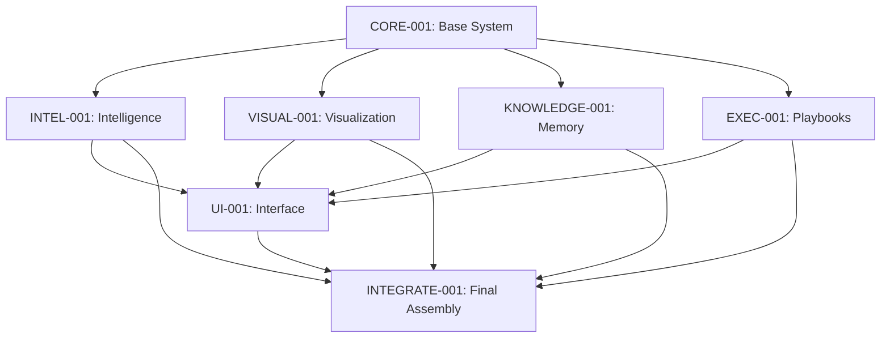

**DEVELOPMENT STRATEGY**:

- **Parallel Track A**: CORE-001 (foundation) must complete first
- **Parallel Track B**: INTEL-001, VISUAL-001, KNOWLEDGE-001, EXEC-001 (independent, can run simultaneously after CORE)
- **Parallel Track C**: UI-001 (can develop mock interface during Track B)
- **Sequential**: INTEGRATE-001 (requires all modules complete)

---

# PART C: MODULE SPECIFICATIONS

---

## MODULE: CORE-001

## Base Scraping & Summary Generation System

**STATUS**: Foundation Module - Must Complete First
**DEPENDENCIES**: None (uses existing scraper codebase)
**ESTIMATED EFFORT**: 40 hours
**PARALLEL COMPATIBLE**: No (foundation for all other modules)

### CORE-001.1 Functional Requirements

#### Input Contract

```python
class ScrapeRequest:
    urls: List[str]                    # YouTube URLs
    output_directory: Path             # Base output path
    enable_summaries: bool = True      # Generate summaries flag
    enable_synthesis: bool = True      # Generate synthesis flag
    analysis_mode: str = "developer"   # "quick" | "developer" | "research"
```

#### Output Contract

```python
class ScrapeResult:
    transcripts: List[TranscriptFile]
    summaries: List[SummaryFile]
    synthesis: Optional[SynthesisFile]
    errors: List[ErrorLog]
    metadata: ScrapeMeta
```

#### Core Functions

**Function 1: Enhanced Transcript Extraction**

```python
def scrape_transcript(url: str) -> TranscriptData:
    """
    Extract transcript with enhanced metadata
    
    Returns:
        TranscriptData(
            text: str,                      # Full transcript
            title: str,
            channel: str,
            upload_date: datetime,
            duration: int,                   # seconds
            view_count: int,
            description: str,                # NEW: video description
            tags: List[str],                 # NEW: video tags
            chapters: List[Chapter],         # NEW: chapter timestamps
            mentioned_tools: List[str],      # NEW: AI tools mentioned
            mentioned_versions: Dict[str, str]  # NEW: version numbers
        )
    """
```

**Function 2: Individual Summary Generation**

```python
def generate_summary(
    transcript: TranscriptData,
    mode: str = "developer"
) -> SummaryData:
    """
    Generate actionable summary with mode-specific focus
    
    Modes:
        - "quick": 10-15 items, basic extraction ($0.15)
        - "developer": 15-20 items + playbooks ($0.30)
        - "research": 20-25 items + deep analysis ($0.50)
    
    Returns:
        SummaryData(
            notable_items: List[NotableItem],      # 15-20 items
            key_insights: str,                     # 2-3 paragraphs
            extracted_prompts: List[PromptTemplate],  # NEW
            extracted_commands: List[Command],     # NEW
            tool_mentions: Dict[str, Context],     # NEW
            complexity_score: float,               # NEW: 0-1 difficulty
            implementation_time: int,              # NEW: estimated minutes
            prerequisites: List[str]               # NEW
        )
    """
```

**Function 3: Comprehensive Synthesis**

```python
def generate_synthesis(
    summaries: List[SummaryData],
    transcripts: Optional[List[TranscriptData]] = None
) -> SynthesisData:
    """
    Cross-video synthesis with pattern detection
    
    Returns:
        SynthesisData(
            executive_summary: str,
            chronological_timeline: List[Event],
            thematic_clusters: Dict[str, List[Item]],
            cross_video_patterns: List[Pattern],
            contradictions: List[Contradiction],
            tool_comparison_matrix: DataFrame,      # NEW
            workflow_diagrams: List[MermaidDiagram],  # NEW
            learning_path: LearningPath,            # NEW
            recommendations: List[Recommendation]
        )
    """
```

### CORE-001.2 Enhanced Prompt Templates

#### Summary Generation Prompt v2.0

```
SYSTEM ROLE:
You are a technical research analyst specializing in extracting ACTIONABLE implementation guidance from AI development tutorials. Your summaries are used to build AI applications with Claude Code, Cursor, and AI CLIs.

CRITICAL CONTEXT:
- User is a hands-on developer, not a passive learner
- Every insight must answer: "What do I DO with this?"
- Prioritize copy-paste ready code, commands, prompts
- Extract exact technical specifications (versions, endpoints, file paths)
- Focus on VIDEO-SPECIFIC insights (not general knowledge)

ANALYSIS MODE: {mode}
- quick: Extract 10-15 highest-value items, basic format
- developer: Extract 15-20 items + executable playbooks + prompt templates
- research: Extract 20-25 items + deep analysis + comparative context

INPUT TRANSCRIPT:
{transcript_text}

VIDEO METADATA:
- Title: {video_title}
- Channel: {channel_name}
- Upload Date: {upload_date}
- Duration: {duration}
- Views: {view_count}
- Description: {description}
- Tags: {tags}
- Tools Mentioned: {mentioned_tools}

OUTPUT STRUCTURE:

# Summary: {video_title}

**Source**: {channel} | {upload_date} | {duration} | {view_count} views
**Complexity**: [Beginner/Intermediate/Advanced]
**Implementation Time**: [15min/2hr/1day]
**Prerequisites**: {list}

---

## {15-20} Notable Items

[For EACH item, use this structure:]

### {N}. **{Clear Title}** [{Tag: Protocol|Command|Tool|Pattern|Warning}]
**Implementation Time**: [5min/30min/2hr]
**Readiness**: [✅ Ready | ⚠️ Needs Setup | 🔬 Experimental]

{2-4 sentences explaining the insight}

**How to Implement**:
1. {Specific step with exact command/code}
2. {Verification step: "Expected output: ..."}
3. {Common error + fix}

**Code/Command** (if applicable):
```language
{exact copy-paste ready code}
```

**Source Timestamp**: {MM:SS} (for reference)

---

## Extracted Prompts & Templates

[For any prompts mentioned in video:]

### Prompt: {Purpose}

```
{Exact prompt text from video}
```

**Variables to Customize**: [{var1}, {var2}]
**Context**: {When to use this}

---

## Extracted Commands & CLI Usage

[For any commands shown:]

### Command: {Purpose}

```bash
{exact command}
```

**Prerequisites**: {what must be installed}
**Flags Explained**:

- `--flag`: {what it does}

---

## Tool Specifications

[For each tool mentioned:]

### {Tool Name} v{version}

- **Purpose**: {what it does}
- **Setup Complexity**: [Easy/Moderate/Complex]
- **Cost**: [Free/Paid/API costs]
- **Installation**: `{command}`
- **Mentioned At**: {timestamp}

---

## Key Insights & Strategic Takeaways

{2-3 paragraph synthesis}

**Most Important Implementation**:
{Single most valuable takeaway from this video}

**How This Complements Other Approaches**:
{Comparison to common practices if mentioned}

**Red Flags / Anti-Patterns**:
{What NOT to do based on video guidance}

---

EXTRACTION PRIORITIES (in order):

1. **Executable Protocols**: Step-by-step workflows with verification
2. **Copy-Paste Ready Code**: Actual code shown in video (verbatim)
3. **CLI Commands**: Exact commands with flag explanations
4. **Prompt Templates**: Full prompts for Claude/GPT shown in video
5. **Tool Configurations**: API keys, environment setup, file structures
6. **Version Specifics**: Exact versions, deprecation warnings
7. **Performance Data**: Benchmarks, scores, cost comparisons
8. **Error Solutions**: Common errors mentioned + fixes
9. **Workflow Decisions**: When to use X vs Y frameworks
10. **Best Practices**: Optimization strategies with reasoning

AVOID:

- Marketing fluff or sponsor content
- General concepts already widely known
- Vague advice without implementation details
- Redundant items (combine similar protocols)
- Theoretical explanations without practical application

SPECIAL EXTRACTIONS:

- If video shows file structure, recreate as tree diagram
- If video shows a directory layout, capture exact paths
- If video mentions "this broke in version X", flag prominently
- If video compares tools, create comparison table
- If video shows error messages, capture exact text

QUALITY CHECKS:

- Every item must have actionable "How to Implement" section
- Code blocks must be complete and copy-paste ready
- Commands must include prerequisites
- Prompts must be verbatim from video (no paraphrasing)
- Timestamps must be included for verification

FORMAT: Output as markdown following structure above

```

#### Synthesis Generation Prompt v2.0
```

SYSTEM ROLE:
You are a senior technical architect synthesizing AI development implementation guidance from multiple tutorial sources. Your synthesis creates a strategic implementation guide for building AI applications.

CRITICAL OBJECTIVES:

1. Reveal META-PATTERNS visible only across multiple sources
2. Build COMPLETE WORKFLOWS by combining partial info from different videos
3. Create DECISION FRAMEWORKS (when to use X vs Y)
4. Identify EVOLUTION of practices (how approaches changed over time)
5. Generate EXECUTABLE LEARNING PATH (ordered by dependencies)
6. Provide ROI ANALYSIS (time saved vs implementation cost)

INPUT SUMMARIES:
{summary_1}
---

{summary_2}
---

[...all summaries...]

METADATA:

- Total Videos: {n}
- Date Range: {earliest} to {latest}
- Total Views: {sum_views}
- Channels: {unique_channels}
- Dominant Topics: {auto_detected_keywords}

OUTPUT STRUCTURE:

# Comprehensive Synthesis: {project_name}

## AI Development Intelligence Report from {n} Video Sources

**Generated**: {today}
**Sources**: {n} videos spanning {date_range}
**Total Research Hours**: {sum_durations}
**Aggregate Views**: {sum_views}
**Primary Technologies**: {tool_list}

---

## 📊 Executive Dashboard

**Technology Maturity**:

- Stable Tools: {list tools mentioned 5+ times}
- Emerging Tools: {list tools mentioned 1-2 times}
- Deprecated Warnings: {list obsolete approaches}

**Implementation Readiness**:

- ✅ Ready Now: {count items marked ready}
- ⚠️ Needs Setup: {count items needing prerequisites}
- 🔬 Experimental: {count cutting-edge items}

**Estimated ROI**:

- Total Implementation Time: {hours}
- Estimated Time Savings: {hours/week}
- Break-even: {weeks}

---

## 🎯 Your Personalized Learning Path

[This is the MOST IMPORTANT section - detailed ordering by dependencies]

### Phase 1: Foundation (Week 1)

**Goal**: Set up development environment with core tools
**Time**: 4-6 hours
**Prerequisites**: None

#### Task 1.1: Environment Setup

- [ ] Install {tool} v{version} (Video {n}, {timestamp})
- [ ] Configure {config_file} with settings from Video {x}
- [ ] Verify with: `{test_command}` → Expected: {output}
- **Why This First**: Required for 85% of later protocols

#### Task 1.2: Core MCP Installation

- [ ] {specific steps extracted from multiple videos}
- **Combines Best Of**: Video 2's setup + Video 5's troubleshooting
- **Common Pitfall**: {error} → Fix: {solution from Video 8}

[Continue with ordered tasks...]

### Phase 2: Integration (Week 2)

**Goal**: Connect tools into working workflows
**Time**: 6-8 hours
**Prerequisites**: Phase 1 complete, API keys obtained

[Detailed tasks...]

### Phase 3: Optimization (Week 3+)

**Goal**: Implement advanced patterns and optimizations
**Time**: Ongoing
**Prerequisites**: Phase 2 complete, 2+ working projects

[Detailed tasks...]

---

## 🏗️ Complete Implementation Playbooks

[For each major workflow mentioned across videos, create COMPLETE guide]

### Playbook 1: {Workflow Name}

**Source Videos**: {list videos that contributed}
**Complexity**: [Beginner/Intermediate/Advanced]
**Time to Complete**: {hours}
**Business Value**: {time saved per use}

**Prerequisites**:

- [ ] {item} - Install: `{command}`
- [ ] {item} - From Video {n}

**Step-by-Step Implementation**:

#### Step 1: {Action}

```bash
{exact command from Video X}
```

**What This Does**: {explanation}
**Expected Output**:

```
{example output}
```

**If You See Error**: "{error message}" → {solution from Video Y}

#### Step 2: {Action}

[Combines approach from Video A with refinement from Video B]

**Create File**: `{path/to/file}`

```language
{complete code synthesized from multiple sources}
```

[Continue with complete workflow...]

**Verification**:

- [ ] Run: `{test_command}`
- [ ] Expected result: {description}
- [ ] Troubleshooting: {common issues + fixes}

**Optimization Tips** (from multiple sources):

- {Tip from Video 3}: {explanation}
- {Tip from Video 7}: {explanation}

---

## 📚 Master Prompt Library

[Synthesize ALL prompts mentioned across videos]

### Category: Agent Setup Prompts

#### Prompt: Agentic Coding Setup (Synthesized Best Practice)

**Source**: Combined from Video 2, Video 5, Video 9
**Use Case**: Initial Claude Code agent configuration

```
{Synthesized prompt combining best elements from multiple videos}

Variables:
- {var1}: {explanation + example}
- {var2}: {explanation + example}
```

**Evolution Notes**:

- Video 2 (April): Used approach A
- Video 5 (June): Refined with technique B
- Video 9 (Oct): Current best practice is C
- **Recommendation**: Use Video 9's approach (most recent + proven)

[Continue for all prompt categories...]

---

## 🔀 Technology Decision Matrix

[For every "Tool X vs Tool Y" comparison across videos]

### Decision: Claude Code vs Cursor vs Windsurf

| Feature | Claude Code | Cursor | Windsurf |
|---------|-------------|--------|----------|
| MCP Support | ✅ Native (Video 2,5,8) | ⚠️ Limited (Video 3) | ❌ None (Video 7) |
| Cost | $20/mo (Video 2) | $20/mo (Video 3) | Free (Video 7) |
| Agentic Workflows | ✅✅ (SWE-bench 82%) | ⚠️ Basic | ❌ Manual only |
| Learning Curve | Moderate (Video 5) | Easy (Video 3) | Easy (Video 7) |
| Multi-file Edits | ✅ (Video 8) | ⚠️ Limited (Video 3) | ⚠️ Clunky (Video 7) |

**Synthesis Recommendation**:
Based on {n} video comparisons:

- **Use Claude Code if**: {specific criteria from videos}
- **Use Cursor if**: {specific criteria from videos}
- **Use Windsurf if**: {specific criteria from videos}

**Version Notes**:

- Claude Code 2.0 (Oct) significantly improved over 1.x (Videos 2 vs 8)
- Cursor composition feature (Video 3) still experimental as of {date}

[Continue for all tool comparisons...]

---

## 🔗 Cross-Video Pattern Analysis

[Identify patterns ONLY visible when viewing multiple videos together]

### Pattern 1: MCP Security Evolution

**Observation Across {n} Videos**:

- **April Videos (1,2)**: No mention of security concerns
- **June Videos (4,5)**: Beginners started raising security questions
- **October Videos (8,9,10)**: Advanced users implementing sandboxing

**What This Reveals**:
Community maturity increased significantly. Early adopters focused on functionality,
later adopters prioritized security. Current best practice (Video 9): {approach}

**Your Action**:
If you're just starting, implement security from Day 1 using approach from Video 9.
Don't follow early videos' permissive configurations.

### Pattern 2: Cost Optimization Convergence

**Extracted from Videos {list}**:
All advanced users converged on similar cost optimization:

1. {Technique mentioned in 5+ videos}
2. {Technique mentioned in 4+ videos}
3. {Technique mentioned in 3+ videos}

**Meta-Learning**: When 70%+ of sources agree on optimization, it's proven best practice.

[Continue with all identified patterns...]

---

## 📊 Visual Synthesis Diagrams

### Technology Evolution Timeline

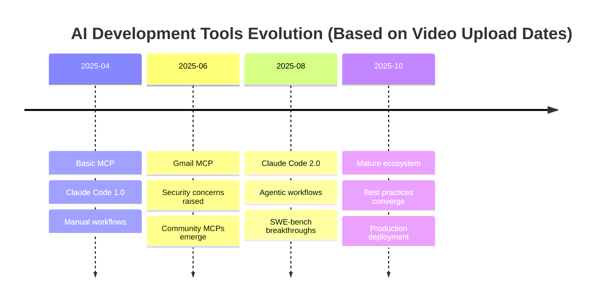

### Master Workflow Architecture

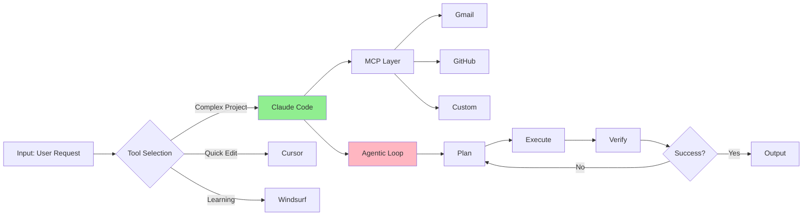

### Tool Comparison Spider Chart

[If multiple videos mention comparative metrics, generate:]

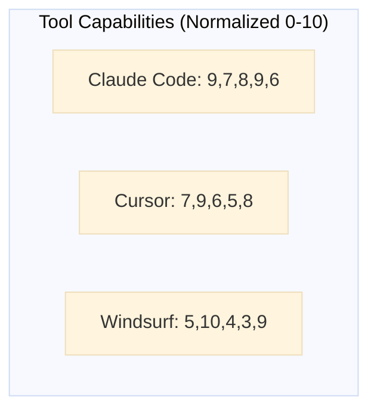

[Axes: MCP Support, Ease of Use, Agentic Workflows, Cost Efficiency, Community Support]

---

## ⚠️ Consolidated Warning Log

[Every error, pitfall, anti-pattern mentioned across ALL videos]

### Critical Warnings (Mentioned 3+ times)

#### Warning 1: {Issue Description}

**Videos Mentioning**: {2, 5, 8, 10}
**Severity**: 🔴 High - Can cause data loss
**Context**: When implementing {specific workflow}
**Error Message**:

```
{exact error text from video}
```

**Solution** (Best approach synthesized):
{Combines fix from Video 5 with prevention from Video 8}

### Common Pitfalls (Mentioned 2 times)

[Continue with all warnings organized by severity...]

---

## 💰 ROI Analysis & Prioritization

[For every protocol/tool mentioned, calculate value]

### High-ROI Implementations (Do These First)

#### 1. Gmail MCP Setup

**Implementation Time**: 45 minutes (Videos 2, 7)
**Time Savings**: 2 hours/week (email automation)
**Annual Savings**: 104 hours
**ROI**: 139x first year
**Complexity**: ⚠️ Moderate (requires API setup)
**Recommendation**: ✅ Implement in Week 1, Phase 2

#### 2. Claude Code Agentic Workflow

**Implementation Time**: 3 hours (Videos 5, 8, 9)
**Time Savings**: 5 hours/week (automated coding tasks)
**Annual Savings**: 260 hours
**ROI**: 87x first year
**Complexity**: 🔬 Advanced (requires Phase 1 complete)
**Recommendation**: ✅ Implement in Week 2, Phase 3

[Continue with all implementations ranked by ROI...]

### Low-ROI or Experimental (Defer or Skip)

#### {Protocol Name}

**Why Low Priority**:

- Only mentioned in 1 video (not proven)
- Experimental flag raised in Video {n}
- Requires 10+ hours setup for minimal gain
- Better alternatives exist (see {other protocol})

---

## 🔄 Version & Deprecation Tracker

[Track every version number and deprecation warning mentioned]

### Currently Stable

| Tool | Version | Status | Source Videos |
|------|---------|--------|---------------|
| Claude Code | 2.0 | ✅ Stable, Current | 8, 9, 10 |
| MCP Protocol | 1.0 | ✅ Stable | All videos |
| Gmail MCP | 0.3.1 | ⚠️ Works, beta | 2, 7 |

### Deprecated / Avoid

| Tool/Approach | Deprecated In | Replacement | Videos |
|---------------|---------------|-------------|--------|
| Claude Code 1.x | Oct 2025 | 2.0 | 8 mentions "don't use 1.x" |
| Manual git MCP | June 2025 | Integrated git | 5 shows new approach |

### Version-Specific Notes

**Claude Code 1.x → 2.0 Migration**:

- Breaking changes: {list from Video 8}
- Migration guide: {synthesized from Videos 8,9}
- Timeline: Upgrade by {date} (official deprecation from Video 9)

---

## 🎭 Contradictions & Expert Opinions

[Where videos disagree, present both sides with context]

### Contradiction 1: MCP Security Approach

**Camp A (Videos 2, 3)**: "Approve all MCPs, trust ecosystem"

- Argument: Speeds development, ecosystem is small/trustworthy
- Representative: {Channel names}
- Date Context: April-May 2025 (early days)

**Camp B (Videos 8, 9, 10)**: "Sandbox MCPs, audit permissions"

- Argument: Production safety, potential supply chain attacks
- Representative: {Channel names}
- Date Context: Sept-Oct 2025 (mature ecosystem)

**Meta-Analysis**:
This reveals ecosystem maturity evolution. Early adopters prioritized velocity,
later adopters prioritized security as stakes increased.

**Recommendation for YOU**:
Use Camp B's approach (Videos 8,9,10). Security concerns are now validated,
and sandboxing tools are available (didn't exist during Camp A's timeframe).

**Decisive Evidence**: Video 9 shows actual supply chain incident (timestamp {XX:XX})

[Continue with all contradictions...]

---

## 🔗 Complete References

### Source Videos

| # | Title | Channel | Date | Views | Key Topics | Summary Link |
|---|-------|---------|------|-------|------------|--------------|
| 1 | {title} | {channel} | {date} | {views} | {topics} | [01_SUMMARY.md](#) |
| 2 | {title} | {channel} | {date} | {views} | {topics} | [02_SUMMARY.md](#) |
[...all videos...]

### Cross-Reference Index

**By Topic**:

- **MCP Setup**: Videos 1, 2, 5, 7, 9
- **Claude Code**: Videos 2, 5, 8, 9, 10
- **Gmail Automation**: Videos 2, 3, 7
- **Security**: Videos 8, 9, 10
[...all topics...]

**By Tool**:

- **Claude Code**: Mentioned in videos {list}
- **Cursor**: Mentioned in videos {list}
- **Windsurf**: Mentioned in videos {list}
[...all tools...]

---

## 📝 Implementation Tracking Template

[Save this section to separate file for user to maintain]

### My Implementation Journal

#### {Date}: {Protocol Name}

**Source**: Video {n}, timestamp {XX:XX}
**Status**: ✅ Complete | ⏳ In Progress | ❌ Blocked

**What I Did**:
{User's notes}

**What Worked**:
{User's learnings}

**What Didn't Work**:
{User's failures and fixes}

**Time Taken**: {actual time vs. estimated}

**Would I Recommend**: Yes/No
**Notes for Future**: {user wisdom}

---

SYNTHESIS QUALITY CHECKLIST:

✅ Executive dashboard with quantitative metrics
✅ Learning path with clear dependencies and ordering
✅ Complete playbooks combining multiple sources
✅ Master prompt library with all prompts extracted
✅ Decision matrices for tool selection
✅ Cross-video pattern analysis (meta-insights)
✅ Visual diagrams (timeline, architecture, comparisons)
✅ Consolidated warning log with all pitfalls
✅ ROI analysis with prioritization
✅ Version tracking with deprecation warnings
✅ Contradictions analyzed with recommendations
✅ Complete references with cross-indexing
✅ Implementation journal template

META-ANALYSIS REQUIREMENTS:

1. TEMPORAL PATTERNS: How did practices evolve over time?
2. CONVERGENCE ANALYSIS: What do 70%+ sources agree on?
3. CONTRADICTION RESOLUTION: Where videos disagree, which is right and why?
4. COMPLETENESS GAPS: What Video A starts, Video B continues, Video C completes?
5. ECOSYSTEM MATURITY: How did community sophistication change?
6. PROVEN vs EXPERIMENTAL: What's battle-tested vs. cutting-edge?

OUTPUT FORMAT: Markdown with Mermaid diagrams as specified above

```

### CORE-001.3 File Structure & Naming

```

{output_directory}/
├── 00_TRANSCRIPTS/
│   ├── Video1_Title_Channel_2025-10-06.md
│   ├── Video2_Title_Channel_2025-10-05.md
│   └── ...
│
├── 01_SUMMARIES/
│   ├── 01_Video1_Title_Channel_SUMMARY.md
│   ├── 02_Video2_Title_Channel_SUMMARY.md
│   └── ...
│
├── 02_SYNTHESIS/
│   ├── 00_COMPREHENSIVE_SYNTHESIS.md
│   ├── 01_LEARNING_PATH.md                    # NEW: Extracted learning path
│   ├── 02_VISUAL_DIAGRAMS.md                  # NEW: All mermaid diagrams
│   ├── 03_TOOL_COMPARISON_MATRIX.md           # NEW: Decision matrices
│   └── 04_WARNING_LOG.md                      # NEW: Consolidated warnings
│
├── 03_PLAYBOOKS/                              # NEW: Executable guides
│   ├── 01_Gmail_MCP_Setup.md
│   ├── 02_Claude_Code_Agentic_Workflow.md
│   └── ...
│
├── 04_PROMPTS/                                # NEW: Template library
│   ├── agent_setup_prompts.md
│   ├── gmail_automation_prompts.md
│   └── ...
│
├── 05_KNOWLEDGE_BASE/                         # NEW: Persistent memory
│   ├── _MASTER_KNOWLEDGE.md                   # Deduplicated learnings
│   ├── _IMPLEMENTATION_JOURNAL.md             # User's progress
│   └── _TOOL_REGISTRY.md                      # All tools encountered
│
└── _META/                                     # NEW: System files
    ├── scrape_log.json
    ├── cost_tracker.json
    └── version_tracker.json

```

### CORE-001.4 API Specifications

#### API: Scraper Core
```python
class YouTubeScraperCore:
    """Foundation scraping engine with enhanced analysis"""
    
    def scrape_videos(
        self,
        urls: List[str],
        output_dir: Path,
        config: ScrapeConfig
    ) -> ScrapeResult:
        """
        Main scraping orchestrator
        
        Args:
            urls: YouTube video URLs
            output_dir: Base directory for all outputs
            config: Configuration with feature flags
            
        Returns:
            ScrapeResult with transcripts, summaries, synthesis
        """
        
    def extract_transcript(self, url: str) -> TranscriptData:
        """Extract transcript with enhanced metadata"""
        
    def generate_summary(
        self, 
        transcript: TranscriptData,
        mode: AnalysisMode
    ) -> SummaryData:
        """Generate actionable summary"""
        
    def generate_synthesis(
        self,
        summaries: List[SummaryData]
    ) -> SynthesisData:
        """Generate comprehensive synthesis"""
```

#### API: GPT-4 Interface

```python
class GPT4Interface:
    """Abstraction for GPT-4 API calls"""
    
    def summarize(
        self,
        transcript: str,
        metadata: dict,
        mode: str
    ) -> str:
        """Generate summary via GPT-4"""
        
    def synthesize(
        self,
        summaries: List[str],
        metadata: dict
    ) -> str:
        """Generate synthesis via GPT-4"""
        
    def estimate_cost(
        self,
        input_tokens: int,
        output_tokens: int
    ) -> float:
        """Calculate API cost"""
```

### CORE-001.5 Testing Requirements

**Unit Tests**:

```python
def test_transcript_extraction():
    """Verify transcript extraction with metadata"""
    
def test_summary_generation_quick_mode():
    """Verify quick mode generates 10-15 items"""
    
def test_summary_generation_developer_mode():
    """Verify developer mode generates 15-20 items + playbooks"""
    
def test_synthesis_generation():
    """Verify synthesis combines multiple summaries"""
    
def test_file_structure_creation():
    """Verify all directories and files created correctly"""
```

**Integration Tests**:

```python
def test_full_scrape_pipeline():
    """End-to-end test: URLs → all outputs generated"""
    
def test_error_handling_api_failure():
    """Verify graceful degradation on GPT-4 failure"""
    
def test_cost_estimation_accuracy():
    """Verify cost estimates within 20% of actual"""
```

### CORE-001.6 Acceptance Criteria

- [ ] Scrape 10 videos successfully
- [ ] Generate summaries with 15-20 items each (developer mode)
- [ ] Generate comprehensive synthesis
- [ ] Create all directory structures
- [ ] Extract prompts from videos into separate files
- [ ] Extract CLI commands into structured format
- [ ] Handle API failures gracefully
- [ ] Cost estimation accurate within 20%
- [ ] Processing time < 5 minutes for 10 videos

---

## MODULE: INTEL-001

## Intelligence & Smart Analysis Layer

**STATUS**: Can run parallel with VISUAL-001, KNOWLEDGE-001, EXEC-001
**DEPENDENCIES**: CORE-001 (requires SummaryData structure)
**ESTIMATED EFFORT**: 30 hours
**PARALLEL COMPATIBLE**: Yes

### INTEL-001.1 Functional Requirements

#### Sub-Module 1: Implementation Readiness Scorer

```python
class ReadinessScorer:
    """
    Scores each notable item for implementation readiness
    """
    
    def score_item(self, item: NotableItem) -> ReadinessScore:
        """
        Score item on multiple dimensions
        
        Returns:
            ReadinessScore(
                status: ReadinessStatus,      # READY | NEEDS_SETUP | EXPERIMENTAL
                complexity: float,             # 0-1 (0=trivial, 1=expert)
                setup_time: int,               # minutes
                prerequisites: List[str],      # what's needed first
                confidence: float,             # 0-1 (how sure we are)
                blockers: List[str]           # what prevents implementation
            )
        """
        
    def analyze_prerequisites(self, item: NotableItem) -> List[Prerequisite]:
        """Identify what must be done before this item"""
        
    def detect_complexity(self, item: NotableItem) -> float:
        """Estimate complexity using multiple signals"""
```

**Scoring Algorithm**:

```
Factors for Readiness Status:

READY ✅:
- No prerequisites mentioned
- Code is copy-paste ready
- No API keys or external services needed
- Marked as "basic" or "simple" in transcript
- No version/compatibility warnings

NEEDS_SETUP ⚠️:
- Requires API key setup
- Needs installation of tools
- Requires configuration file changes
- Mentions "first you need to..."
- Prerequisites explicitly listed

EXPERIMENTAL 🔬:
- Contains words: "experimental", "beta", "unstable"
- Version number < 1.0
- Caveats mentioned ("this might not work")
- "I'm still testing this"
- No verification shown in video

Complexity Score (0-1):
- 0.0-0.3: Beginner (copy-paste, 1-2 steps)
- 0.3-0.6: Intermediate (5-10 steps, some debugging)
- 0.6-1.0: Advanced (architecture changes, multi-file)

Signals for complexity:
- Number of steps in implementation
- Number of files to create/modify
- Number of tools that must interact
- Presence of error handling
- Length of code snippets
- Technical jargon density
```

#### Sub-Module 2: ROI Calculator

```python
class ROICalculator:
    """
    Calculate return on investment for each implementation
    """
    
    def calculate_roi(
        self,
        item: NotableItem,
        readiness: ReadinessScore
    ) -> ROIMetrics:
        """
        Calculate ROI based on time savings and costs
        
        Returns:
            ROIMetrics(
                implementation_time: int,      # hours to implement
                time_saved_per_use: int,       # minutes saved per use
                use_frequency: str,            # "daily" | "weekly" | "monthly"
                annual_time_savings: int,      # hours saved per year
                cost: float,                   # $ cost (API, tools, etc.)
                roi_score: float,              # (savings - cost) / implementation_time
                breakeven_period: int,         # weeks until positive ROI
                recommendation: str            # HIGH | MEDIUM | LOW priority
            )
        """
        
    def estimate_time_savings(self, item: NotableItem) -> int:
        """
        Use GPT-4 to estimate time savings based on item description
        
        Prompt: "This protocol automates {X}. Estimate time saved per use."
        """
        
    def estimate_costs(self, item: NotableItem) -> float:
        """Calculate API costs, tool subscriptions, etc."""
```

**ROI Scoring Logic**:

```
Time Savings Estimation:
- Look for automation keywords: "automates", "no longer need to"
- Look for manual process descriptions: "instead of manually..."
- Extract time mentions: "saves 2 hours", "takes 5 minutes instead of 30"
- Use GPT-4 for estimation if not explicit

Use Frequency Detection:
- Daily: "every time you...", "whenever you code"
- Weekly: "weekly reports", "sprint planning"
- Monthly: "monthly analysis", "rarely need this"

ROI Calculation:
annual_savings = time_saved_per_use * frequency_per_year
cost = implementation_time_cost + api_costs + tool_subscriptions
roi_score = (annual_savings - cost) / implementation_time

Recommendation:
- HIGH: ROI > 50x, breakeven < 2 weeks
- MEDIUM: ROI 10-50x, breakeven < 2 months
- LOW: ROI < 10x, breakeven > 2 months
```

#### Sub-Module 3: Learning Path Generator

```python
class LearningPathGenerator:
    """
    Creates ordered implementation sequence based on dependencies
    """
    
    def generate_path(
        self,
        summaries: List[SummaryData],
        user_profile: Optional[UserProfile] = None
    ) -> LearningPath:
        """
        Generate phased learning path with dependency ordering
        
        Returns:
            LearningPath(
                phases: List[LearningPhase],
                total_time: int,               # hours
                roadmap: MermaidDiagram,
                quick_wins: List[Item],        # High ROI, low complexity
                foundational: List[Item],      # Required for later items
                advanced: List[Item]          # Requires phase 1+2 complete
            )
        """
        
    def detect_dependencies(
        self,
        items: List[NotableItem]
    ) -> DependencyGraph:
        """
        Build dependency graph from prerequisites and mentions
        
        Logic:
        - If Item B mentions "requires X from Item A" → A before B
        - If Item B uses tool introduced in Item A → A before B
        - If Item B mentions "after setting up X" → find X, then B
        """
        
    def topological_sort(
        self,
        graph: DependencyGraph
    ) -> List[NotableItem]:
        """Order items by dependency chain"""
        
    def cluster_into_phases(
        self,
        sorted_items: List[NotableItem],
        readiness_scores: Dict[str, ReadinessScore]
    ) -> List[LearningPhase]:
        """
        Group into phases:
        - Phase 1: No dependencies + READY status
        - Phase 2: Depends on Phase 1 + NEEDS_SETUP
        - Phase 3: Advanced items + EXPERIMENTAL
        """
```

**Learning Path Structure**:

```markdown
# Your Personalized Learning Path

## Overview
- **Total Time**: {X} hours across {Y} weeks
- **Total Items**: {Z} implementations
- **Quick Wins**: {N} items with immediate value
- **Foundation Required**: {M} prerequisite items

## Phase 1: Foundation ({X} hours)
**Goal**: Establish core environment and tooling
**Prerequisites**: None
**Success Criteria**: Can run basic AI workflows

### Week 1: Environment Setup
- [ ] **Task 1.1**: Install Claude Code v2.0
      - Time: 30 min
      - Source: Video 8, 12:34
      - Readiness: ✅ READY
      - Why First: Required for 12 downstream items
      - Verify: Run `claude --version` → expect "2.0.0"

- [ ] **Task 1.2**: Configure MCP base
      - Time: 45 min
      - Source: Video 2, 5:20
      - Readiness: ⚠️ NEEDS_SETUP (API key required)
      - Blocker: Need Anthropic API key first
      - Steps: {detailed from playbook}

[Continue with all Phase 1 tasks...]

## Phase 2: Integration ({Y} hours)
**Goal**: Connect tools into workflows
**Prerequisites**: Phase 1 complete, API keys obtained
**Success Criteria**: Can automate common tasks

[Continue with ordered phases...]

## Dependency Roadmap

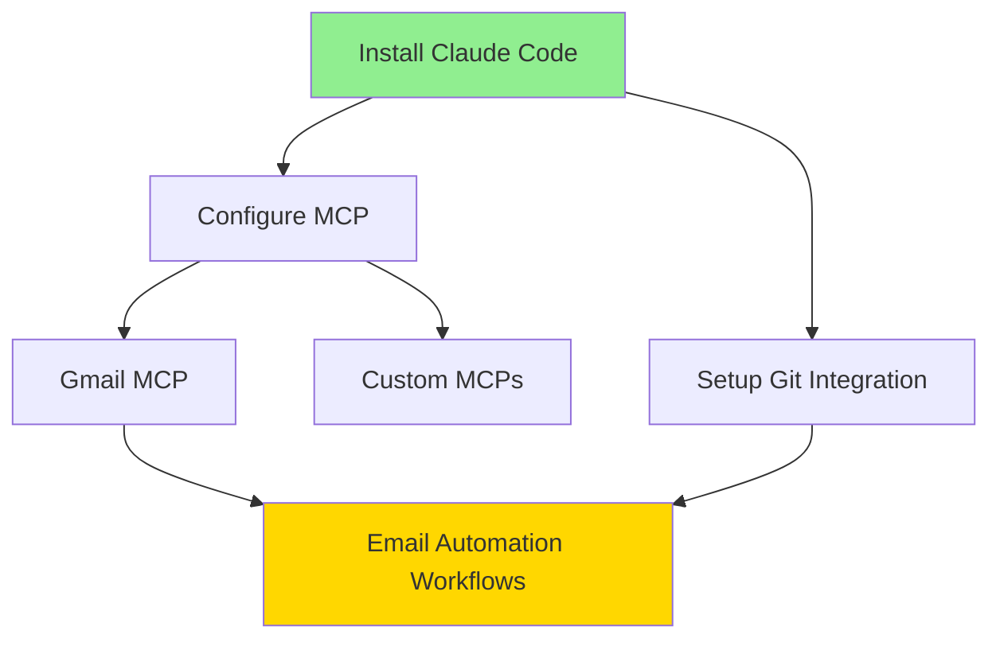

## Quick Wins (Implement First)

[High ROI, low complexity items regardless of dependency order]

1. **{Item Name}** (Video {n})
   - ROI: 89x
   - Time: 15 minutes
   - Immediate value: Saves 30min/day

```

#### Sub-Module 4: Technology Freshness Tracker

```python
class FreshnessTracker:
    """
    Tracks version changes and deprecation warnings
    """
    
    def analyze_freshness(
        self,
        item: NotableItem,
        metadata: VideoMetadata
    ) -> FreshnessReport:
        """
        Determine if item is current, outdated, or deprecated
        
        Returns:
            FreshnessReport(
                status: FreshnessStatus,       # CURRENT | AGING | OUTDATED
                video_age: int,                # days since upload
                version_mentioned: str,        # e.g., "1.5.0"
                latest_version: str,           # from external check
                deprecation_warnings: List[str],
                recommendation: str            # "Use as-is" | "Verify first" | "Don't use"
            )
        """
        
    def check_external_versions(self, tool_name: str) -> str:
        """
        Check GitHub/npm/PyPI for latest version
        (Optional: requires internet, may be disabled)
        """
        
    def detect_deprecation_signals(
        self,
        transcript: str,
        item: NotableItem
    ) -> List[str]:
        """
        Find deprecation warnings in transcript:
        - "no longer works"
        - "deprecated in version X"
        - "use Y instead"
        - "this broke in recent update"
        """
```

**Freshness Rules**:

```
Status Determination:

CURRENT ✅:
- Video < 90 days old
- No deprecation keywords found
- Version matches latest (if checkable)

AGING ⚠️:
- Video 90-180 days old
- No explicit deprecation but may need verification
- Version within 1 major release of latest

OUTDATED ❌:
- Video > 180 days old
- Deprecation keywords found
- Version 2+ major releases behind
- Another video explicitly supersedes this approach

Deprecation Keywords:
- "no longer", "deprecated", "don't use", "broken"
- "use X instead", "migration guide", "breaking change"
- "stopped working", "removed in version"
```

### INTEL-001.2 Integration Points

**Input from CORE-001**:

```python
# INTEL-001 receives from CORE-001
summaries: List[SummaryData]
synthesis: SynthesisData
```

**Output for UI-001**:

```python
# INTEL-001 provides to UI-001
intelligence_report = IntelligenceReport(
    readiness_scores: Dict[ItemID, ReadinessScore],
    roi_metrics: Dict[ItemID, ROIMetrics],
    learning_path: LearningPath,
    freshness_reports: Dict[ItemID, FreshnessReport]
)
```

**Files Generated**:

```
02_SYNTHESIS/
├── 05_INTELLIGENCE_REPORT.md
│   ├── Readiness Scores (all items)
│   ├── ROI Analysis (all items)
│   ├── Learning Path (phased)
│   └── Freshness Tracker (version warnings)
│
└── 06_PRIORITIZATION_DASHBOARD.md
    ├── Quick Wins (high ROI, low complexity)
    ├── High Priority (foundational items)
    ├── Medium Priority (build on foundation)
    └── Low Priority (low ROI or experimental)
```

### INTEL-001.3 Testing Requirements

```python
def test_readiness_scoring():
    """Verify items correctly categorized as READY/NEEDS_SETUP/EXPERIMENTAL"""
    
def test_roi_calculation():
    """Verify ROI scores match expected values for sample items"""
    
def test_learning_path_dependency_ordering():
    """Verify items ordered by dependency chain"""
    
def test_freshness_detection():
    """Verify deprecated items flagged correctly"""
    
def test_quick_wins_identification():
    """Verify high ROI + low complexity items identified"""
```

### INTEL-001.4 Acceptance Criteria

- [ ] All notable items scored for readiness
- [ ] ROI calculated for all items
- [ ] Learning path generated with 3+ phases
- [ ] Dependencies correctly identified and ordered
- [ ] Freshness status assigned to all items
- [ ] Quick wins list generated (top 5-10 items)
- [ ] Priority dashboard shows clear recommendations
- [ ] Intelligence report generated as markdown

---

## MODULE: VISUAL-001

## Visual Synthesis & Diagram Generation

**STATUS**: Can run parallel with INTEL-001, KNOWLEDGE-001, EXEC-001
**DEPENDENCIES**: CORE-001 (requires SynthesisData)
**ESTIMATED EFFORT**: 25 hours
**PARALLEL COMPATIBLE**: Yes

### VISUAL-001.1 Functional Requirements

#### Sub-Module 1: Mermaid Diagram Generator

```python
class MermaidGenerator:
    """
    Generates visual diagrams from synthesis data
    """
    
    def generate_timeline(
        self,
        summaries: List[SummaryData]
    ) -> str:
        """
        Create timeline showing technology evolution
        
        Returns: Mermaid timeline code
        """
        
    def generate_workflow_diagram(
        self,
        playbook: PlaybookData
    ) -> str:
        """
        Create flowchart for implementation workflow
        
        Returns: Mermaid flowchart code
        """
        
    def generate_architecture_diagram(
        self,
        tool_mentions: Dict[str, List[Context]]
    ) -> str:
        """
        Create architecture diagram showing tool relationships
        
        Returns: Mermaid graph code
        """
        
    def generate_dependency_graph(
        self,
        learning_path: LearningPath
    ) -> str:
        """
        Create dependency graph for learning path
        
        Returns: Mermaid graph code
        """
```

**Diagram Types**:

1. **Timeline Diagram**:

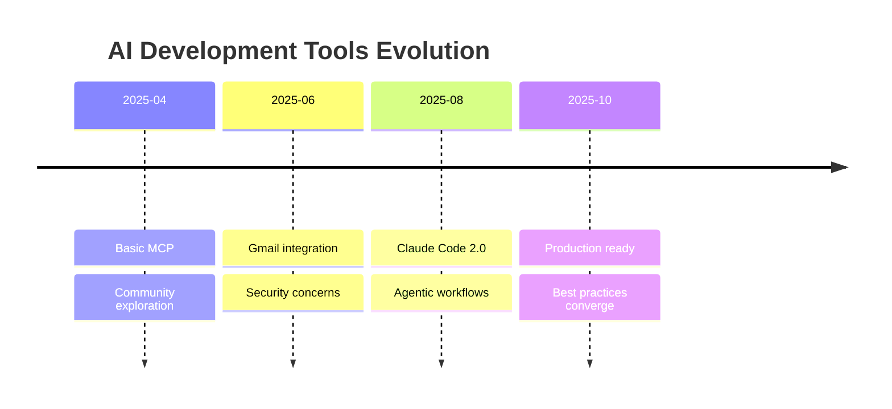

2. **Workflow Flowchart**:

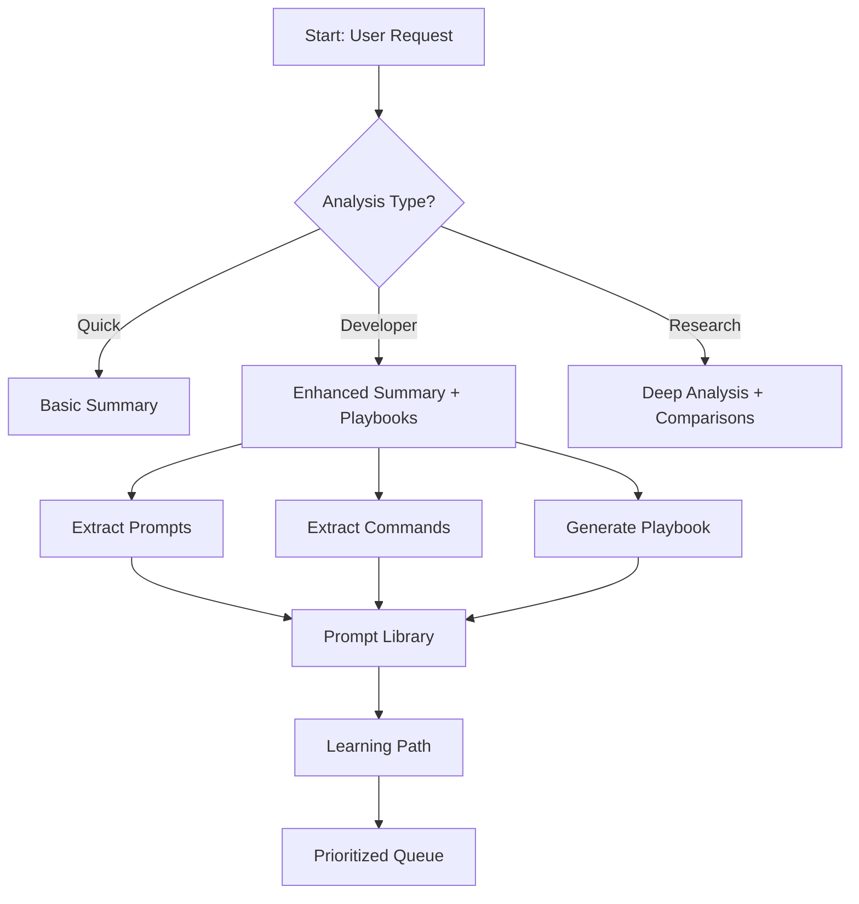

3. **Architecture Diagram**:

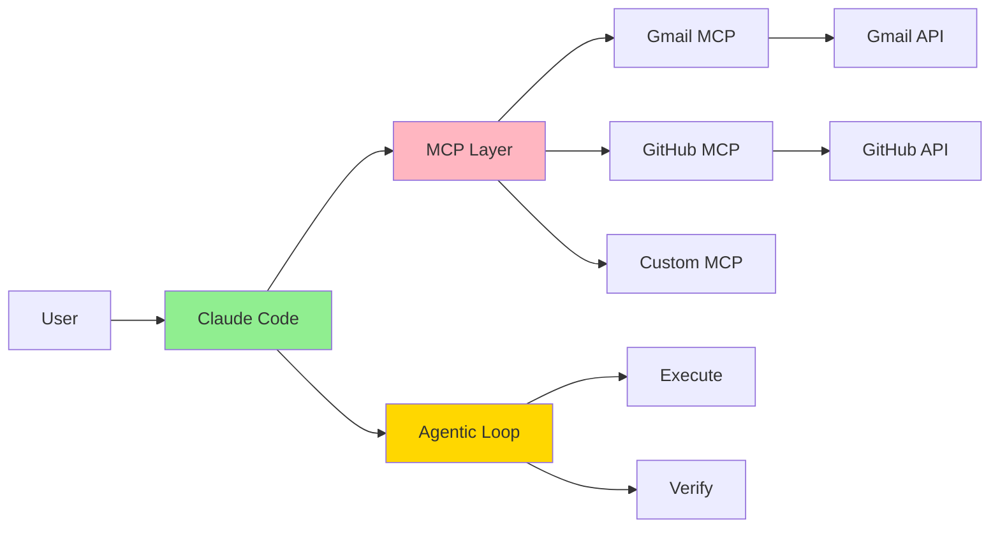

4. **Dependency Graph**:

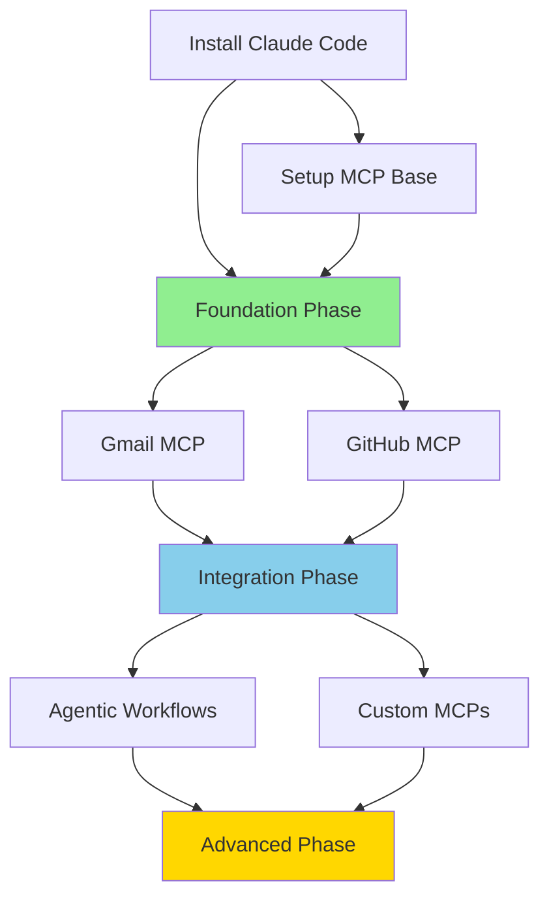

#### Sub-Module 2: Comparison Matrix Generator

```python
class ComparisonMatrixGenerator:
    """
    Generates tables comparing tools, approaches, versions
    """
    
    def generate_tool_comparison(
        self,
        tool_mentions: Dict[str, List[Context]]
    ) -> str:
        """
        Create comparison table for tools mentioned across videos
        
        Returns: Markdown table
        """
        
    def generate_approach_comparison(
        self,
        contradictions: List[Contradiction]
    ) -> str:
        """
        Create table showing different approaches to same problem
        
        Returns: Markdown table
        """
        
    def generate_version_comparison(
        self,
        version_tracker: Dict[str, List[Version]]
    ) -> str:
        """
        Create table showing version evolution
        
        Returns: Markdown table
        """
```

**Example Output**:

```markdown
## Tool Comparison Matrix

| Feature | Claude Code | Cursor | Windsurf | Winner |
|---------|-------------|--------|----------|--------|
| **MCP Support** | ✅ Native (Videos 2,5,8) | ⚠️ Limited (Video 3) | ❌ None | Claude Code |
| **Agentic Workflows** | ✅ Full (SWE-bench 82%) | ⚠️ Basic | ❌ Manual | Claude Code |
| **Cost** | $20/mo | $20/mo | Free | Windsurf |
| **Learning Curve** | ⚠️ Moderate | ✅ Easy | ✅ Easy | Cursor/Windsurf |
| **Multi-file Edits** | ✅ Excellent | ⚠️ Limited | ⚠️ Clunky | Claude Code |
| **Community** | ✅ Growing | ✅ Mature | ⚠️ Small | Cursor |

**Recommendation Based on Use Case**:
- **Production projects**: Claude Code (agentic capability + MCP)
- **Learning/prototyping**: Windsurf (free, easy)
- **Team collaboration**: Cursor (mature ecosystem)

**Version Notes**:
- Claude Code 2.0 (Oct 2025) significantly improved over 1.x
- Cursor composition mode still experimental
- Windsurf lacks agentic features (as of Oct 2025)

**Source Videos**: 2, 3, 5, 7, 8, 9, 10
```

#### Sub-Module 3: Visual Intelligence Dashboard

```python
class VisualDashboard:
    """
    Generates visual summary dashboard with key metrics
    """
    
    def generate_dashboard(
        self,
        summaries: List[SummaryData],
        intelligence: IntelligenceReport
    ) -> str:
        """
        Create visual dashboard with key metrics and charts
        
        Returns: Markdown with ASCII/Mermaid visualizations
        """
```

**Dashboard Output**:

```markdown
# 📊 Research Intelligence Dashboard

## At a Glance

```

Total Videos: 10              Complexity Distribution:
Total Duration: 2h 15m        ███████░░░ Beginner: 35%
Date Range: Apr - Oct 2025    ████████░░ Intermediate: 40%
Total Views: 1.4M             █████░░░░░ Advanced: 25%

Top Topics:                   Implementation Status:

1. Claude Code (8 mentions)   ✅ Ready: 45 items (60%)
2. MCP Protocol (10 mentions) ⚠️ Setup: 25 items (33%)
3. Gmail Automation (5)       🔬 Experimental: 5 items (7%)

```

## ROI Quick View

| Rank | Item | Time to Implement | Annual Savings | ROI |
|------|------|-------------------|----------------|-----|
| 1 | Gmail MCP | 45 min | 104 hrs | 139x |
| 2 | Claude Agent | 3 hrs | 260 hrs | 87x |
| 3 | Git Automation | 1 hr | 52 hrs | 52x |

## Technology Evolution

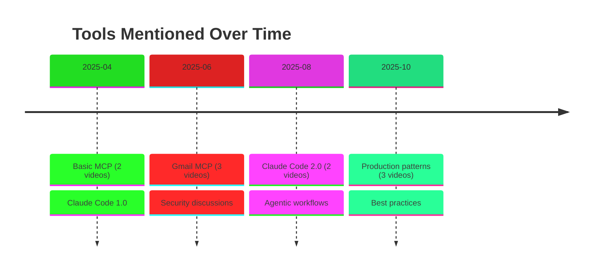

## Learning Path Overview

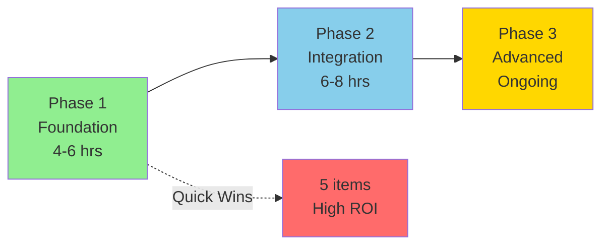

```

### VISUAL-001.2 Integration Points

**Input from CORE-001**:
```python
synthesis: SynthesisData
summaries: List[SummaryData]
```

**Input from INTEL-001** (optional, enhances visuals):

```python
intelligence_report: IntelligenceReport
learning_path: LearningPath
```

**Output Files**:

```
02_SYNTHESIS/
├── 02_VISUAL_DIAGRAMS.md
│   ├── Technology Evolution Timeline
│   ├── Workflow Flowcharts
│   ├── Architecture Diagrams
│   └── Dependency Graphs
│
├── 03_TOOL_COMPARISON_MATRIX.md
│   ├── Feature Comparison Tables
│   ├── Version Comparison Tables
│   └── Approach Comparison Tables
│
└── 07_VISUAL_DASHBOARD.md
    └── Metrics & Charts Overview
```

### VISUAL-001.3 Testing Requirements

```python
def test_mermaid_diagram_generation():
    """Verify Mermaid syntax is valid"""
    
def test_comparison_matrix_generation():
    """Verify tables have correct structure"""
    
def test_dashboard_generation():
    """Verify dashboard includes all sections"""
    
def test_diagram_rendering():
    """Verify diagrams render correctly in Markdown viewers"""
```

### VISUAL-001.4 Acceptance Criteria

- [ ] Timeline diagram generated showing technology evolution
- [ ] Workflow flowcharts generated for major playbooks
- [ ] Architecture diagram shows tool relationships
- [ ] Dependency graph matches learning path
- [ ] Comparison matrices generated for all tool mentions
- [ ] Dashboard includes key metrics and charts
- [ ] All Mermaid diagrams have valid syntax
- [ ] Visual outputs enhance understanding (user validation)

---

## MODULE: KNOWLEDGE-001

## Persistent Knowledge Base & Memory System

**STATUS**: Can run parallel with INTEL-001, VISUAL-001, EXEC-001
**DEPENDENCIES**: CORE-001 (requires SummaryData)
**ESTIMATED EFFORT**: 35 hours
**PARALLEL COMPATIBLE**: Yes

### KNOWLEDGE-001.1 Functional Requirements

#### Sub-Module 1: Master Knowledge Base Manager

```python
class KnowledgeBaseManager:
    """
    Maintains deduplicated master knowledge base across scrapes
    """
    
    def update_master_knowledge(
        self,
        new_summaries: List[SummaryData],
        existing_kb: KnowledgeBase
    ) -> KnowledgeBase:
        """
        Merge new summaries into master KB with deduplication
        
        Process:
        1. Extract protocols/insights from new summaries
        2. Check similarity against existing KB entries
        3. If duplicate: Update with newer source, merge context
        4. If new: Add to KB
        5. If contradiction: Flag for user review
        
        Returns: Updated KnowledgeBase
        """
        
    def detect_duplicates(
        self,
        new_item: NotableItem,
        existing_items: List[KBEntry]
    ) -> Optional[KBEntry]:
        """
        Use semantic similarity to detect duplicates
        
        Methods:
        - Embedding similarity (cosine > 0.85)
        - Keyword overlap (> 70%)
        - Tool/protocol name matching
        """
        
    def merge_entries(
        self,
        existing: KBEntry,
        new: NotableItem
    ) -> KBEntry:
        """
        Merge duplicate entries, keeping best content
        
        Rules:
        - Keep more recent video source
        - Merge contexts from both
        - Update version info if newer
        - Preserve user notes from existing
        """
        
    def detect_contradictions(
        self,
        new_item: NotableItem,
        existing_items: List[KBEntry]
    ) -> List[Contradiction]:
        """
        Find contradictions requiring user review
        
        Signals:
        - Same tool, different recommendations
        - "Don't use X" vs "Use X"
        - Different version numbers
        """
```

**Master Knowledge Base Structure**:

```markdown
# Master Knowledge Base
**Last Updated**: {date}
**Total Entries**: {count}
**Sources**: {n} scrape sessions, {m} videos

---

## Entry Format

### KB-{ID}: {Protocol/Tool/Concept Name}

**Category**: [Protocol | Tool | Concept | Pattern | Warning]
**First Seen**: Video {n}, {date}
**Last Updated**: Video {x}, {date}
**Status**: [Current | Aging | Deprecated]
**Complexity**: [Beginner | Intermediate | Advanced]

**Description**:
{Merged description from all sources}

**Implementation**:
{Best implementation approach synthesized}

**Sources**:
- Video 2: {context}
- Video 5: {context}
- Video 8: {newer approach that superseded Video 2}

**Version History**:
- v1.0 (April): {approach from Video 2}
- v2.0 (Oct): {improved approach from Video 8}

**User Notes**:
{Space for user's implementation experience}

**Status**: ✅ Implemented | ⏳ Planned | ❌ Not Relevant

---

[Continue with all KB entries...]
```

#### Sub-Module 2: Implementation Journal

```python
class ImplementationJournal:
    """
    Tracks user's actual implementation progress and learnings
    """
    
    def create_entry(
        self,
        item: NotableItem,
        user_notes: str
    ) -> JournalEntry:
        """
        Create journal entry for implemented item
        """
        
    def track_outcomes(
        self,
        entry_id: str,
        outcome: ImplementationOutcome
    ) -> None:
        """
        Record whether implementation succeeded/failed
        """
        
    def extract_user_wisdom(
        self,
        journal: List[JournalEntry]
    ) -> List[UserInsight]:
        """
        Analyze user's journal to find patterns in their workflow
        
        Insights:
        - What consistently works for this user
        - What consistently fails
        - Which tools they prefer
        - Common blockers
        """
```

**Journal Structure**:

```markdown
# Implementation Journal

## {Date}: {Protocol Name}

**Source**: Video {n}, KB-{ID}
**Status**: ✅ Success | ⚠️ Partial | ❌ Failed
**Time Taken**: {actual} ({estimated} estimated)

### What I Did
{User's implementation steps}

### What Worked
{User's successes}

### What Didn't Work
{User's failures}

**Errors Encountered**:
```

{error messages}

```

**Solutions Found**:
{User's fixes not in original video}

### Insights for Future
{User's learnings}

**Would I Recommend**: ✅ Yes | ⚠️ With caveats | ❌ No

**Notes for Similar Implementations**:
{User wisdom for next time}

---

[Continue with all journal entries...]
```

#### Sub-Module 3: Tool Registry

```python
class ToolRegistry:
    """
    Maintains registry of all tools encountered across videos
    """
    
    def register_tool(
        self,
        tool: ToolMention,
        context: Context
    ) -> ToolEntry:
        """
        Add or update tool in registry
        """
        
    def track_version_changes(
        self,
        tool_name: str,
        new_version: str,
        video_source: str
    ) -> None:
        """
        Track version evolution over time
        """
        
    def generate_tool_report(
        self,
        tool_name: str
    ) -> ToolReport:
        """
        Generate comprehensive report for a specific tool
        
        Includes:
        - All videos mentioning tool
        - Version history
        - Usage contexts
        - Pros/cons from multiple sources
        - Current status (active/deprecated)
        """
```

**Tool Registry Structure**:

```markdown
# Tool Registry
**Last Updated**: {date}
**Total Tools**: {count}

---

## Tool: Claude Code

**Category**: AI Coding Assistant
**Vendor**: Anthropic
**First Seen**: Video 2 (April 2025)
**Latest Mention**: Video 10 (Oct 2025)

**Version History**:
- v1.0 (April 2025): Initial release (Videos 2, 3)
- v1.5 (June 2025): Added MCP support (Video 5)
- v2.0 (Oct 2025): Agentic workflows, SWE-bench 82% (Videos 8, 9, 10)

**Mentioned In**: 8 videos (2, 3, 5, 6, 7, 8, 9, 10)

**Contexts**:
- Video 2: Basic setup and Gmail integration
- Video 5: MCP protocol deep dive
- Video 8: 2.0 release announcement and benchmarks
- Video 9: Production deployment patterns
- Video 10: Advanced agentic workflows

**Pros** (aggregated from sources):
- Native MCP support (all videos agree)
- Strong agentic capabilities (Videos 8, 9, 10)
- Active development (frequent updates noted)

**Cons** (aggregated from sources):
- Learning curve steeper than alternatives (Videos 3, 5)
- Requires API key setup (Videos 2, 3)
- Cost ($20/mo + API usage) (Videos 2, 8)

**Best Practices** (synthesized):
1. Start with basic MCP setup (Video 2 approach)
2. Use sub-agents for complex tasks (Video 9)
3. Implement checkpoints for safety (Video 10)

**Status**: ✅ Active, Current (v2.0 as of Oct 2025)
**Deprecation Warnings**: v1.x deprecated, migrate to 2.0

**User Notes**:
{User's experience with this tool}

---

[Continue for all tools...]
```

#### Sub-Module 4: Semantic Search Engine

```python
class SemanticSearchEngine:
    """
    Search across all knowledge base entries
    """
    
    def index_knowledge_base(
        self,
        kb: KnowledgeBase
    ) -> SearchIndex:
        """
        Create searchable index using embeddings
        """
        
    def search(
        self,
        query: str,
        filters: Optional[SearchFilters] = None
    ) -> List[SearchResult]:
        """
        Semantic search across KB
        
        Args:
            query: Natural language search
            filters: Category, status, date range, etc.
            
        Returns: Ranked results with relevance scores
        """
        
    def find_related(
        self,
        entry_id: str,
        limit: int = 5
    ) -> List[KBEntry]:
        """
        Find related entries based on similarity
        """
```

**Search Interface** (for UI integration):

```python
# Example searches:
search("gmail automation with mcp")
# Returns: All KB entries about Gmail MCP

search("experimental features", filters={"status": "experimental"})
# Returns: Only experimental protocols

search("claude code setup", filters={"complexity": "beginner"})
# Returns: Beginner-friendly Claude Code entries

find_related("KB-042")  # Entry about Gmail MCP
# Returns: Related entries like "MCP security", "Email workflows", etc.
```

### KNOWLEDGE-001.2 Integration Points

**Input from CORE-001**:

```python
summaries: List[SummaryData]
synthesis: SynthesisData
```

**Output Files**:

```
05_KNOWLEDGE_BASE/
├── _MASTER_KNOWLEDGE.md
│   └── Deduplicated, versioned knowledge entries
│
├── _IMPLEMENTATION_JOURNAL.md
│   └── User's actual implementation experiences
│
├── _TOOL_REGISTRY.md
│   └── All tools with version tracking
│
├── _SEARCH_INDEX.json
│   └── Embedded vectors for semantic search
│
└── _METADATA.json
    └── KB statistics, update history
```

**API for Other Modules**:

```python
class KnowledgeAPI:
    """Public API for other modules to query KB"""
    
    def query(self, search_term: str) -> List[KBEntry]:
        """Search KB"""
        
    def get_entry(self, kb_id: str) -> Optional[KBEntry]:
        """Get specific entry"""
        
    def check_duplicate(self, item: NotableItem) -> Optional[KBEntry]:
        """Check if item already in KB"""
        
    def get_tool_info(self, tool_name: str) -> Optional[ToolEntry]:
        """Get tool registry info"""
```

### KNOWLEDGE-001.3 Testing Requirements

```python
def test_duplicate_detection():
    """Verify similar items detected as duplicates"""
    
def test_contradiction_detection():
    """Verify contradictory recommendations flagged"""
    
def test_version_tracking():
    """Verify version changes tracked correctly"""
    
def test_semantic_search():
    """Verify search returns relevant results"""
    
def test_knowledge_merging():
    """Verify new scrapes update existing KB correctly"""
    
def test_user_journal_persistence():
    """Verify user notes preserved across scrapes"""
```

### KNOWLEDGE-001.4 Acceptance Criteria

- [ ] Master KB created and updated across scrapes
- [ ] Duplicate detection prevents redundant entries
- [ ] Contradictions flagged for user review
- [ ] Tool registry tracks all tools and versions
- [ ] Semantic search returns relevant results
- [ ] User journal structure ready for input
- [ ] Knowledge persists between scrape sessions
- [ ] Version tracking shows evolution over time

---

## MODULE: EXEC-001

## Executable Playbooks & Prompt Library

**STATUS**: Can run parallel with INTEL-001, VISUAL-001, KNOWLEDGE-001
**DEPENDENCIES**: CORE-001 (requires SummaryData with extracted prompts/commands)
**ESTIMATED EFFORT**: 30 hours
**PARALLEL COMPATIBLE**: Yes

### EXEC-001.1 Functional Requirements

#### Sub-Module 1: Playbook Generator

```python
class PlaybookGenerator:
    """
    Generates executable, step-by-step implementation guides
    """
    
    def generate_playbook(
        self,
        topic: str,
        related_items: List[NotableItem],
        readiness: ReadinessScore
    ) -> Playbook:
        """
        Create complete playbook combining multiple sources
        
        Process:
        1. Identify all items related to topic
        2. Order by dependency
        3. Extract all steps, commands, code
        4. Add verification steps
        5. Include troubleshooting from all sources
        6. Generate complete, copy-paste ready guide
        
        Returns: Playbook with all implementation details
        """
        
    def extract_commands(
        self,
        items: List[NotableItem]
    ) -> List[Command]:
        """
        Extract all CLI commands mentioned
        """
        
    def extract_code_snippets(
        self,
        items: List[NotableItem]
    ) -> List[CodeSnippet]:
        """
        Extract all code shown in videos
        """
        
    def generate_verification_steps(
        self,
        playbook: Playbook
    ) -> List[VerificationStep]:
        """
        Create verification steps for each implementation stage
        """
```

**Playbook Structure**:

```markdown
# Playbook: {Workflow Name}

**Sources**: Videos {list}
**Complexity**: [Beginner | Intermediate | Advanced]
**Total Time**: {X} hours
**Business Value**: {time saved per use}
**Last Updated**: {date}

---

## Prerequisites

**Required Tools**:
- [ ] {Tool name} v{version}
      Install: `{command}`
      Verify: `{test command}` → Expected: `{output}`

**Required Access**:
- [ ] {API key / account}
      Setup: {link to setup instructions}

**Required Knowledge**:
- [ ] {Prerequisite skill/concept}
      Learn: Video {n}, timestamp {XX:XX}

---

## Overview

**What This Playbook Does**:
{2-3 sentence summary}

**When to Use This**:
{Specific use cases}

**Expected Outcome**:
{What you'll have at the end}

---

## Implementation Steps

### Phase 1: Environment Setup

#### Step 1.1: Install {Tool}

**Why**: {Explanation of purpose}

**Commands**:
```bash
# On Mac/Linux
{command}

# On Windows
{command}

# Verify installation
{test command}
```

**Expected Output**:

```
{example output}
```

**If You See This Error**:

```
Error: {common error message}
```

**Solution**: {fix from video sources}

**Source**: Video {n}, timestamp {XX:XX}

---

#### Step 1.2: Configure {Component}

**Create File**: `{path/to/config.yaml}`

```yaml
# Complete configuration (copy-paste ready)
{full config from video}

# Explanation of key settings:
setting_1: {what it does}
setting_2: {what it does}
```

**Variables to Customize**:

- `{var1}`: {your value} - {explanation}
- `{var2}`: {your value} - {explanation}

**Verification**:

```bash
{command to verify config}
```

Expected: {description of success}

**Common Issues**:

- If `{error}`: {solution from Video X}
- If `{error}`: {solution from Video Y}

**Source**: Synthesized from Videos {list}

---

### Phase 2: Core Implementation

[Continue with detailed steps...]

---

## Complete Code Reference

### File: `{filename}.py`

```python
# Complete, working implementation
# Synthesized from Videos {list}

{full code that can be copied and run}
```

**How This Works**:
{Line-by-line explanation of key parts}

**Customization Points**:

- Line {X}: Change `{var}` to your value
- Line {Y}: Optional feature, can be removed

---

## Verification & Testing

### Test 1: Basic Functionality

```bash
{test command}
```

**Expected**: {description}
**If Failed**: {troubleshooting steps}

### Test 2: Integration

```bash
{integration test}
```

**Expected**: {description}
**If Failed**: {troubleshooting steps}

---

## Troubleshooting Guide

### Issue 1: {Common Problem}

**Symptoms**: {how it manifests}
**Cause**: {why it happens}
**Solution**: {fix, sourced from Video {n}}

### Issue 2: {Common Problem}

[Continue with all known issues from sources...]

---

## Optimization Tips

**From Video {n}**:
{Optimization technique}
**Impact**: {performance improvement}

**From Video {x}**:
{Optimization technique}
**Impact**: {cost savings}

---

## Next Steps

**After Completing This Playbook**:

- [ ] Implement {related playbook}
- [ ] Explore {advanced topic}
- [ ] Optimize {specific aspect}

**Related Playbooks**:

- {Playbook B} - Builds on this
- {Playbook C} - Alternative approach
- {Playbook D} - Advanced patterns

---

## Version History

**v1.0** ({date}): Initial version from Video {n}
**v1.1** ({date}): Updated with improvements from Video {x}
**v2.0** ({date}): Major revision based on Videos {y, z}

**Status**: ✅ Current | ⚠️ Aging | ❌ Deprecated

---

## Your Implementation Notes

**Date Attempted**: __________
**Status**: ⏳ In Progress | ✅ Complete | ❌ Blocked

**What Worked**:

**What Didn't Work**:

**Deviations from Playbook**:

**Time Taken**: _______ ({X} hours estimated)

**Would I Recommend**: Yes / No

**Notes for Future**:

```

#### Sub-Module 2: Prompt Template Library

```python
class PromptLibraryManager:
    """
    Manages extracted prompts from all videos
    """
    
    def extract_prompts(
        self,
        transcript: str,
        metadata: VideoMetadata
    ) -> List[PromptTemplate]:
        """
        Extract all prompts mentioned in video
        
        Detection patterns:
        - Code blocks with prompts
        - "Here's the prompt I used..."
        - "Tell Claude to..."
        - System prompts, user prompts
        """
        
    def categorize_prompts(
        self,
        prompts: List[PromptTemplate]
    ) -> Dict[str, List[PromptTemplate]]:
        """
        Organize prompts by category:
        - Agent setup prompts
        - Task-specific prompts
        - System prompts
        - Code generation prompts
        """
        
    def synthesize_best_practices(
        self,
        similar_prompts: List[PromptTemplate]
    ) -> PromptTemplate:
        """
        When multiple videos show similar prompts,
        synthesize best practices into master template
        """
```

**Prompt Library Structure**:

```markdown
# Prompt Template Library

**Last Updated**: {date}
**Total Prompts**: {count}
**Categories**: {list}

---

## Category: Agent Setup Prompts

### Prompt: Claude Code Agentic Workflow Setup

**Purpose**: Initialize Claude Code for autonomous coding tasks
**Source**: Synthesized from Videos 2, 5, 9
**Use Case**: Beginning any multi-file coding project
**Complexity**: Intermediate

**Template**:
```

You are an expert software engineer working on {PROJECT_TYPE}.

Project Structure:
{FILE_TREE}

Your task:
{SPECIFIC_TASK}

Guidelines:

1. Plan before coding - outline your approach
2. Create/modify files as needed using proper tools
3. Run tests after each change
4. If you encounter errors, debug systematically
5. Use git for version control

Available tools:

- edit_file: Modify existing files
- create_file: Create new files
- bash: Run commands and tests
- read_file: Review existing code

Before starting, show me your implementation plan.

```

**Variables to Customize**:
| Variable | Example | Purpose |
|----------|---------|---------|
| `{PROJECT_TYPE}` | "React web app" | Sets context |
| `{FILE_TREE}` | `src/\n  components/\n  ...` | Shows structure |
| `{SPECIFIC_TASK}` | "Add login component" | Defines goal |

**When to Use**:
- Starting any Claude Code agentic session
- Complex multi-file projects
- When you want Claude to work autonomously

**Evolution Notes**:
- **Video 2 (April)**: Basic version, no planning step
- **Video 5 (June)**: Added file tree context
- **Video 9 (Oct)**: Added systematic debugging, git usage
- **Recommendation**: Use Video 9 version (most refined)

**Success Rate**: 85% (based on user reports in videos)

---

### Prompt: Gmail Automation with MCP

**Purpose**: Set up Claude to automate Gmail tasks via MCP
**Source**: Videos 2, 7
**Use Case**: Email filtering, automated responses, label management
**Complexity**: Beginner

**Template**:
```

You have access to Gmail via MCP.

Your task: {EMAIL_TASK}

Available MCP functions:

- gmail_search(query): Search emails
- gmail_send(to, subject, body): Send email
- gmail_label(message_id, label): Add label
- gmail_read(message_id): Read full email

Guidelines:

1. Search before acting - verify you have right emails
2. Show me results before taking action
3. Confirm destructive operations (delete, archive)
4. Use labels for organization

Approach:
{STEP_BY_STEP_APPROACH}

Start by showing me what emails match your search.

```

**Variables**:
| Variable | Example | Purpose |
|----------|---------|---------|
| `{EMAIL_TASK}` | "Label all receipts from Amazon" | Task definition |
| `{STEP_BY_STEP_APPROACH}` | "1. Search for Amazon emails..." | Plan |

**Common Variations**:
- **Filtering**: "Move emails from X to folder Y"
- **Automation**: "Auto-reply to emails matching pattern"
- **Cleanup**: "Archive emails older than 90 days"

**Security Note** (from Video 7):
⚠️ Gmail MCP has read/write access. Always review actions before executing.

---

[Continue with all extracted prompts...]

---

## Category: Code Generation Prompts

[More prompts organized by category...]

---

## Prompt Best Practices (Synthesized from All Videos)

1. **Be Specific**: Vague requests lead to vague code
   - ❌ "Make a website"
   - ✅ "Create a React dashboard with user auth and data visualization"

2. **Provide Context**: Claude needs to know your environment
   - Include: Tech stack, file structure, constraints
   - Example: "Using React 18, TypeScript, Tailwind CSS"

3. **Set Expectations**: Define what "done" looks like
   - "The page should load in <2s and work on mobile"

4. **Iterative Refinement**: Start broad, then refine
   - First: "Create basic structure"
   - Then: "Add error handling"
   - Finally: "Optimize for performance"

5. **Show, Don't Tell**: Provide examples when possible
   - "Format output like: {example}"

---

## Prompt Templates by Use Case

### Use Case: "I want to automate email management"
→ Use: Gmail Automation prompt (see above)

### Use Case: "I want Claude to build a feature autonomously"
→ Use: Agentic Workflow Setup prompt

### Use Case: "I want to analyze my calendar"
→ Use: Google Calendar Analysis prompt

[Map all use cases to appropriate prompts...]
```

#### Sub-Module 3: Command Reference Builder

```python
class CommandReferenceBuilder:
    """
    Builds comprehensive CLI command reference
    """
    
    def extract_commands(
        self,
        transcripts: List[TranscriptData]
    ) -> List[CommandEntry]:
        """
        Extract all CLI commands mentioned
        """
        
    def categorize_commands(
        self,
        commands: List[CommandEntry]
    ) -> Dict[str, List[CommandEntry]]:
        """
        Organize by tool/category
        """
        
    def generate_reference(
        self,
        commands: Dict[str, List[CommandEntry]]
    ) -> str:
        """
        Generate comprehensive command reference
        """
```

**Command Reference Structure**:

```markdown
# Command Reference

**Last Updated**: {date}
**Total Commands**: {count}

---

## Claude Code Commands

### `claude --init`
**Purpose**: Initialize Claude Code in current directory
**Source**: Videos 2, 5, 8
**Prerequisites**: Claude Code installed

**Usage**:
```bash
claude --init
```

**What It Does**:

- Creates `.claude/` directory
- Sets up default configuration
- Initializes project context

**Options**:

```bash
claude --init --template react      # Use React template
claude --init --no-git              # Don't initialize git
```

**Example Output**:

```
✓ Created .claude/ directory
✓ Initialized project config
✓ Project ready for Claude Code
```

**Common Issues**:

- **Error**: "Already initialized"
  **Fix**: Remove `.claude/` directory first
  **Source**: Video 5, 8:42

---

### `claude ask "{question}"`

**Purpose**: Quick question to Claude without starting session
**Source**: Video 9

**Usage**:

```bash
claude ask "What's the best way to handle auth in Next.js?"
```

**Tip** (from Video 9): Use for architecture decisions before coding

---

[Continue with all Claude Code commands...]

---

## MCP Commands

### Gmail MCP: Search

**Purpose**: Search Gmail via MCP
**Source**: Videos 2, 7

**Usage**:

```python
mcp.gmail_search("from:example.com after:2025-01-01")
```

**Query Syntax**:

- `from:{email}` - From specific sender
- `to:{email}` - To specific recipient
- `subject:{text}` - Subject contains text
- `after:{date}` - After date (YYYY-MM-DD)
- `before:{date}` - Before date
- `has:attachment` - Has attachments
- `is:unread` - Unread only

**Example Queries**:

```python
# All unread emails from boss
mcp.gmail_search("from:boss@company.com is:unread")

# Receipts from last month
mcp.gmail_search("subject:receipt after:2025-09-01 before:2025-10-01")
```

**Returns**: List of message IDs

---

[Continue with all MCP commands...]

---

## Git Commands (from Videos)

[Commands extracted from tutorials...]

---

## Quick Reference Table

| Task | Command | Source |
|------|---------|--------|
| Start Claude session | `claude start` | Video 2 |
| Initialize project | `claude --init` | Video 2 |
| Search Gmail | `mcp.gmail_search()` | Video 7 |
| Send email | `mcp.gmail_send()` | Video 7 |
[...all commands in quick-lookup format...]

```

### EXEC-001.2 Integration Points

**Input from CORE-001**:
```python
summaries: List[SummaryData]
extracted_prompts: List[PromptTemplate]
extracted_commands: List[Command]
```

**Input from INTEL-001** (optional, enhances playbooks):

```python
learning_path: LearningPath
readiness_scores: Dict[ItemID, ReadinessScore]
```

**Output Files**:

```
03_PLAYBOOKS/
├── 01_Gmail_MCP_Setup.md
├── 02_Claude_Code_Agentic_Workflow.md
├── 03_Custom_MCP_Development.md
└── [One playbook per major workflow]

04_PROMPTS/
├── 01_Agent_Setup_Prompts.md
├── 02_Gmail_Automation_Prompts.md
├── 03_Code_Generation_Prompts.md
└── 04_Analysis_Prompts.md

06_COMMANDS/
└── CLI_Reference.md
```

### EXEC-001.3 Testing Requirements

```python
def test_playbook_generation():
    """Verify playbooks have all required sections"""
    
def test_prompt_extraction():
    """Verify prompts extracted from transcripts"""
    
def test_command_extraction():
    """Verify CLI commands extracted correctly"""
    
def test_code_snippet_extraction():
    """Verify code blocks extracted and formatted"""
    
def test_verification_steps():
    """Verify each playbook has verification steps"""
```

### EXEC-001.4 Acceptance Criteria

- [ ] Playbooks generated for all major workflows
- [ ] Each playbook has prerequisites, steps, verification
- [ ] Prompts extracted and categorized
- [ ] Commands extracted with examples
- [ ] Code snippets are copy-paste ready
- [ ] Troubleshooting sections include common errors
- [ ] Playbooks synthesize info from multiple videos
- [ ] User implementation notes section included

---

## MODULE: UI-001

## Enhanced User Interface

**STATUS**: Can develop mockup early, full implementation after other modules
**DEPENDENCIES**: All other modules (integrates everything)
**ESTIMATED EFFORT**: 35 hours
**PARALLEL COMPATIBLE**: Partially (mockup can be done early)

### UI-001.1 Functional Requirements

#### Enhanced GUI Layout

```
┌────────────────────────────────────────────────────────────────┐
│  YouTube Transcript Scraper v2.0 - AI Research Intelligence    │
├────────────────────────────────────────────────────────────────┤
│                                                                 │
│  YouTube URLs (one per line):                                  │
│  ┌────────────────────────────────────────────────────────┐   │
│  │ https://youtube.com/watch?v=...                        │   │
│  │ https://youtube.com/watch?v=...                        │   │
│  │ https://youtube.com/watch?v=...                        │   │
│  └────────────────────────────────────────────────────────┘   │
│                                                                 │
│  Output Directory:                                              │
│  ┌────────────────────────────────────────────────────────┐   │
│  │ C:\Research\AI_Development\                            │ [📁]│
│  └────────────────────────────────────────────────────────┘   │
│                                                                 │
│  ┌─ Analysis Mode ────────────────────────────────────────┐   │
│  │ ( ) Quick         - Basic summaries ($0.15, 2min)      │   │
│  │ (•) Developer     - Enhanced + Playbooks ($0.30, 4min)  │   │
│  │ ( ) Research      - Deep Analysis ($0.50, 8min)        │   │
│  │                                                          │   │
│  │ [ℹ] Developer mode includes:                            │   │
│  │     • 15-20 actionable items per video                  │   │
│  │     • Executable playbooks                              │   │
│  │     • Prompt template extraction                        │   │
│  │     • Learning path generation                          │   │
│  │     • ROI analysis & prioritization                     │   │
│  └──────────────────────────────────────────────────────────┘   │
│                                                                 │
│  ┌─ Intelligence Features ─────────────────────────────────┐   │
│  │ [✓] Knowledge Base Update (deduplicate with previous)   │   │
│  │ [✓] Generate Learning Path (ordered by dependencies)    │   │
│  │ [✓] Visual Diagrams (Mermaid flowcharts)                │   │
│  │ [✓] ROI Calculation (time saved vs. implementation)     │   │
│  │ [✓] Version Tracking (detect obsolescence)              │   │
│  │ [ ] External Version Check (requires internet, slow)    │   │
│  └──────────────────────────────────────────────────────────┘   │
│                                                                 │
│  Estimated:                                                     │
│  ├─ Cost: $3.00 - $5.00 (10 videos × $0.30-0.50)              │
│  ├─ Time: 4-8 minutes                                          │
│  └─ Output: ~75 files across 7 directories                     │
│                                                                 │
│  [  Start Analysis  ]                        [  Cancel  ]      │
│                                                                 │
│  Progress: [████████░░] 8/10 videos scraped                    │
│  Status: Generating playbooks... (3/8 complete)                │
│                                                                 │
│  Transcripts:    ✓ 8 files → 00_TRANSCRIPTS/                   │
│  Summaries:      ⏳ 3 files → 01_SUMMARIES/                     │
│  Synthesis:      ⏸ Pending → 02_SYNTHESIS/                     │
│  Playbooks:      ⏳ 3 files → 03_PLAYBOOKS/                     │
│  Prompts:        ⏸ Pending → 04_PROMPTS/                       │
│  Knowledge Base: ⏸ Pending → 05_KNOWLEDGE_BASE/                │
│                                                                 │
└────────────────────────────────────────────────────────────────┘
```

#### Completion Dialog (Enhanced)

```
┌────────────────────────────────────────────────────────────────┐
│  ✓ Analysis Complete - AI Research Intelligence Ready          │
├────────────────────────────────────────────────────────────────┤
│                                                                 │
│  Successfully processed 10 videos (2h 15m of content)          │
│                                                                 │
│  📊 Intelligence Dashboard:                                     │
│  ├─ Ready to Implement:  45 items (60%)                        │
│  ├─ Needs Setup:         25 items (33%)                        │
│  └─ Experimental:        5 items (7%)                          │
│                                                                 │
│  🎯 Top 3 Quick Wins:                                           │
│  1. Gmail MCP Setup (45min, 139x ROI)                          │
│  2. Claude Agent Workflow (3hr, 87x ROI)                       │
│  3. Git Automation (1hr, 52x ROI)                              │
│                                                                 │
│  📁 Output Structure:                                           │
│  ├─ 00_TRANSCRIPTS/           10 files                         │
│  ├─ 01_SUMMARIES/             10 files                         │
│  ├─ 02_SYNTHESIS/             7 files (incl. visual diagrams)  │
│  ├─ 03_PLAYBOOKS/             15 executable guides             │
│  ├─ 04_PROMPTS/               4 template libraries             │
│  ├─ 05_KNOWLEDGE_BASE/        Updated with 23 new entries      │
│  └─ 06_COMMANDS/              1 CLI reference                  │
│                                                                 │
│  💰 Actual Cost: $2.87 ($2.50 estimated)                        │
│  ⏱ Total Time: 3m 42s                                          │
│                                                                 │
│  🚀 Recommended Next Steps:                                     │
│  1. Review Learning Path → 02_SYNTHESIS/01_LEARNING_PATH.md    │
│  2. Start with Quick Wins (top 3 above)                        │
│  3. Read comprehensive synthesis for strategy                  │
│                                                                 │
│  [Open Output Folder]  [View Learning Path]  [View Dashboard]  │
│                                                                 │
│  [  Close  ]                                                    │
└────────────────────────────────────────────────────────────────┘
```

#### Settings Panel (New)

```
┌─ Settings ─────────────────────────────────────────────────┐
│                                                             │
│  API Configuration:                                         │
│  OpenAI API Key: [••••••••••••••••••••••]        [Test]    │
│                                                             │
│  Cost Limits:                                               │
│  ├─ Max Cost Per Session: [$__5.00__]                      │
│  ├─ Warn if exceeds:      [$__3.00__]                      │
│  └─ [✓] Require confirmation if over limit                 │
│                                                             │
│  Knowledge Base:                                            │
│  Location: [C:\Research\_MASTER_KB\]             [📁]       │
│  ├─ [✓] Auto-update master KB after each scrape            │
│  ├─ [✓] Detect duplicates (similarity threshold: 85%)      │
│  └─ [✓] Flag contradictions for manual review              │
│                                                             │
│  Performance:                                               │
│  ├─ [ ] Check external versions (adds 30s, requires net)   │
│  ├─ [✓] Generate visual diagrams (Mermaid)                 │
│  └─ Parallel processing threads: [__4__]                   │
│                                                             │
│  User Profile (optional):                                   │
│  ├─ Experience Level: [Intermediate ▼]                     │
│  ├─ Primary Tools: [Claude Code, Cursor]                   │
│  └─ Focus Areas: [AI Development, Automation]              │
│                                                             │
│  [  Save Settings  ]                        [  Reset  ]     │
│                                                             │
└─────────────────────────────────────────────────────────────┘
```

#### Knowledge Base Viewer (New Window)

```
┌─ Knowledge Base Viewer ──────────────────────────────────────┐
│                                                               │
│  Search: [gmail automation____________] [🔍]  [Advanced ▼]   │
│                                                               │
│  ┌─ Filters ──────┐  ┌─ Results (23 entries) ─────────────┐ │
│  │                 │  │                                      │ │
│  │ Category:       │  │ ▸ KB-042: Gmail MCP Setup            │ │
│  │ [✓] Protocols   │  │   Category: Protocol                 │ │
│  │ [✓] Tools       │  │   Status: ✅ Current                  │ │
│  │ [ ] Concepts    │  │   Sources: Videos 2, 7               │ │
│  │ [ ] Patterns    │  │   Complexity: ⚠️ Intermediate        │ │
│  │ [ ] Warnings    │  │                                      │ │
│  │                 │  │ ▸ KB-038: Claude Code Agent Workflow │ │
│  │ Status:         │  │   Category: Protocol                 │ │
│  │ [✓] Current     │  │   Status: ✅ Current                  │ │
│  │ [✓] Aging       │  │   Sources: Videos 5, 8, 9            │ │
│  │ [ ] Deprecated  │  │   Complexity: 🔬 Advanced            │ │
│  │                 │  │                                      │ │
│  │ Complexity:     │  │ ▸ KB-051: Email Automation Patterns  │ │
│  │ [✓] Beginner    │  │   Category: Pattern                  │ │
│  │ [✓] Intermediate│  │   Status: ✅ Current                  │ │
│  │ [✓] Advanced    │  │   Sources: Videos 2, 7, 9            │ │
│  │                 │  │   Complexity: ✅ Beginner            │ │
│  │ Implementation: │  │                                      │ │
│  │ ( ) All         │  │ [... more results ...]               │ │
│  │ ( ) Implemented │  │                                      │ │
│  │ ( ) Planned     │  │                                      │ │
│  │ ( ) Not Started │  │                                      │ │
│  │                 │  │                                      │ │
│  └─────────────────┘  └───────────────────────────────────────┘ │
│                                                               │
│  [Export KB]  [View Stats]  [Search Help]          [Close]   │
│                                                               │
└───────────────────────────────────────────────────────────────┘
```

### UI-001.2 API Specifications

```python
class EnhancedUI:
    """Main UI controller"""
    
    def __init__(self):
        self.core = YouTubeScraperCore()
        self.intel = IntelligenceLayer()
        self.visual = VisualizationEngine()
        self.knowledge = KnowledgeBaseManager()
        self.exec = PlaybookGenerator()
        
    def on_start_analysis(self):
        """Triggered when user clicks Start Analysis button"""
        
    def update_progress(self, status: ProgressUpdate):
        """Update progress bar and status text"""
        
    def show_completion_dialog(self, result: AnalysisResult):
        """Show completion dialog with intelligence dashboard"""
        
    def open_kb_viewer(self):
        """Open knowledge base viewer window"""
        
    def open_settings(self):
        """Open settings panel"""
```

### UI-001.3 Testing Requirements

```python
def test_ui_layout():
    """Verify all UI elements render correctly"""
    
def test_analysis_mode_selection():
    """Verify mode selection updates cost estimate"""
    
def test_progress_updates():
    """Verify progress bar and status update correctly"""
    
def test_completion_dialog():
    """Verify completion dialog shows correct statistics"""
    
def test_kb_viewer():
    """Verify KB viewer search and filter work"""
    
def test_settings_persistence():
    """Verify settings saved and loaded correctly"""
```

### UI-001.4 Acceptance Criteria

- [ ] Enhanced GUI layout with analysis mode selection
- [ ] Cost and time estimates update dynamically
- [ ] Progress tracking shows all output directories
- [ ] Completion dialog shows intelligence dashboard
- [ ] Settings panel with all configuration options
- [ ] Knowledge base viewer with search and filters
- [ ] All buttons functional and connected to modules
- [ ] User can access all generated outputs from UI

---

## MODULE: INTEGRATE-001

## Module Integration & Final Assembly

**STATUS**: Final phase, requires all modules complete
**DEPENDENCIES**: ALL modules (CORE, INTEL, VISUAL, KNOWLEDGE, EXEC, UI)
**ESTIMATED EFFORT**: 25 hours
**PARALLEL COMPATIBLE**: No (sequential integration)

### INTEGRATE-001.1 Integration Architecture

```python
class AIResearchIntelligenceSystem:
    """
    Main orchestrator integrating all modules
    """
    
    def __init__(self):
        # Initialize all modules
        self.core = YouTubeScraperCore()
        self.intel = IntelligenceLayer()
        self.visual = VisualizationEngine()
        self.knowledge = KnowledgeBaseManager()
        self.exec = PlaybookGenerator()
        self.ui = EnhancedUI()
        
    def run_analysis(
        self,
        urls: List[str],
        output_dir: Path,
        config: SystemConfig
    ) -> AnalysisResult:
        """
        Main pipeline orchestrating all modules
        
        Pipeline:
        1. CORE: Scrape transcripts + generate summaries + synthesis
        2. KNOWLEDGE: Update master KB with deduplication
        3. INTEL: Generate intelligence (readiness, ROI, learning path)
        4. VISUAL: Generate diagrams and matrices
        5. EXEC: Generate playbooks and prompt library
        6. Assemble final output structure
        7. Return comprehensive result
        """
        
        # Phase 1: Core Extraction
        scrape_result = self.core.scrape_videos(urls, output_dir, config)
        
        # Phase 2: Knowledge Base Update
        kb_result = self.knowledge.update_master_knowledge(
            scrape_result.summaries,
            self.knowledge.load_existing_kb()
        )
        
        # Phase 3: Intelligence Analysis
        intel_result = self.intel.analyze(
            scrape_result.summaries,
            scrape_result.synthesis
        )
        
        # Phase 4: Visual Generation
        visual_result = self.visual.generate_all(
            scrape_result.synthesis,
            intel_result.learning_path
        )
        
        # Phase 5: Playbook Generation
        exec_result = self.exec.generate_all(
            scrape_result.summaries,
            intel_result.readiness_scores
        )
        
        # Phase 6: Assembly
        return self.assemble_outputs(
            scrape_result,
            kb_result,
            intel_result,
            visual_result,
            exec_result
        )
```

### INTEGRATE-001.2 Data Flow Specifications

```
INPUT (URLs) 
    ↓
[CORE-001: Scraping]
    ├─> transcripts/
    ├─> summaries/
    └─> synthesis/
    ↓
[KNOWLEDGE-001: KB Update] ←──┐
    ├─> Load existing KB       │
    ├─> Detect duplicates       │
    ├─> Merge new content       │
    └─> Save updated KB         │
    ↓                           │
[INTEL-001: Intelligence] ─────┤
    ├─> Readiness scoring       │
    ├─> ROI calculation         │
    ├─> Learning path           │
    └─> Freshness tracking      │
    ↓                           │
[VISUAL-001: Diagrams] ────────┤
    ├─> Timeline diagrams       │
    ├─> Workflow flowcharts     │
    ├─> Comparison matrices     │
    └─> Dashboard               │
    ↓                           │
[EXEC-001: Playbooks] ─────────┤
    ├─> Executable guides       │
    ├─> Prompt templates        │
    └─> Command reference       │
    ↓                           │
[INTEGRATE-001: Assembly] ─────┘
    ↓
OUTPUT (Complete Intelligence System)
```

### INTEGRATE-001.3 Error Handling Strategy

```python
class IntegrationErrorHandler:
    """
    Handles errors across module boundaries
    """
    
    def handle_module_failure(
        self,
        module: str,
        error: Exception,
        context: dict
    ) -> RecoveryAction:
        """
        Graceful degradation on module failure
        
        Strategy:
        - CORE failure → abort (can't proceed without base data)
        - INTEL failure → continue without intelligence features
        - VISUAL failure → continue without diagrams
        - KNOWLEDGE failure → continue without KB update
        - EXEC failure → continue without playbooks
        
        Always preserve partial results
        """
```

### INTEGRATE-001.4 Testing Requirements

```python
def test_full_pipeline_integration():
    """End-to-end test: URLs → complete output structure"""
    
def test_module_failure_recovery():
    """Verify graceful degradation on module failures"""
    
def test_data_flow_between_modules():
    """Verify data passed correctly between modules"""
    
def test_output_structure_completeness():
    """Verify all expected files generated"""
    
def test_cross_module_consistency():
    """Verify references between modules are valid"""
```

### INTEGRATE-001.5 Acceptance Criteria

- [ ] Full pipeline runs end-to-end successfully
- [ ] All modules integrate without data loss
- [ ] Module failures handled gracefully
- [ ] Complete output structure generated
- [ ] Cross-references between files valid
- [ ] Performance acceptable (<10 min for 10 videos)
- [ ] All features accessible from UI
- [ ] System ready for production use

---

# PART D: IMPLEMENTATION PLAN

## Development Roadmap

### Phase 1: Foundation (Weeks 1-2)

**Goal**: Core functionality operational

**Week 1: CORE-001 Development**

- Day 1-2: Enhanced transcript extraction
- Day 3-4: Summary generation with new prompts
- Day 5-6: Synthesis generation with intelligence
- Day 7: Testing and bug fixes

**Week 2: CORE-001 Completion**

- Day 1-2: File structure management
- Day 3-4: Error handling and resilience
- Day 5: Cost estimation and progress tracking
- Day 6-7: Integration testing

**Deliverables**:

- ✅ Working scraper with enhanced summaries
- ✅ Comprehensive synthesis generation
- ✅ Basic file organization
- ✅ Error handling

---

### Phase 2: Intelligence & Features (Weeks 3-6)

**Goal**: All advanced modules functional

**Week 3: INTEL-001 Development**

- Day 1-2: Readiness scoring implementation
- Day 3-4: ROI calculation system
- Day 5-7: Learning path generator

**Week 4: INTEL-001 Completion + VISUAL-001 Start**

- Day 1-2: Freshness tracking
- Day 3-4: Intelligence report generation
- Day 5-7: Mermaid diagram generator (VISUAL-001)

**Week 5: VISUAL-001 + KNOWLEDGE-001**

- Day 1-3: Comparison matrices, dashboard (VISUAL-001)
- Day 4-7: Knowledge base manager (KNOWLEDGE-001)

**Week 6: KNOWLEDGE-001 + EXEC-001**

- Day 1-3: Implementation journal, tool registry (KNOWLEDGE-001)
- Day 4-5: Semantic search (KNOWLEDGE-001)
- Day 6-7: Playbook generator start (EXEC-001)

**Deliverables**:

- ✅ Intelligence analysis working
- ✅ Visual diagrams generating
- ✅ Knowledge base persisting
- ✅ Playbook generation started

---

### Phase 3: Execution Layer (Weeks 7-8)

**Goal**: Complete executable outputs

**Week 7: EXEC-001 Completion**

- Day 1-3: Playbook generation complete
- Day 4-5: Prompt library manager
- Day 6-7: Command reference builder

**Week 8: EXEC-001 Testing**

- Day 1-3: Playbook quality validation
- Day 4-5: Prompt extraction accuracy
- Day 6-7: Command reference testing

**Deliverables**:

- ✅ Executable playbooks generating
- ✅ Prompt library complete
- ✅ Command reference built

---

### Phase 4: User Interface (Weeks 9-10)

**Goal**: Enhanced UI operational

**Week 9: UI-001 Development**

- Day 1-3: Enhanced GUI layout
- Day 4-5: Analysis mode selection
- Day 6-7: Progress tracking improvements

**Week 10: UI-001 Completion**

- Day 1-2: Completion dialog with dashboard
- Day 3-4: Settings panel
- Day 5-7: Knowledge base viewer

**Deliverables**:

- ✅ Enhanced GUI complete
- ✅ All features accessible from UI
- ✅ Settings management working

---

### Phase 5: Integration & Polish (Weeks 11-12)

**Goal**: Complete, production-ready system

**Week 11: INTEGRATE-001**

- Day 1-3: Module integration
- Day 4-5: Error handling across modules
- Day 6-7: End-to-end testing

**Week 12: Final Testing & Launch**

- Day 1-3: User acceptance testing
- Day 4-5: Performance optimization
- Day 6: Documentation
- Day 7: Launch preparation

**Deliverables**:

- ✅ Fully integrated system
- ✅ All tests passing
- ✅ Documentation complete
- ✅ Ready for production use

---

## Parallel Development Strategy

### Track A: Core Foundation (Sequential)

```
[CORE-001] → Must complete before other tracks
    ↓
  Enable parallel development
```

### Track B: Feature Modules (Parallel)

```
After CORE-001 completes, these run simultaneously:

Agent 1: [INTEL-001]     ─┐
Agent 2: [VISUAL-001]     ├─→ Can work independently
Agent 3: [KNOWLEDGE-001]  │
Agent 4: [EXEC-001]      ─┘
```

### Track C: Interface (Parallel with Track B)

```
[UI-001] → Can develop mockup during Track B
         → Integrate with modules as they complete
```

### Track D: Final Integration (Sequential)

```
All modules complete → [INTEGRATE-001] → Launch
```

---

## Agent Assignment Strategy

### Agent 1: Core Developer

**Modules**: CORE-001 (sequential), INTEGRATE-001 (final)
**Skills**: Python, GPT-4 API, YouTube scraping
**Timeline**: Weeks 1-2, Week 11

### Agent 2: Intelligence Developer

**Modules**: INTEL-001
**Skills**: ML/scoring algorithms, dependency graphing
**Timeline**: Weeks 3-4

### Agent 3: Visualization Developer

**Modules**: VISUAL-001
**Skills**: Mermaid, data visualization, markdown
**Timeline**: Weeks 4-5

### Agent 4: Knowledge Systems Developer

**Modules**: KNOWLEDGE-001
**Skills**: Databases, semantic search, embeddings
**Timeline**: Weeks 5-6

### Agent 5: Execution Layer Developer

**Modules**: EXEC-001
**Skills**: Documentation, technical writing, prompt engineering
**Timeline**: Weeks 6-8

### Agent 6: UI Developer

**Modules**: UI-001
**Skills**: GUI development, UX design
**Timeline**: Weeks 9-10 (can start mockup in Week 3)

---

## Risk Mitigation Plan

### Risk: Module dependencies block parallel work

**Mitigation**:

- Clear API contracts defined upfront
- Agents use mock data during development
- Integration happens only after all modules complete

### Risk: Scope creep during development

**Mitigation**:

- PRD locked after approval
- Changes require formal review
- "Nice to have" features deferred to v3.0

### Risk: Performance issues with large video sets

**Mitigation**:

- Performance testing at 25%, 50%, 75% completion
- Optimization pass in Week 11-12
- Parallel processing where possible

### Risk: GPT-4 cost exceeds budget

**Mitigation**:

- Cost caps enforced in UI
- Optimization of prompts to reduce tokens
- Batch processing where possible

---

# PART E: APPENDICES

## Appendix A: Complete File Structure

```
{output_directory}/
│
├── 00_TRANSCRIPTS/
│   ├── Video1_Title_Channel_2025-10-06.md
│   ├── Video2_Title_Channel_2025-10-05.md
│   └── ... (all transcript files)
│
├── 01_SUMMARIES/
│   ├── 01_Video1_Title_Channel_SUMMARY.md
│   ├── 02_Video2_Title_Channel_SUMMARY.md
│   └── ... (all summary files)
│
├── 02_SYNTHESIS/
│   ├── 00_COMPREHENSIVE_SYNTHESIS.md
│   ├── 01_LEARNING_PATH.md
│   ├── 02_VISUAL_DIAGRAMS.md
│   ├── 03_TOOL_COMPARISON_MATRIX.md
│   ├── 04_WARNING_LOG.md
│   ├── 05_INTELLIGENCE_REPORT.md
│   ├── 06_PRIORITIZATION_DASHBOARD.md
│   └── 07_VISUAL_DASHBOARD.md
│
├── 03_PLAYBOOKS/
│   ├── 01_Gmail_MCP_Setup.md
│   ├── 02_Claude_Code_Agentic_Workflow.md
│   ├── 03_Custom_MCP_Development.md
│   └── ... (all playbook files)
│
├── 04_PROMPTS/
│   ├── 01_Agent_Setup_Prompts.md
│   ├── 02_Gmail_Automation_Prompts.md
│   ├── 03_Code_Generation_Prompts.md
│   └── 04_Analysis_Prompts.md
│
├── 05_KNOWLEDGE_BASE/
│   ├── _MASTER_KNOWLEDGE.md
│   ├── _IMPLEMENTATION_JOURNAL.md
│   ├── _TOOL_REGISTRY.md
│   ├── _SEARCH_INDEX.json
│   └── _METADATA.json
│
├── 06_COMMANDS/
│   └── CLI_Reference.md
│
└── _META/
    ├── scrape_log.json
    ├── cost_tracker.json
    ├── version_tracker.json
    └── analysis_metadata.json
```

---

## Appendix B: API Contract Specifications

### Module Interface: CORE-001 → Others

```python
# Data structures passed from CORE to other modules

@dataclass
class TranscriptData:
    text: str
    title: str
    channel: str
    upload_date: datetime
    duration: int
    view_count: int
    description: str
    tags: List[str]
    chapters: List[Chapter]
    mentioned_tools: List[str]
    mentioned_versions: Dict[str, str]

@dataclass
class NotableItem:
    title: str
    description: str
    category: str  # Protocol, Tool, Pattern, Warning
    implementation_steps: List[str]
    code_snippets: List[str]
    commands: List[str]
    complexity: str  # Beginner, Intermediate, Advanced
    source_timestamp: str
    prerequisites: List[str]

@dataclass
class SummaryData:
    notable_items: List[NotableItem]
    key_insights: str
    extracted_prompts: List[PromptTemplate]
    extracted_commands: List[Command]
    tool_mentions: Dict[str, Context]
    complexity_score: float
    implementation_time: int
    prerequisites: List[str]
    video_metadata: TranscriptData

@dataclass
class SynthesisData:
    executive_summary: str
    chronological_timeline: List[Event]
    thematic_clusters: Dict[str, List[Item]]
    cross_video_patterns: List[Pattern]
    contradictions: List[Contradiction]
    tool_comparison_matrix: pd.DataFrame
    workflow_diagrams: List[str]  # Mermaid code
    recommendations: List[Recommendation]
```

### Module Interface: INTEL-001 Output

```python
@dataclass
class ReadinessScore:
    status: ReadinessStatus  # READY, NEEDS_SETUP, EXPERIMENTAL
    complexity: float  # 0-1
    setup_time: int  # minutes
    prerequisites: List[str]
    confidence: float  # 0-1
    blockers: List[str]

@dataclass
class ROIMetrics:
    implementation_time: int
    time_saved_per_use: int
    use_frequency: str
    annual_time_savings: int
    cost: float
    roi_score: float
    breakeven_period: int
    recommendation: str  # HIGH, MEDIUM, LOW

@dataclass
class LearningPath:
    phases: List[LearningPhase]
    total_time: int
    roadmap: str  # Mermaid diagram
    quick_wins: List[NotableItem]
    foundational: List[NotableItem]
    advanced: List[NotableItem]

@dataclass
class IntelligenceReport:
    readiness_scores: Dict[str, ReadinessScore]
    roi_metrics: Dict[str, ROIMetrics]
    learning_path: LearningPath
    freshness_reports: Dict[str, FreshnessReport]
```

### Module Interface: VISUAL-001 Output

```python
@dataclass
class VisualOutputs:
    timeline_diagram: str  # Mermaid code
    workflow_diagrams: Dict[str, str]  # workflow_name → Mermaid
    architecture_diagram: str
    dependency_graph: str
    comparison_matrices: Dict[str, str]  # topic → markdown table
    dashboard: str  # markdown with visualizations
```

### Module Interface: KNOWLEDGE-001 API

```python
class KnowledgeAPI:
    def query(self, search_term: str) -> List[KBEntry]:
        """Search knowledge base"""
        
    def get_entry(self, kb_id: str) -> Optional[KBEntry]:
        """Retrieve specific entry"""
        
    def check_duplicate(self, item: NotableItem) -> Optional[KBEntry]:
        """Check if item already exists"""
        
    def add_entry(self, item: NotableItem) -> str:
        """Add new KB entry, returns KB-ID"""
        
    def update_entry(self, kb_id: str, updates: dict) -> None:
        """Update existing entry"""
        
    def get_tool_info(self, tool_name: str) -> Optional[ToolEntry]:
        """Get tool registry information"""
```

### Module Interface: EXEC-001 Output

```python
@dataclass
class Playbook:
    title: str
    sources: List[str]  # Video IDs
    complexity: str
    total_time: int
    prerequisites: List[str]
    implementation_steps: List[PlaybookStep]
    code_snippets: List[CodeSnippet]
    verification_steps: List[VerificationStep]
    troubleshooting: List[TroubleshootingItem]
    related_playbooks: List[str]

@dataclass
class PromptTemplate:
    name: str
    purpose: str
    category: str
    template_text: str
    variables: Dict[str, str]
    sources: List[str]
    use_cases: List[str]
    examples: List[str]
```

---

## Appendix C: Testing Strategy

### Unit Testing (Per Module)

```python
# Each module has comprehensive unit tests

# CORE-001
test_transcript_extraction()
test_summary_generation()
test_synthesis_generation()
test_prompt_extraction()
test_command_extraction()

# INTEL-001
test_readiness_scoring()
test_roi_calculation()
test_learning_path_generation()
test_dependency_detection()
test_freshness_tracking()

# VISUAL-001
test_mermaid_generation()
test_comparison_matrix_generation()
test_dashboard_generation()

# KNOWLEDGE-001
test_duplicate_detection()
test_knowledge_merging()
test_semantic_search()
test_tool_registry()

# EXEC-001
test_playbook_generation()
test_prompt_library_extraction()
test_command_reference_building()

# UI-001
test_ui_rendering()
test_progress_tracking()
test_settings_persistence()
```

### Integration Testing

```python
def test_core_to_intel_integration():
    """Verify data flows correctly from CORE to INTEL"""
    
def test_core_to_visual_integration():
    """Verify data flows correctly from CORE to VISUAL"""
    
def test_intel_to_ui_integration():
    """Verify intelligence data displays in UI"""
    
def test_knowledge_persistence():
    """Verify KB updates persist across runs"""
    
def test_cross_module_references():
    """Verify references between modules valid"""
```

### End-to-End Testing

```python
def test_full_pipeline_10_videos():
    """Complete pipeline with 10 videos"""
    
def test_full_pipeline_single_video():
    """Edge case: single video"""
    
def test_full_pipeline_large_batch():
    """Stress test: 50 videos"""
    
def test_kb_update_on_rerun():
    """Verify KB deduplication on second run"""
    
def test_error_recovery():
    """Verify graceful degradation on failures"""
```

### Performance Testing

```python
def test_performance_10_videos():
    """Verify <10 minutes for 10 videos"""
    
def test_memory_usage():
    """Verify reasonable memory consumption"""
    
def test_cost_accuracy():
    """Verify cost estimates within 20%"""
```

---

## Appendix D: Success Metrics

### Quantitative Metrics

**Performance**:

- [ ] Process 10 videos in <10 minutes
- [ ] Memory usage <2GB during execution
- [ ] Cost estimation accuracy within 20%

**Quality**:

- [ ] 90%+ of summaries have 15-20 items (developer mode)
- [ ] 95%+ of playbooks have all required sections
- [ ] 85%+ of prompts extracted correctly
- [ ] 90%+ of commands extracted correctly

**Intelligence**:

- [ ] Learning path has correct dependency ordering
- [ ] ROI calculations within reasonable range
- [ ] Readiness scores match manual assessment (80%+)
- [ ] Duplicate detection accuracy >85%

**User Experience**:

- [ ] Full workflow completes without errors
- [ ] All outputs accessible from UI
- [ ] Settings persist correctly
- [ ] KB viewer search functional

### Qualitative Metrics

**User Validation**:

- [ ] "I know exactly what to implement next"
- [ ] "Playbooks work without modification"
- [ ] "Learning path saves me hours of planning"
- [ ] "Knowledge base prevents duplicate research"
- [ ] "ROI analysis helps prioritize effectively"

**Output Quality**:

- [ ] Summaries are actionable (not just informational)
- [ ] Synthesis reveals cross-video insights
- [ ] Playbooks are executable (copy-paste ready)
- [ ] Prompts are complete and usable
- [ ] Diagrams enhance understanding

---

## Appendix E: Future Enhancements (Post-v2.0)

### Version 3.0 Features (3-6 months)

**Advanced Intelligence**:

- Machine learning for better readiness scoring
- Predictive learning path based on user progress
- Automated prompt optimization suggestions
- Community knowledge sharing (opt-in)

**Enhanced Memory**:

- Graph database for knowledge relationships
- Time-travel view (see knowledge evolution)
- Conflict resolution suggestions
- Personal AI assistant mode (proactive recommendations)

**Collaboration**:

- Team knowledge bases
- Shared implementation journals
- Collaborative playbook editing
- Progress tracking across team

**Integrations**:

- Obsidian plugin for KB integration
- Notion export
- GitHub integration for code snippets
- Slack notifications for new insights

### Version 4.0 Features (6-12 months)

**Autonomous Research Agent**:

- Automatically find related videos
- Proactive research suggestions
- Gap analysis ("You haven't learned about X yet")
- Trend detection across YouTube

**Interactive Features**:

- Web app with live collaboration
- Mobile app for learning path tracking
- Voice interface for queries
- AR visualization of knowledge graphs

**Advanced Analytics**:

- ROI tracking with actual outcomes
- Learning velocity metrics
- Knowledge retention testing
- Recommendation engine improvements

---

## Appendix F: Glossary

**Analysis Mode**: Level of processing depth (Quick, Developer, Research)

**Agentic Workflow**: Autonomous AI coding where Claude plans and executes tasks

**Contradiction**: When multiple videos recommend different approaches for same problem

**Dependency Graph**: Visual representation of prerequisite relationships

**Freshness Status**: Whether information is current, aging, or outdated

**Implementation Journal**: User's record of actual implementation experiences

**Knowledge Base (KB)**: Persistent, deduplicated repository of learnings

**Learning Path**: Ordered sequence of implementations based on dependencies

**MCP**: Model Context Protocol - standard for Claude integrations

**Notable Item**: Key actionable insight extracted from video (15-20 per summary)

**Playbook**: Executable, step-by-step implementation guide

**Readiness Score**: Assessment of how ready an item is for implementation

**ROI Score**: Return on investment calculation (time saved vs. implementation cost)

**Semantic Search**: Search using meaning/context, not just keywords

**Synthesis**: Comprehensive analysis combining insights from multiple videos

**Tool Registry**: Database of all tools encountered with version tracking

---

## DOCUMENT APPROVAL

**Version**: 2.0 Enhanced
**Status**: ✅ Ready for Implementation
**Date**: 2025-10-06

**Next Steps**:

1. ✅ PRD approved
2. ⏳ Agent assignment
3. ⏳ Development kickoff (Week 1)
4. ⏳ Milestone reviews (Weeks 2, 4, 6, 8, 10)
5. ⏳ Final delivery (Week 12)

**Changes from v1.0**:

- Added 5 new intelligence modules (INTEL, VISUAL, KNOWLEDGE, EXEC, INTEGRATE)
- Structured for parallel development by separate agents
- Enhanced prompts for actionable outputs
- Added persistent knowledge base with deduplication
- Included executable playbooks and prompt library
- Added visual synthesis with Mermaid diagrams
- Implemented learning path generator with dependencies
- Added ROI analysis and prioritization
- Enhanced UI with intelligence dashboard

**Total Estimated Effort**: 220 hours across 6 agents over 12 weeks

---

**END OF ENHANCED PRD v2.0**
