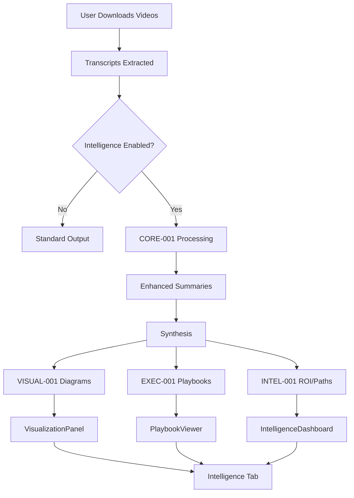

# UI-001 Integration Guide
## Integrating Enhanced Intelligence Dashboard with Main Application

**Module**: UI-001
**Version**: 1.0.0
**Status**: Production Ready
**Last Updated**: 2025-10-06

---

## Table of Contents

1. [Overview](#overview)
2. [Integration Steps](#integration-steps)
3. [Main Application Updates](#main-application-updates)
4. [Data Flow](#data-flow)
5. [Example Implementation](#example-implementation)
6. [Testing Integration](#testing-integration)
7. [Troubleshooting](#troubleshooting)

---

## Overview

This guide demonstrates how to integrate UI-001 components into the main YouTube Transcript Scraper application (`src/main.py`). The integration adds a new "Intelligence" tab to the existing GUI that provides access to all v2.0 features.

### Integration Goals

- ✅ Extend existing tkinter GUI without breaking v1.0 functionality
- ✅ Add tabbed interface for intelligence features
- ✅ Connect UI-001 components to CORE-001, VISUAL-001, EXEC-001 outputs
- ✅ Maintain backward compatibility
- ✅ Enable progressive disclosure of advanced features

---

## Integration Steps

### Step 1: Import UI-001 Components

Add imports to `src/main.py`:

```python
# At top of main.py, add:
from modules.ui_001 import (
    IntelligenceDashboard,
    VisualizationPanel,
    PlaybookViewer,
    SettingsPanel
)
```

### Step 2: Add Intelligence Tab to Main Window

Modify the main application class to include intelligence features:

```python
class YouTubeScraperApp:
    def __init__(self, root):
        self.root = root
        self.root.title("YouTube Research Intelligence Platform v2.0")

        # Create main notebook (if not already exists)
        self.main_notebook = ttk.Notebook(root)
        self.main_notebook.pack(fill="both", expand=True)

        # Existing scraper tab
        self.scraper_frame = ttk.Frame(self.main_notebook)
        self.main_notebook.add(self.scraper_frame, text="Video Scraper")

        # NEW: Intelligence tab
        self.intelligence_frame = ttk.Frame(self.main_notebook)
        self.main_notebook.add(self.intelligence_frame, text="Intelligence Dashboard")

        # Build existing UI in scraper_frame
        self._build_scraper_ui(self.scraper_frame)

        # NEW: Build intelligence UI
        self._build_intelligence_ui(self.intelligence_frame)

    def _build_intelligence_ui(self, parent):
        """Build intelligence dashboard interface"""
        # Create sub-notebook for intelligence features
        intel_notebook = ttk.Notebook(parent)
        intel_notebook.pack(fill="both", expand=True, padx=10, pady=10)

        # Dashboard tab
        dashboard_frame = ttk.Frame(intel_notebook)
        intel_notebook.add(dashboard_frame, text="Dashboard")
        self.dashboard = IntelligenceDashboard(dashboard_frame, callback=self.log_message)
        self.dashboard.pack(fill="both", expand=True)

        # Visualization tab
        visual_frame = ttk.Frame(intel_notebook)
        intel_notebook.add(visual_frame, text="Diagrams")
        self.visual_panel = VisualizationPanel(visual_frame, callback=self.log_message)
        self.visual_panel.pack(fill="both", expand=True)

        # Playbook tab
        playbook_frame = ttk.Frame(intel_notebook)
        intel_notebook.add(playbook_frame, text="Playbooks")
        self.playbook_viewer = PlaybookViewer(playbook_frame, callback=self.log_message)
        self.playbook_viewer.pack(fill="both", expand=True)

        # Settings tab
        settings_frame = ttk.Frame(intel_notebook)
        intel_notebook.add(settings_frame, text="Settings")
        self.settings_panel = SettingsPanel(settings_frame, callback=self.log_message)
        self.settings_panel.pack(fill="both", expand=True)
```

### Step 3: Connect Module Outputs to UI Components

Add method to process and display intelligence data:

```python
def process_with_intelligence(self, videos):
    """Process videos with all intelligence modules"""

    # Get settings from UI
    settings = self.settings_panel.get_settings()

    # 1. CORE-001: Enhanced summaries
    from modules.core_001 import CoreEngine

    core_engine = CoreEngine(
        api_key=settings["api"]["openai_key"],
        callback=self.log_message
    )

    summaries = []
    for video in videos:
        summary = core_engine.enhance_summary(
            transcript=video["transcript"],
            metadata=video["metadata"],
            mode=settings["core"]["mode"]
        )
        summaries.append(summary)

    # 2. CORE-001: Synthesis
    if settings["core"]["synthesis_enabled"] and len(summaries) > 1:
        synthesis = core_engine.synthesize_videos(summaries)
    else:
        synthesis = None

    # 3. VISUAL-001: Generate diagrams
    if synthesis:
        from modules.visual_001 import VisualEngine

        visual_engine = VisualEngine(callback=self.log_message)

        visual_config = {
            "types": settings["visual"]["types"],
            "complexity": settings["visual"]["complexity"]
        }

        diagrams = visual_engine.generate_all(synthesis, visual_config)
        self.visual_panel.load_diagrams(diagrams)

    # 4. EXEC-001: Generate playbooks
    from modules.exec_001 import ExecutionEngine

    exec_engine = ExecutionEngine(callback=self.log_message)

    all_insights = []
    for summary in summaries:
        all_insights.extend(summary.get("notable_items", []))

    artifacts = exec_engine.generate_all(all_insights)

    playbooks = artifacts.get("playbooks", [])
    self.playbook_viewer.load_playbooks(playbooks)

    # 5. Update intelligence dashboard
    # (INTEL-001 integration would go here when available)
    dashboard_data = {
        "roi_scores": self._calculate_roi_scores(all_insights),
        "learning_path": self._generate_learning_path(all_insights),
        "knowledge_base": all_insights,
        "progress_items": self._create_progress_items(playbooks)
    }

    self.dashboard.update_data(dashboard_data)

    self.log_message("Intelligence processing complete!")

def _calculate_roi_scores(self, insights):
    """Calculate ROI scores for insights (placeholder for INTEL-001)"""
    return [
        {
            "title": item.get("title", "Unknown"),
            "score": 7.0,  # Placeholder
            "time_minutes": self._parse_time(item.get("implementation_time", "30min")),
            "readiness": item.get("readiness", "UNKNOWN"),
            "category": item.get("tag", "General")
        }
        for item in insights
    ]

def _generate_learning_path(self, insights):
    """Generate learning path (placeholder for INTEL-001)"""
    return [
        {
            "title": item.get("title", "Unknown"),
            "description": item.get("description", "")
        }
        for item in insights[:10]  # Top 10 items
    ]

def _create_progress_items(self, playbooks):
    """Create progress tracking items"""
    items = []
    for playbook in playbooks:
        for step in playbook.get("steps", []):
            items.append({
                "title": step.get("title", "Unknown"),
                "status": "completed" if step.get("completed") else "pending"
            })
    return items

def _parse_time(self, time_str):
    """Parse time string to minutes"""
    if "min" in time_str:
        return int(time_str.replace("min", "").strip())
    elif "hr" in time_str or "hour" in time_str:
        return int(time_str.replace("hr", "").replace("hour", "").strip()) * 60
    return 30  # Default
```

### Step 4: Add Intelligence Button to Scraper UI

Add button to trigger intelligence processing after download:

```python
def _build_scraper_ui(self, parent):
    """Build existing scraper UI with intelligence button"""

    # ... existing UI code ...

    # Add intelligence processing button
    intel_frame = ttk.Frame(parent)
    intel_frame.pack(fill="x", padx=20, pady=10)

    self.enable_intel_var = tk.BooleanVar(value=False)
    ttk.Checkbutton(
        intel_frame,
        text="Enable Intelligence Processing (v2.0 features)",
        variable=self.enable_intel_var
    ).pack(side="left", padx=5)

    ttk.Button(
        intel_frame,
        text="Process with Intelligence",
        command=self._run_intelligence,
        state="disabled"  # Enable after download
    ).pack(side="left", padx=5)

def _run_intelligence(self):
    """Run intelligence processing on downloaded videos"""
    if not self.downloaded_videos:
        messagebox.showwarning("No Data", "Please download videos first")
        return

    if not self.enable_intel_var.get():
        messagebox.showinfo("Disabled", "Enable intelligence processing first")
        return

    # Switch to intelligence tab
    self.main_notebook.select(1)  # Intelligence tab index

    # Process with intelligence
    self.process_with_intelligence(self.downloaded_videos)
```

---

## Data Flow



---

## Example Implementation

### Complete Integration Example

```python
# src/main.py - Enhanced with UI-001 integration

import tkinter as tk
from tkinter import ttk, filedialog, messagebox
import threading
from typing import List, Dict

# Existing imports
from core.scraper_engine import TranscriptScraper
from core.search_optimizer import optimize_search_query
from utils.config import Config

# NEW: UI-001 imports
from modules.ui_001 import (
    IntelligenceDashboard,
    VisualizationPanel,
    PlaybookViewer,
    SettingsPanel
)

# NEW: Intelligence module imports
from modules.core_001 import CoreEngine
from modules.visual_001 import VisualEngine
from modules.exec_001 import ExecutionEngine


class EnhancedYouTubeApp:
    """YouTube Research Intelligence Platform v2.0"""

    def __init__(self, root):
        self.root = root
        self.root.title("YouTube Research Intelligence Platform v2.0")
        self.root.geometry("1400x900")

        self.downloaded_videos = []

        # Create main tabbed interface
        self.main_notebook = ttk.Notebook(root)
        self.main_notebook.pack(fill="both", expand=True)

        # Tab 1: Video Scraper (v1.0 functionality)
        self.scraper_frame = ttk.Frame(self.main_notebook)
        self.main_notebook.add(self.scraper_frame, text="📹 Video Scraper")

        # Tab 2: Intelligence Dashboard (v2.0 features)
        self.intel_frame = ttk.Frame(self.main_notebook)
        self.main_notebook.add(self.intel_frame, text="🧠 Intelligence")

        # Build UIs
        self._build_scraper_ui()
        self._build_intelligence_ui()

    def _build_scraper_ui(self):
        """Build video scraper interface (v1.0)"""
        # ... (existing scraper UI code) ...

        # Add intelligence toggle
        intel_control = ttk.Frame(self.scraper_frame)
        intel_control.pack(fill="x", padx=20, pady=10)

        self.enable_intel_var = tk.BooleanVar(value=True)
        ttk.Checkbutton(
            intel_control,
            text="🧠 Enable Intelligence Processing",
            variable=self.enable_intel_var
        ).pack(side="left")

    def _build_intelligence_ui(self):
        """Build intelligence dashboard (v2.0)"""
        # Sub-notebook for intelligence features
        intel_notebook = ttk.Notebook(self.intel_frame)
        intel_notebook.pack(fill="both", expand=True, padx=10, pady=10)

        # Dashboard
        dash_frame = ttk.Frame(intel_notebook)
        intel_notebook.add(dash_frame, text="📊 Dashboard")
        self.dashboard = IntelligenceDashboard(dash_frame, callback=print)
        self.dashboard.pack(fill="both", expand=True)

        # Diagrams
        viz_frame = ttk.Frame(intel_notebook)
        intel_notebook.add(viz_frame, text="📈 Diagrams")
        self.visual = VisualizationPanel(viz_frame, callback=print)
        self.visual.pack(fill="both", expand=True)

        # Playbooks
        play_frame = ttk.Frame(intel_notebook)
        intel_notebook.add(play_frame, text="📋 Playbooks")
        self.playbook = PlaybookViewer(play_frame, callback=print)
        self.playbook.pack(fill="both", expand=True)

        # Settings
        set_frame = ttk.Frame(intel_notebook)
        intel_notebook.add(set_frame, text="⚙️ Settings")
        self.settings = SettingsPanel(set_frame, callback=print)
        self.settings.pack(fill="both", expand=True)

    def on_download_complete(self, videos: List[Dict]):
        """Called after videos are downloaded"""
        self.downloaded_videos = videos

        if self.enable_intel_var.get():
            # Run intelligence processing
            threading.Thread(
                target=self.process_intelligence,
                args=(videos,),
                daemon=True
            ).start()

    def process_intelligence(self, videos: List[Dict]):
        """Process videos with intelligence modules"""
        try:
            settings = self.settings.get_settings()

            # CORE-001
            core = CoreEngine(
                api_key=settings["api"]["openai_key"],
                callback=print
            )

            summaries = []
            for video in videos:
                summary = core.enhance_summary(
                    video["transcript"],
                    video["metadata"],
                    settings["core"]["mode"]
                )
                summaries.append(summary)

            synthesis = core.synthesize_videos(summaries) if len(summaries) > 1 else None

            # VISUAL-001
            if synthesis:
                visual = VisualEngine(callback=print)
                diagrams = visual.generate_all(synthesis, settings["visual"])
                self.visual.load_diagrams(diagrams)

            # EXEC-001
            exec_engine = ExecutionEngine(callback=print)
            all_insights = sum([s["notable_items"] for s in summaries], [])
            artifacts = exec_engine.generate_all(all_insights)
            self.playbook.load_playbooks(artifacts.get("playbooks", []))

            # Dashboard
            dashboard_data = {
                "roi_scores": [...],  # From INTEL-001
                "learning_path": [...],  # From INTEL-001
                "knowledge_base": all_insights,
                "progress_items": [...]
            }
            self.dashboard.update_data(dashboard_data)

            # Switch to intelligence tab
            self.main_notebook.select(1)

            print("✅ Intelligence processing complete!")

        except Exception as e:
            print(f"❌ Intelligence processing failed: {e}")


if __name__ == "__main__":
    root = tk.Tk()
    app = EnhancedYouTubeApp(root)
    root.mainloop()
```

---

## Testing Integration

### Manual Testing Checklist

- [ ] Video scraper tab loads correctly
- [ ] Intelligence tab appears
- [ ] All 4 sub-tabs visible (Dashboard, Diagrams, Playbooks, Settings)
- [ ] Settings panel loads default values
- [ ] Intelligence toggle checkbox works
- [ ] After downloading videos, intelligence processing triggers
- [ ] Dashboard updates with data
- [ ] Diagrams load in visualization panel
- [ ] Playbooks load in viewer
- [ ] Export functions work
- [ ] No errors in console

### Automated Testing

```bash
# Run UI-001 tests
pytest tests/test_ui_001.py -v

# Run integration test
python -m src.main  # Manual verification
```

---

## Troubleshooting

### Issue: Intelligence tab not appearing

**Solution**: Ensure UI-001 imports are at top of file and components are initialized before adding to notebook.

### Issue: Data not updating in dashboard

**Solution**: Call `root.update()` after `update_data()`:

```python
self.dashboard.update_data(data)
self.root.update()  # Force UI refresh
```

### Issue: Module not found errors

**Solution**: Verify all modules are in `src/modules/` and `__init__.py` files exist.

### Issue: Diagrams not opening in browser

**Solution**: Check internet connection (Mermaid.js CDN) or use local Mermaid library.

---

## Next Steps

1. ✅ Complete INTEL-001 module for ROI scoring and learning paths
2. ✅ Complete KNOWLEDGE-001 module for persistent knowledge base
3. ✅ Integrate INTEL-001 outputs into dashboard
4. ✅ Add KNOWLEDGE-001 search to knowledge base tab
5. ✅ Implement INTEGRATE-001 for final orchestration

---

**Status**: ✅ Integration Guide Complete
**Version**: 1.0.0
**Last Updated**: 2025-10-06
