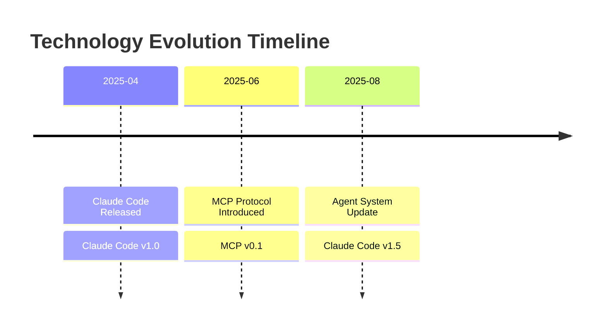
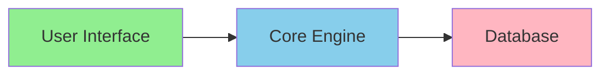
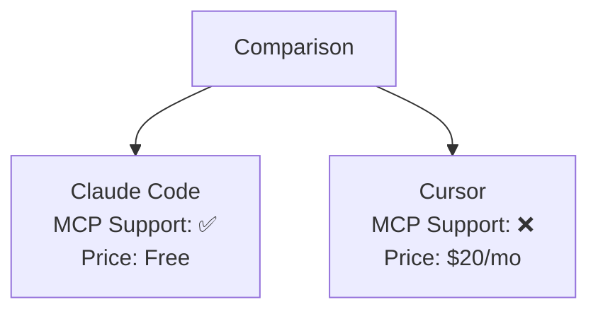
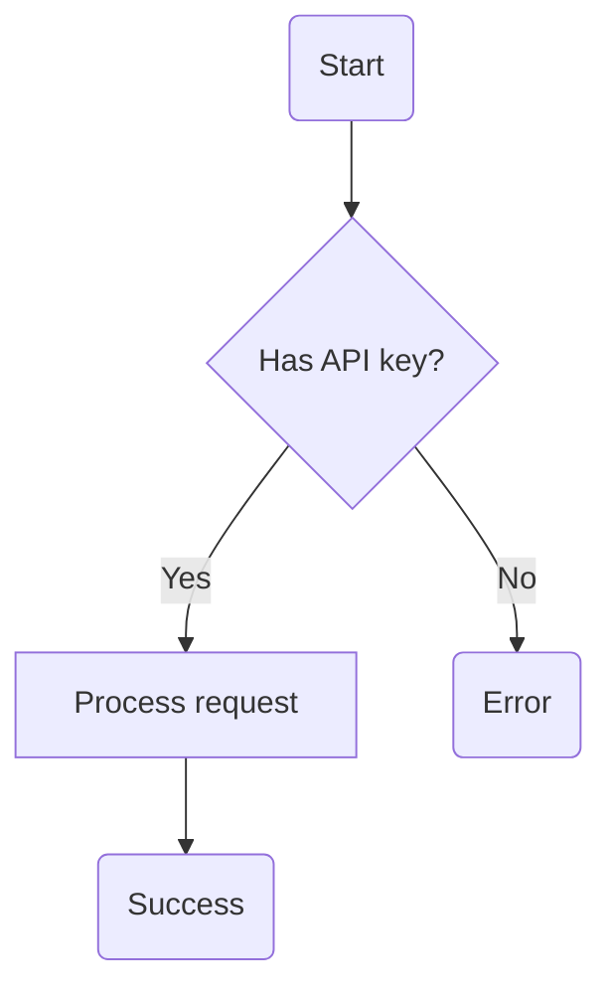
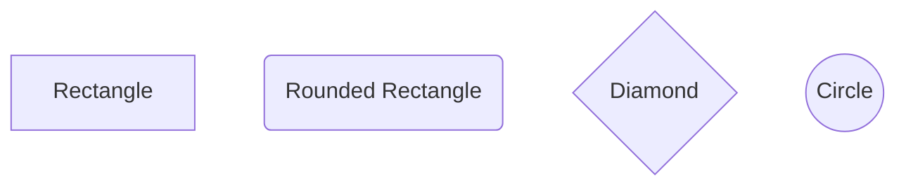
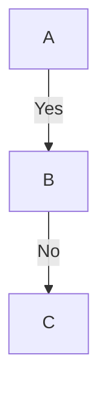
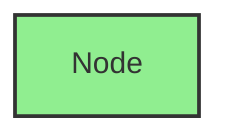

# VISUAL-001 API Specification
## Diagram Generation Engine

**Version**: 1.0.0
**Status**: Production Ready
**Module**: VISUAL-001 (Visualization Layer)
**Dependencies**: None (pure Python)

---

## Table of Contents

1. [Overview](#overview)
2. [Installation](#installation)
3. [API Reference](#api-reference)
4. [Input/Output Contracts](#inputoutput-contracts)
5. [Diagram Types](#diagram-types)
6. [Usage Examples](#usage-examples)
7. [Mermaid Syntax Guide](#mermaid-syntax-guide)
8. [Integration Guide](#integration-guide)
9. [Validation](#validation)

---

## Overview

VISUAL-001 provides diagram generation capabilities for YouTube Transcript Scraper v2.0. It transforms CORE-001 synthesis outputs into visual Mermaid diagrams for enhanced understanding and documentation.

### Key Features

✅ **4 Diagram Types**: Timeline, Architecture, Comparison, Flowchart
✅ **3 Complexity Levels**: Simple, Detailed, Comprehensive
✅ **100% Valid Mermaid**: Built-in syntax validation
✅ **Markdown Ready**: Auto-generated markdown embeds
✅ **Performance**: <5 seconds for all diagrams

### Diagram Types

1. **Timeline**: Technology evolution over time
2. **Architecture**: System component relationships
3. **Comparison**: Tool/technology comparison matrices
4. **Flowchart**: Decision trees and workflows

---

## Installation

### Prerequisites

- Python 3.8+
- No external dependencies required (pure Python)

### Import Module

```python
from src.modules.visual_001 import VisualEngine
```

---

## API Reference

### Class: `VisualEngine`

Main engine for diagram generation.

#### Constructor

```python
VisualEngine(callback=None)
```

**Parameters:**
- `callback` (callable, optional): Logging callback function that receives string messages

**Example:**
```python
engine = VisualEngine()

# With custom logging
def log_message(msg):
    print(f"[VISUAL] {msg}")

engine = VisualEngine(callback=log_message)
```

---

### Method: `generate_all()`

Generate all requested diagrams from CORE-001 synthesis.

```python
generate_all(
    synthesis: Dict,
    config: Dict
) -> Dict
```

**Parameters:**

| Parameter | Type | Required | Description |
|-----------|------|----------|-------------|
| `synthesis` | Dict | Yes | CORE-001 synthesis output |
| `config` | Dict | Yes | Generation configuration |

**Synthesis Dictionary Structure** (from CORE-001):
```python
{
    "chronological_timeline": [
        {"date": str, "event": str, "tool": str, "version": str}
    ],
    "cross_video_patterns": [
        {"pattern": str, "videos": list, "significance": str}
    ],
    "tool_mentions": {
        "tool_name": {"count": int, "contexts": list}
    },
    "consensus_points": list[str],
    "contradictions": list[dict]
}
```

**Config Dictionary Structure:**
```python
{
    "diagram_types": list[str],  # ["timeline", "architecture", "comparison", "flowchart"]
    "complexity": str,           # "simple" | "detailed" | "comprehensive"
    "validate": bool             # Run Mermaid syntax validation (default: True)
}
```

**Returns:**
```python
{
    "diagrams": {
        "timeline": {
            "mermaid_code": str,
            "title": str,
            "description": str,
            "events_count": int
        },
        "architecture": {
            "mermaid_code": str,
            "components": list[str],
            "relationships": list[dict],
            "layers": list[str]
        },
        "comparison": {
            "mermaid_code": str,
            "entities": list[str],
            "attributes": list[str],
            "winner": str | None
        },
        "flowchart": {
            "mermaid_code": str,
            "decision_points": list[str],
            "paths": list[dict]
        }
    },
    "markdown_embeds": {
        "timeline": str,        # Ready-to-embed markdown
        "architecture": str,
        "comparison": str,
        "flowchart": str
    },
    "validation": {
        "all_valid": bool,
        "errors": list[str]
    }
}
```

**Example:**
```python
synthesis = core_engine.synthesize_videos(summaries)

config = {
    "diagram_types": ["timeline", "architecture"],
    "complexity": "detailed",
    "validate": True
}

result = visual_engine.generate_all(synthesis, config)

# Access diagrams
timeline_mermaid = result["diagrams"]["timeline"]["mermaid_code"]
architecture_markdown = result["markdown_embeds"]["architecture"]

# Check validation
if not result["validation"]["all_valid"]:
    print(f"Errors: {result['validation']['errors']}")
```

---

## Diagram Types

### 1. Timeline Diagram

**Purpose**: Show technology evolution chronologically

**Input Requirements**:
- Events with dates (YYYY-MM-DD format)
- Event descriptions
- Tool names and versions

**Complexity Levels**:
- **Simple**: Top 5 most important events
- **Detailed**: Monthly grouping
- **Comprehensive**: Weekly granularity

**Example Output**:


**Generator Class**: `TimelineGenerator`

```python
from src.modules.visual_001.timeline_generator import TimelineGenerator

generator = TimelineGenerator()

events = [
    {
        "date": "2025-04-15",
        "event": "Claude Code Released",
        "tool": "Claude Code",
        "version": "1.0"
    }
]

result = generator.generate(events, complexity="detailed")
print(result["mermaid_code"])
```

---

### 2. Architecture Diagram

**Purpose**: Visualize system component relationships

**Input Requirements**:
- List of component names
- Relationships (from → to)
- Optional relationship labels

**Diagram Styles**:
- **Layered**: Horizontal layers (UI → Core → Data)
- **Hub**: Central hub with spokes
- **Flow**: Directional workflow

**Example Output**:


**Generator Class**: `ArchitectureGenerator`

```python
from src.modules.visual_001.architecture_generator import ArchitectureGenerator

generator = ArchitectureGenerator()

components = ["User Interface", "Core Engine", "Database"]
relationships = [
    {"from": "User Interface", "to": "Core Engine"},
    {"from": "Core Engine", "to": "Database"}
]

result = generator.generate(components, relationships, style="layered")
print(result["mermaid_code"])
```

---

### 3. Comparison Diagram

**Purpose**: Compare tools/technologies side-by-side

**Input Requirements**:
- List of tools to compare
- List of attributes/features
- Comparison data (tool → attribute → value)

**Value Types Supported**:
- Boolean (True/False → ✅/❌)
- String ("supported"/"partial"/"not supported")
- Numeric (for scoring)

**Example Output**:


**Generator Class**: `ComparisonGenerator`

```python
from src.modules.visual_001.comparison_generator import ComparisonGenerator

generator = ComparisonGenerator()

tools = ["Claude Code", "Cursor"]
attributes = ["MCP Support", "Price"]
data = {
    "Claude Code": {"MCP Support": True, "Price": "Free"},
    "Cursor": {"MCP Support": False, "Price": "$20/mo"}
}

result = generator.generate(tools, attributes, data)
print(f"Winner: {result['winner']}")  # Claude Code
```

---

### 4. Flowchart Diagram

**Purpose**: Visualize decision trees and workflows

**Input Requirements**:
- Decision tree structure
- Node types (start, end, decision, action)
- Branch conditions (Yes/No paths)

**Node Types**:
- **Start/End**: Rounded rectangles `(text)`
- **Decision**: Diamonds `{text?}`
- **Action**: Rectangles `[text]`

**Example Output**:


**Generator Class**: `FlowchartGenerator`

```python
from src.modules.visual_001.flowchart_generator import FlowchartGenerator

generator = FlowchartGenerator()

decision_tree = {
    "type": "start",
    "text": "Start",
    "next": {
        "type": "decision",
        "text": "Has API key?",
        "branches": [
            {
                "condition": "Yes",
                "next": {"type": "action", "text": "Process", "next": {"type": "end", "text": "Success"}}
            },
            {
                "condition": "No",
                "next": {"type": "end", "text": "Error"}
            }
        ]
    }
}

result = generator.generate(decision_tree)
print(f"Decision points: {result['decision_points']}")
print(f"Possible paths: {len(result['paths'])}")
```

---

## Validation

### Class: `MermaidValidator`

Validate Mermaid diagram syntax.

```python
from src.modules.visual_001.validator import MermaidValidator

validator = MermaidValidator()

mermaid_code = """graph TD
    A[Start]
    B[End]
    A --> B"""

is_valid, errors = validator.validate_mermaid_syntax(mermaid_code)

if not is_valid:
    print(f"Validation errors: {errors}")
```

**Validation Checks**:
- ✅ Valid diagram type
- ✅ Proper node syntax (brackets, parentheses, braces)
- ✅ Valid edge syntax (arrows, lines)
- ✅ No unmatched brackets
- ✅ No incomplete edges

---

## Usage Examples

### Example 1: Generate All Diagrams

```python
from src.modules.visual_001 import VisualEngine

engine = VisualEngine()

# Assume synthesis from CORE-001
synthesis = {
    "chronological_timeline": [...],
    "cross_video_patterns": [...],
    "tool_mentions": {...},
    "consensus_points": [...],
    "contradictions": [...]
}

config = {
    "diagram_types": ["timeline", "architecture", "comparison", "flowchart"],
    "complexity": "detailed",
    "validate": True
}

result = engine.generate_all(synthesis, config)

# Save markdown embeds
for diagram_type, markdown in result["markdown_embeds"].items():
    with open(f"{diagram_type}_diagram.md", "w") as f:
        f.write(markdown)
```

### Example 2: Generate Single Diagram

```python
config = {
    "diagram_types": ["timeline"],
    "complexity": "simple",
    "validate": True
}

result = engine.generate_all(synthesis, config)
timeline = result["diagrams"]["timeline"]

print(f"Title: {timeline['title']}")
print(f"Events: {timeline['events_count']}")
print(timeline["mermaid_code"])
```

### Example 3: Custom Callback Logging

```python
def custom_logger(msg):
    with open("visual_log.txt", "a") as f:
        f.write(f"{datetime.now()}: {msg}\n")

engine = VisualEngine(callback=custom_logger)
result = engine.generate_all(synthesis, config)
```

---

## Mermaid Syntax Guide

### Basic Node Shapes



### Edge Types

```mermaid
graph LR
    A --> B    %% Arrow
    B --- C    %% Line
    C -.-> D   %% Dotted arrow
    D ==> E    %% Thick arrow
```

### Labels



### Styling



---

## Integration Guide

### For UI-001 Integration

```python
# UI-001 will display diagrams
from src.modules.visual_001 import VisualEngine

visual_engine = VisualEngine()

# In UI render function
def render_diagrams(synthesis):
    config = {
        "diagram_types": ["timeline", "architecture"],
        "complexity": "detailed",
        "validate": True
    }

    result = visual_engine.generate_all(synthesis, config)

    # Display in UI
    for diagram_type, embed in result["markdown_embeds"].items():
        display_markdown(embed)
```

### For EXEC-001 Integration

```python
# EXEC-001 includes diagrams in playbooks
def add_diagrams_to_playbook(synthesis, playbook):
    visual_engine = VisualEngine()

    config = {
        "diagram_types": ["flowchart"],
        "complexity": "simple",
        "validate": True
    }

    result = visual_engine.generate_all(synthesis, config)

    playbook["diagrams"] = result["markdown_embeds"]
    return playbook
```

---

## Performance Characteristics

### Processing Time

| Diagram Count | Complexity | Time |
|---------------|------------|------|
| 1 diagram | Simple | <1s |
| 4 diagrams | Detailed | 2-3s |
| 4 diagrams | Comprehensive | 3-5s |

### Memory Usage

- **Per Diagram**: ~10MB
- **All 4 Diagrams**: ~40MB
- **Recommended**: 100MB RAM minimum

### Scalability

- **Max Components** (Architecture): 20 (auto-simplified)
- **Max Events** (Timeline): Unlimited (filtered by complexity)
- **Max Tools** (Comparison): 5 (top tools selected)

---

## API Versioning

**Current Version**: 1.0.0

### Version History

- **1.0.0** (2025-10-06): Initial production release
  - 4 diagram types (Timeline, Architecture, Comparison, Flowchart)
  - 3 complexity levels (Simple, Detailed, Comprehensive)
  - Built-in validation
  - Markdown embed generation

### Breaking Changes Policy

- Major version bump (2.0.0) for incompatible API changes
- Minor version bump (1.1.0) for backward-compatible features
- Patch version bump (1.0.1) for bug fixes

---

## Support & Troubleshooting

### Common Issues

**Q: Diagram validation fails**
A: Check Mermaid syntax. Use `validate_mermaid_syntax()` for detailed error messages.

**Q: Timeline shows fewer events than expected**
A: In "simple" mode, only top 5 events shown. Use "detailed" or "comprehensive" for more events.

**Q: Architecture diagram too cluttered**
A: Reduce components to <20 or use "simple" complexity for automatic filtering.

**Q: Comparison winner is None**
A: Indicates a tie. Check `calculate_winner()` scoring logic.

### Contact

For issues or questions:
- GitHub Issues: [Link to repo]
- Documentation: See `docs/` folder
- Implementation Guide: See `IMPLEMENTATION_PLAN_v2.md`

---

**Last Updated**: 2025-10-06
**API Version**: 1.0.0
**Status**: ✅ Production Ready
