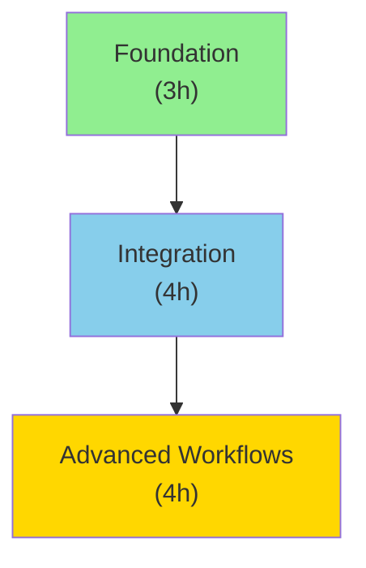

# Intelligence Report

## Executive Summary

**Total Items**: 5
**Ready to Implement**: 2 (40.0%)
**High Priority**: 2
**Total Implementation Time**: 11h
**Potential Annual Savings**: 530h

## Quick Wins

High ROI, low complexity items for immediate implementation:

1. **Quick Automation Script**
   - ROI Score: 3562.5x
   - Complexity: 0.10
   - Time: 15min

2. **Basic API Setup**
   - ROI Score: 562.5x
   - Complexity: 0.00
   - Time: 40min

## Prioritization Dashboard

### HIGH Priority (2 items)

- **Quick Automation Script**
  - Status: READY
  - ROI: 3562.5x
  - Complexity: 0.10

- **Advanced Workflow Automation**
  - Status: NEEDS_SETUP
  - ROI: 32812.5x
  - Complexity: 0.50

### MEDIUM Priority (1 items)

- **Basic API Setup**
  - Status: NEEDS_SETUP
  - ROI: 562.5x
  - Complexity: 0.00

### LOW Priority (2 items)

- **Experimental Beta Feature**
  - Status: EXPERIMENTAL
  - ROI: -75.0x
  - Complexity: 0.10

- **Database Integration**
  - Status: NEEDS_SETUP
  - ROI: -75.0x
  - Complexity: 0.20

## Learning Path

**Total Duration**: 11 hours
**Number of Phases**: 3

### Phase 1: Foundation

**Goal**: Establish core environment and tooling
**Duration**: 3h
**Prerequisites**: None
**Success Criteria**: Can run basic AI workflows

**Items**:

- Basic API Setup (NEEDS_SETUP, 40min)
- Quick Automation Script (READY, 15min)
- Experimental Beta Feature (EXPERIMENTAL, 90min)
- Advanced Workflow Automation (NEEDS_SETUP, 115min)
- Database Integration (NEEDS_SETUP, 40min)

## Dependency Roadmap

